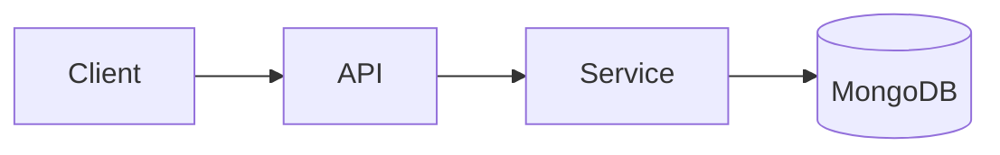

# Artifact Conventions (PDLC)

**This is the single source of truth for how every persona produces reviewable artifacts.**
Every persona template references this doc. The Tacticl dashboard renders artifacts directly
from what you write here, so the rules below are not stylistic preferences — they are the
contract between the agents and the UI. Follow them exactly.

An *artifact* is a durable, reviewable work product (a PRD, an architecture decision, a task
plan, a change summary, a review verdict, a test report, a security report). It is **not** the
code change itself — it is the human-readable record a gate reviewer reads to decide
go / no-go.

---

## 1. Storage path

Each artifact is a **markdown file** the agent commits to the working branch:

```
.tacticl/pdlc/{runId}/<name>.md
```

- **GitHub is the store.** There is no separate artifact database — the file rides inside
  the PR for the run. The dashboard reads it from the branch / PR.
- `{runId}` is the pipeline run id (provided in your boot assignment). All artifacts for one
  run live under the same `.tacticl/pdlc/{runId}/` directory.
- `<name>` is the conventional file name for your artifact type (see §7). Use the canonical
  name so reviewers and the UI can locate it deterministically.
- **Versioning is git history.** Never write `-v2` files or rename. Edit the same file and
  bump the `version` field in frontmatter (see §2). The diff between commits *is* the version
  trail.

---

## 2. Frontmatter (required)

Every artifact MUST begin with a YAML frontmatter block. The dashboard parses it to index,
title, and route the artifact. A file with no frontmatter is treated as invalid and will not
render.

```yaml
---
type: <artifact-type slug>
title: <human title>
artifact_id: artifact_<role>_<short>
agent: <persona name>
run_id: {runId}
version: 1
---
```

| Field         | Required | Description                                                                                          |
|---------------|----------|------------------------------------------------------------------------------------------------------|
| `type`        | yes      | Artifact-type slug. One of: `prd`, `solution-architecture`, `task-plan`, `change-summary`, `review`, `test-report`, `security-report` (see §7). Drives which gate reviews it. |
| `title`       | yes      | Human-readable title shown in the dashboard header (e.g. "Solution Architecture: Discord ingress").  |
| `artifact_id` | yes      | Stable id, format `artifact_<role>_<short>` (e.g. `artifact_architect_sad`). Stable across edits — it is the artifact's identity in the manifest. |
| `agent`       | yes      | The persona that authored it (e.g. `Architect`, `Product Owner`).                                    |
| `run_id`      | yes      | The pipeline run id. Must equal the `{runId}` in your storage path.                                  |
| `version`     | yes      | Integer, starts at `1`. Increment by 1 every time you rewrite the artifact in a later turn / rework. |

---

## 3. Sections & headings (UI outline)

The dashboard builds the **left-hand outline navigation** from your headings. Get this right or
the artifact is unnavigable.

- Use `##` for **top-level sections** — these become the outline entries.
- Use `###` for **sub-sections** — these nest under their parent in the outline.
- Do **not** use `#` (H1) for content — the `title` frontmatter is the document title; an H1 in
  the body produces a duplicate, broken outline root.
- Keep section names consistent with your persona template's canonical sections so reviewers
  across runs see the same structure.

---

## 4. Diagrams (mermaid)

Where a diagram clarifies more than prose — architecture component layouts, sequence flows,
state machines — emit a fenced **mermaid** block. The dashboard renders it as an inline SVG.

- Prefer mermaid over ASCII art. ASCII renders as a monospace blob; mermaid renders as a real
  diagram.
- Fence with three backticks and the language tag `mermaid`.
- Keep diagrams focused — one concept per diagram. A second diagram is cheaper than an
  overloaded one.

Example (architecture components):



---

## 5. Tables (GitHub-Flavored Markdown)

Use **GFM tables** for any structured, columnar data — data models, requirements matrices,
acceptance criteria, security advisories, file-change lists. The dashboard renders GFM tables
natively. Reserve prose for narrative; put structure in tables.

```markdown
| Field | Type   | Notes              |
|-------|--------|--------------------|
| id    | string | primary key        |
| state | enum   | DRAFT \| PUBLISHED |
```

---

## 6. Decisions (ADRs)

Architectural and other consequential decisions are recorded as **ADR sub-sections** inside the
relevant artifact (the Architect folds ADRs into the Solution Architecture's `## Decisions`
section; other personas may use the same form for any decision worth auditing).

Each ADR is a `###` sub-section with the four canonical parts in bold:

```markdown
### ADR-001: Use MongoDB change streams over polling

**Status:** Accepted

**Context:** What forces are at play (latency, blast radius, cost, reversibility, team skill).
Link back to the PRD / research that motivated the decision.

**Decision:** What we will do, specifically enough that the implementer has no ambiguity about
the mechanism.

**Consequences:** Positive, negative, and neutral outcomes. Name the modules/services affected
and any breaking-change migration path.
```

- Number ADRs sequentially within the run: `ADR-001`, `ADR-002`, …
- An ADR with no rejected-alternative reasoning in **Context** is not an ADR — decide, and say
  why the alternatives lost.

---

## 7. Artifact types → reviewing gate

There are **two human-in-the-loop gates** in a PDLC run:

- **Plan gate** — reviews the *plan-stage* artifacts before any PR exists. The human decides
  whether the proposed product, design, and plan are sound enough to build.
- **Merge gate** — reviews the *implementation-stage* artifacts on a real GitHub PR. The human
  decides whether the change is correct, tested, and safe enough to merge.

| Artifact type           | Slug (`type`)           | Canonical file name        | Author (persona)   | Reviewing gate |
|-------------------------|-------------------------|----------------------------|--------------------|----------------|
| Product requirements    | `prd`                   | `prd.md`                   | Product Owner      | **Plan gate**  |
| Solution architecture   | `solution-architecture` | `solution-architecture.md` | Architect          | **Plan gate**  |
| Task plan               | `task-plan`             | `task-plan.md`             | Planner            | **Plan gate**  |
| Change summary          | `change-summary`        | `change-summary.md`        | Implementer        | **Merge gate** |
| Code review             | `review`                | `review.md`                | Reviewer           | **Merge gate** |
| Test report             | `test-report`           | `test-report.md`           | Tester             | **Merge gate** |
| Security report         | `security-report`       | `security-report.md`       | Security Analyst   | **Merge gate** |

> Other personas (Researcher, Designer, Technical Writer, DevOps, Retro Analyst) produce
> supporting artifacts that feed these gates but are not themselves the gate decision document;
> they follow every convention in this doc and pick the closest matching `type` slug.

---

## 8. Manifest

After writing (or updating) an artifact, the agent appends/updates an entry for it in the run
manifest:

```
.tacticl/pdlc/{runId}/manifest.json
```

The manifest is a JSON array of artifact descriptors. It is the index the dashboard uses to
list everything produced in a run, in order.

**Entry schema:**

```json
{
  "artifact_id": "artifact_architect_sad",
  "type": "solution-architecture",
  "agent": "Architect",
  "path": ".tacticl/pdlc/{runId}/solution-architecture.md",
  "title": "Solution Architecture: Discord ingress",
  "summary": "One-line description of what this artifact decides/contains.",
  "sha": ""
}
```

| Field         | Description                                                                                  |
|---------------|----------------------------------------------------------------------------------------------|
| `artifact_id` | Matches the artifact's `artifact_id` frontmatter. The dedupe key.                            |
| `type`        | Matches the artifact's `type` frontmatter.                                                    |
| `agent`       | Authoring persona.                                                                            |
| `path`        | Full repo-relative path to the artifact file.                                                 |
| `title`       | Matches the artifact's `title` frontmatter.                                                    |
| `summary`     | **One line.** What this artifact decides or contains — shown in the run's artifact list.       |
| `sha`         | Leave empty (`""`). **Filled by git** at commit time; do not hand-edit.                        |

**How to append:**

1. Read `.tacticl/pdlc/{runId}/manifest.json` (create as `[]` if it does not exist).
2. If an entry with your `artifact_id` already exists (a rework), **replace it in place**;
   otherwise **append** your entry to the array.
3. Write the file back. Keep it valid JSON (an array of objects).
4. Commit the manifest in the same commit as the artifact.

---

## 9. How to emit (every persona)

1. **Write** your artifact to `.tacticl/pdlc/{runId}/<name>.md` with the required frontmatter
   (§2), `##`/`###` sections (§3), and mermaid/tables/ADRs where they add clarity (§4–6).
2. **Update** `.tacticl/pdlc/{runId}/manifest.json` — append or replace your entry (§8).
3. **Commit** the artifact and the manifest together to the working branch. The file rides
   inside the PR; git history is the version trail (§1). Do not open a separate branch for the
   artifact — it lives alongside the change it documents.
