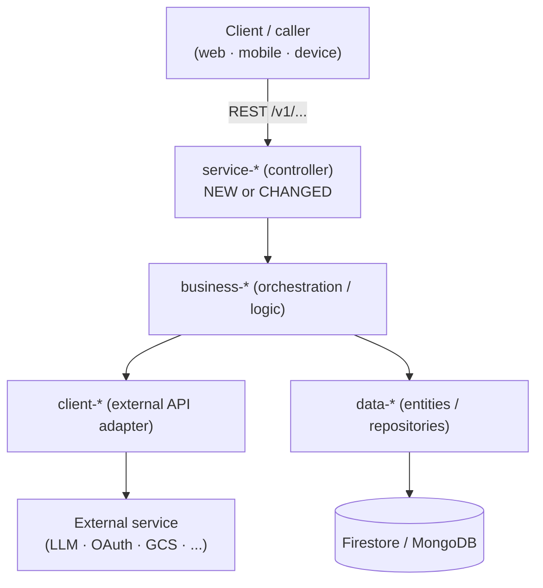
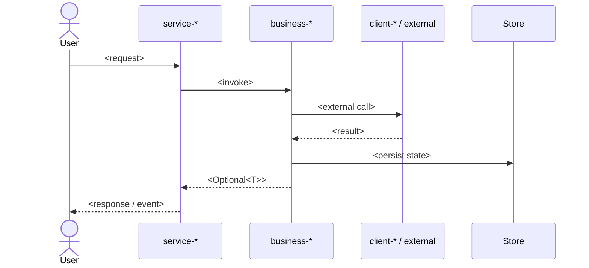

<!--
ARCHITECT TEMPLATE — "architecture" (Solution Architecture Document, ADR-bearing).
Reviewed at the Plan gate. Fill every section; delete the HTML comments before committing.
Voice: assertive and auditable. "We will use X because Y. We rejected Z because W."
Decisions, not essays. Every claim links back to the PRD or the research report — no hedging,
no "we could consider", no architecture-for-its-own-sake. Synthesize; do not recap research verbatim.
-->

## Context & goals

<!-- What forces are at play and what this design must achieve. State the problem in one paragraph,
then the goals/non-goals as bullets. Cite the PRD acceptance criteria and the Researcher report you
are building against (link by artifact_id or path). Keep it tight — this frames every decision below. -->

- **Goals:** <the outcomes this architecture must deliver, tied to PRD acceptance criteria>
- **Non-goals:** <explicitly out of scope — name them so nobody designs for them>
- **Driving forces (in priority order):** correctness against AC → reversibility → blast radius → team familiarity → cost.

## Constraints & assumptions

<!-- The hard boundaries the design lives inside. Be honest about what is fixed vs. assumed —
an assumption that turns out false is an Open Question for the Plan gate, not a silent risk. -->

| # | Constraint / Assumption | Type | Source |
|---|-------------------------|------|--------|
| 1 | <e.g. must honor module dependency rules: service → business → client/data, no inversions> | Constraint | CLAUDE.md |
| 2 | <e.g. Java 25 / Spring Boot 4 / Firestore-or-Mongo target> | Constraint | <repo> |
| 3 | <e.g. assume Vault secret path exists at secret/...> | Assumption | <to confirm> |

## Architecture overview

<!-- The shape of the system after this change. One or two paragraphs of narrative, THEN a mermaid
component diagram showing the modules/services/stores involved and how they connect. Highlight
NEW vs. CHANGED vs. UNCHANGED components. Respect the layered dependency rules — the diagram must
not show a service → service edge or a layer inversion. -->



## Data model

<!-- Entities/collections/fields this change adds or modifies. One row per field for new/changed
entities. Note ownership (nested-under-user vs. flat operational), required/optional, and any
breaking schema change. If nothing changes, say "No data-model changes" and delete the table. -->

| Entity / Collection | Field | Type | Req? | Notes (new/changed, ownership, indexes) |
|---------------------|-------|------|------|------------------------------------------|
| <Spark / Persona / pipeline_runs / ...> | <fieldName> | <String / enum / Map / ...> | <yes/no> | <NEW · default · index · breaking?> |

## Key flows

<!-- The 1–3 flows that matter most (the happy path plus any tricky failure/recovery or async path).
Prefer a mermaid sequence diagram over prose for each. Show actors, the layers crossed, and where
state is persisted. Omit this section's diagram only if the change is a pure data/config change. -->



## Interfaces & contracts

<!-- The concrete seams IMPLEMENTER builds against. Be specific enough that there is no ambiguity
about the mechanism: REST endpoints (path + method + verbed body), WebSocket message types, service
method signatures, event/skill names, Vault secret paths, feature flags. List affected clients
(tacticl-web / tacticl-mobile / tacticl-device) for any contract change — cross-repo coordination is
a Plan-gate decision, flag it. -->

| Interface | Contract | Consumers / clients to update |
|-----------|----------|-------------------------------|
| <REST `POST /v1/...`> | <request → response shape, status codes> | <web · mobile · device> |
| <service method> | <`Optional<T> doThing(...)` signature> | <calling business module> |
| <feature flag / Vault path> | <`tacticl.x.enabled` / `secret/...` → key> | <ops> |

## Decisions

<!-- The heart of the artifact. One ADR sub-section per material decision. DECIDE — name the choice,
the mechanism, and at least one rejected alternative with a concrete reason citing research/spec.
This is where the Architect's existing ADR format lives (Status / Context / Decision / Consequences),
extended with Rejected Alternatives and Migration Path. An ADR without rejected options is not an ADR. -->

### ADR-001: <decision summary>

- **Status:** Proposed
- **Context:** <forces at play; link PRD AC + research findings — synthesize, don't recap>
- **Decision:** <what we chose and the exact mechanism. Specific enough that IMPLEMENTER has no ambiguity.>
- **Rejected alternatives:**
  - **<Option B>** — rejected because <concrete reason, citing research>.
  - **<Option C>** — rejected because <concrete reason, citing research>.
- **Consequences:** <positive / negative / neutral. Name every module affected (service/business/client/data). Call out breaking changes explicitly.>
- **Migration path:** <only if breaking — who migrates, when, dual-read/rollback plan. Otherwise "None — additive change.">

<!-- Add ADR-002, ADR-003, ... as needed. Number monotonically; never renumber a published ADR. -->

## Risks & trade-offs

<!-- What this design buys and what it costs. Be honest — the bet you document is the bet you can
correct later. One row per risk with a likelihood/impact read and a mitigation or accepted stance. -->

| Risk / Trade-off | Likelihood | Impact | Mitigation / Accepted stance |
|------------------|-----------|--------|------------------------------|
| <e.g. new external dependency adds latency> | <low/med/high> | <low/med/high> | <circuit breaker / cache / accepted> |

## Open questions

<!-- Anything left for the human (Plan gate), PLANNER, or IMPLEMENTER to settle. State each as a
crisp question with the options you see. If a question blocks the design, say so — do not paper over it. -->

- [ ] <question> — options: <A> / <B>; blocking? <yes/no>

---

**HITL NOTE:** Reviewed at the **Plan gate** — the human reads this Solution Architecture Document (alongside the PRD and the task plan) and decides approve / request changes / reject before IMPLEMENTER is dispatched; the chosen ADRs become binding contracts for the run.

**HOW TO EMIT**
1. Write this file to `.tacticl/pdlc/{runId}/architecture.md` on the working branch with the required frontmatter, `##`/`###` sections, and mermaid/tables/ADRs (replace every `<…>` and delete the HTML-comment guidance).
2. Commit it to the working branch (it rides inside the PR; git history is the version trail — edit in place and bump `version` on rework, never write `-v2` files).
3. Append/update the entry in `.tacticl/pdlc/{runId}/manifest.json` (replace the entry with the same `artifact_id` if it already exists; leave `sha` empty for git to fill):
   ```json
   {
     "artifact_id": "artifact_architect_architecture",
     "type": "solution-architecture",
     "agent": "Architect",
     "path": ".tacticl/pdlc/{runId}/architecture.md",
     "title": "<human title>",
     "summary": "<one-line summary of the chosen architecture>",
     "sha": ""
   }
   ```
