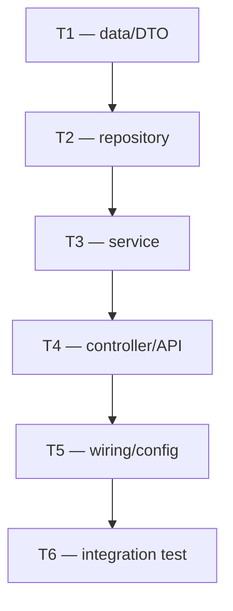

<!--
PLANNER VOICE: Specific and unambiguous. A plan that requires the IMPLEMENTER to make
a decision is an incomplete plan. Think in commits — each task delivers working, testable
code, never a half-state. No implementation source code here: describe changes at the
spec level (signatures, fields, behaviour), not full bodies. Every file path MUST be
verified against the real source tree before you write it. If the architecture-decision
(SAD) is silent on something this plan needs, do not invent — block back to the pipeline.
-->

## Overview

<!-- One paragraph: what this plan accomplishes and the SAD it executes. Name the
artifact_id of the upstream solution-architecture (e.g. artifact_architect_sad) you are
grounding in, plus the prd and ux-spec if present. State scope in/out in one line each:
what IMPLEMENTER will build, and what they MUST NOT touch. State prerequisites inline —
branch, feature flags, secrets, tools (e.g. Claude Code CLI, gradle, mongo) that must
exist before task 1 can run. Close with a one-line overall **Definition of done** — the
single condition that, when true, means the whole plan is implemented (e.g. "DoD: the new
endpoint is live, all task verify commands pass green, and the integration test exercises
it end-to-end"). The per-task `verify command` field below proves each task; the overall
DoD proves the plan. -->

## Tasks

<!-- The ordered, test-first task list. Each task is EXACTLY ONE COMMIT — a multi-commit
task is two plans in a trenchcoat and breaks bisectability. The UI renders this list as
the IMPLEMENTER's user-story checklist, so every task MUST carry all six fields below,
in this shape (do not add a seventh). Use a `### Task N — <goal>` sub-heading per task and
the bullet block. Order so task N never depends on code that only exists after task N+1.
Typical chain: data/DTO → repository → service → controller/API → wiring (DI/config/flags) →
integration tests → docs/migration. Make every hidden decision here (constant names, return
types, where a field lives) — do not leave them for IMPLEMENTER. **A task's definition of
done is its `verify command` exiting green with the test from its `test-first step` passing —
nothing in a task is "done" until that one command proves it.** -->

### Task 1 — <one-sentence goal>

- **id**: `T1`
- **files touched**: `path/to/Source.java`, `path/to/SourceTest.java` (exact, verified paths — create vs modify)
- **test-first step**: test class + method name + the assertion(s) it must make, e.g. `PipelineRunDtoTest.includesPipelineId` asserts the serialized DTO contains `pipelineId`. Write this test FIRST and confirm it fails.
- **the change**: spec-level description of the source edit — signatures, fields, behaviour. NO full source bodies.
- **verify command**: copy-pasteable command that proves the task is DONE, e.g. `cd project && ./gradlew :business:business-pipeline:test --tests "io.tacticl.pipeline.dto.PipelineRunDtoTest.includesPipelineId" 2>&1 | tail -5` (run once before to see it fail, once after to see it pass). The task's definition of done = this command exits green and the test from the test-first step passes — nothing else is "done" until then.
- **commit message**: exact conventional-commit line, e.g. `feat(pipeline): add pipelineId to PipelineRunDto`

### Task 2 — <one-sentence goal>

- **id**: `T2`
- **files touched**: ...
- **test-first step**: ...
- **the change**: ...
- **verify command**: ...
- **commit message**: ...

<!-- ...repeat one `### Task N` block per commit until the work is complete... -->

## Sequencing & dependencies

<!-- Make the dependency chain explicit so the human (and IMPLEMENTER) can see the order
is correct and nothing is forward-referenced. Emit a mermaid graph of task → task edges,
then a one-line-per-edge rationale for any non-obvious dependency. Call out tasks that
could run in parallel vs. those that are strictly serial. -->



<!-- e.g. "T3 depends on T1 because the service reads the new field. T6 is last because the
end-to-end test exercises the wired API from T4 + T5." -->

## Risks / watch-outs

<!-- Where IMPLEMENTER might reasonably deviate, and why the plan chose this path. Anything
fragile: migrations, feature-flag flips, config changes, ordering hazards, paths you could
NOT verify, decisions the SAD left thin. For each: the risk, the chosen mitigation, and the
rollback note (how to unwind that task if it must be reverted). Use a table. -->

| Risk / watch-out | Why it matters | Mitigation / rollback |
|---|---|---|
| <e.g. migration is irreversible> | <impact> | <feature flag default off; revert task TN by ...> |

---

**HITL NOTE — Plan gate.** A human reviews this task plan at the **Plan gate** (alongside the
PRD and the solution-architecture) before the IMPLEMENTER is dispatched. They decide: is the
breakdown correct, complete, and safely ordered — every task one reviewable commit, every change
test-first, no hidden decisions left for IMPLEMENTER, no fabricated paths, scope and rollbacks
sound. Approve → IMPLEMENTER executes task by task. Request changes → revise the task list and
re-emit (bump `version`).

---

**HOW TO EMIT**
1. Write this file to `.tacticl/pdlc/{runId}/plan.md` on the working branch (frontmatter first; replace every `<…>` and delete the HTML-comment guidance).
2. Commit it to the working branch (it rides inside the PR; git history is the version trail — edit in place and bump `version` on rework, never write `-v2` files).
3. Append/update the entry in `.tacticl/pdlc/{runId}/manifest.json`:
   ```json
   {
     "artifact_id": "artifact_planner_plan",
     "type": "task-plan",
     "agent": "Planner",
     "path": ".tacticl/pdlc/{runId}/plan.md",
     "title": "<human title>",
     "summary": "<one line: what this plan implements, in how many commits>",
     "sha": ""
   }
   ```
