# Tacticl Product PRD, System SAD, and PDLC v2 Documentation Plan

> **For agentic workers:** REQUIRED: Use superpowers:subagent-driven-development (if subagents available) or superpowers:executing-plans to implement this plan. Steps use checkbox (`- [ ]`) syntax for tracking.

**Goal:** Create the full Tacticl documentation suite: Level 1 Product PRD + System SAD (whole product), update PDLC v2 PRD with dual-format + SAD requirements, update artifact taxonomy, and create the PDLC v2 SAD (component-level architecture).

**Architecture:** Two-level hierarchy — Level 1 docs establish the full Tacticl product picture, Level 2 docs zoom into the PDLC pipeline. All Tier 1 phase reports follow the dual-format rule: `.md` (source, comprehensive) + `.html` (HITL surface, auto-generated). PDLC v2 replaces v1 entirely.

**Tech Stack:** Markdown + YAML frontmatter for all spec docs. Mermaid for flow/sequence diagrams (embedded as code blocks, rendered by viewer). Draw.io for deployment topology (SVG exported, embedded in HTML). Tacticl purple theme (`#6C63FF` primary) for all HTML surfaces.

---

## Files to Create or Modify

| Action | Path | Purpose |
|--------|------|---------|
| **Create** | `docs/superpowers/specs/2026-04-12-tacticl-product-prd.md` | Level 1: full Tacticl product requirements — all features, all personas, roadmap |
| **Create** | `docs/superpowers/specs/2026-04-12-tacticl-system-architecture-sad.md` | Level 1: full system topology — all repos, services, infra, auth, data architecture |
| **Modify** | `docs/superpowers/specs/2026-04-11-tacticl-pdlc-v2-prd.md` | Add dual-format requirement (FR7.5–7.8), SAD structure requirements, v2 replaces v1 |
| **Modify** | `docs/superpowers/specs/2026-04-12-tacticl-pdlc-artifact-taxonomy-design.md` | Add `.html` column to per-phase maps, document HTML_ASSEMBLER step |
| **Create** | `docs/superpowers/specs/2026-04-11-tacticl-pdlc-v2-sad.md` | Level 2: PDLC v2 component architecture — containers, workspace, gRPC, MongoDB, Qdrant |

---

## Chunk 1: Level 1 Product Docs (Tasks 1–2, parallel)

---

### Task 1: Create Tacticl Product PRD (Level 1)

**File:** Create `docs/superpowers/specs/2026-04-12-tacticl-product-prd.md`

This is the authoritative product requirements document for all of Tacticl. It covers every feature area at the product level — not implementation detail. Subcomponent specs (like the PDLC v2 PRD) are children of this doc.

- [ ] **Step 1: Create the file with frontmatter and executive summary**

```markdown
---
name: Tacticl Product Requirements Document
description: Level 1 product PRD for all of Tacticl — features, personas, use cases, roadmap
type: engineering-spec
status: draft
date: 2026-04-12
author: Gabriel Jimenez
related-docs:
  - 2026-04-12-tacticl-system-architecture-sad.md
  - 2026-04-11-tacticl-pdlc-v2-prd.md
---

# Tacticl — Product Requirements Document

**Date:** 2026-04-12
**Version:** 1.0
**Status:** Draft
**Author:** Gabriel Jimenez
**Related docs:**
- [System Architecture](2026-04-12-tacticl-system-architecture-sad.md)
- [PDLC v2 Component Spec](2026-04-11-tacticl-pdlc-v2-prd.md)

---

## 1. Executive Summary

Tacticl is a personal AI assistant that remotes into all your devices and utilizes them as workers. It can handle any task you can do on your devices — social automation, web browsing, content generation, video creation, software development, research, reminders, and more. You describe what you want in natural language. Tacticl routes it to the right execution plane, tracks progress, and delivers results.

For software tasks, Tacticl runs a full Product Development Lifecycle (PDLC) pipeline: 12 specialized AI agents that design, implement, test, review, document, and deploy production-ready code — with the user in control at every key decision point.

---

## 2. Problem Statement

### 2.1 The Core Problem

Modern knowledge workers manage an increasing number of digital workflows: social presence, content creation, research, code, communications, and business operations. AI models are powerful enough to execute all of these — but they lack the infrastructure to act on your behalf across your real devices, accounts, and repositories.

Existing AI assistants can answer questions and generate text. They cannot:
- Take action across your actual devices (phone, laptop, desktop)
- Maintain a persistent understanding of your work and preferences across sessions
- Run a production-grade software development pipeline from spec to merged PR
- Schedule, batch, and coordinate multi-step workflows asynchronously
- Learn from past runs to improve quality over time

### 2.2 The Tacticl Solution

Tacticl is the execution layer between user intent and real-world action. It operates two execution planes:

**Cloud Agent** — Runs 24/7 on Cloud Run. Handles tasks that don't require a user's physical device (research, social publishing, PDLC pipeline, reminders).

**Device Agent** — Runs as a daemon on user's devices (macOS, Windows, Linux, iOS, Android). Handles tasks that require local execution (terminal commands, browser automation, file manipulation, desktop app control).

The two planes are coordinate under a single chat + voice interface. The user issues commands in natural language. The system routes to the right plane, executes, and reports back.

---

## 3. Vision & Goals

### 3.1 Vision

Every person has an intelligent AI workforce running behind them — across every device they own, every account they control, every repo they maintain. Tacticl makes that real: one interface, one set of permissions, one running history, infinite execution.

### 3.2 Primary Goals

| # | Goal | Measure |
|---|------|---------|
| G1 | **Universal task execution** | Any task doable on a connected device, Tacticl can do for you |
| G2 | **Production-ready software output** | ≥85% of PDLC pipelines produce PRs passing CI on first run |
| G3 | **True device integration** | Commands execute on real devices, not in simulated environments |
| G4 | **User control at every decision point** | No irreversible action without user confirmation |
| G5 | **Continuous improvement** | System gets better with every run via retro learning loop |
| G6 | **Cross-session memory** | Persistent understanding of user's context, preferences, history |

---

## 4. Users & Personas

### 4.1 Primary: Solo Developer / Founder

- Builds products alone or on a small team
- Uses Tacticl to offload implementation, content, and research work
- Needs trust: every significant action requires transparency and confirmation
- Cares about code quality, maintainability, and consistency

### 4.2 Secondary: Product Manager

- Describes features in natural language
- Files GitHub issues; Tacticl picks them up via webhook and implements them
- Reviews resulting PRs without writing code
- Uses PDLC checkpoints to steer direction

### 4.3 Tertiary: Engineering Lead

- Sets quality bars via configurable rework limits, required critics, checkpoint gates
- Reviews weekly retro outputs, approves learnings
- Monitors pipeline cost, quality metrics, and rework rates

---

## 5. Feature Areas

### 5.1 Conversational Interface (Chat + Voice)

Every interaction starts here. Users issue commands by typing or speaking. Voice input is transcribed by Whisper API (~500ms). The command enters the Spark pipeline.

**Key capabilities:**
- Text chat via mobile, web, or desktop
- Push-to-talk voice (expo-av) on mobile
- Persistent conversation history within a session
- Multi-turn clarification before spark creation
- Inline progress updates as tasks execute

### 5.2 Cloud Agent

The cloud-side execution engine. Handles tasks that run entirely in the cloud without needing a physical device.

**Key capabilities:**
- 20+ skill handlers (web search, social automation, reminders, PDLC, research, media)
- Multi-model routing: Haiku for classification/simple tasks, Sonnet for content generation, Opus for PDLC roles
- Tool use (Claude tool_use protocol) with `ToolRegistry`
- Brave Search integration for web research
- Jina Reader for web page extraction
- Persistent agent memory (`users/{id}/agent_memory/`)
- Two-tier action safety: Tier 0 (auto-execute), Tier 1 (confirm before executing)

### 5.3 Device Agent

The on-device execution engine. Handles tasks that require real device access.

**Key capabilities:**
- WebSocket-based spark dispatch from cloud to device
- Tactic decomposition: one spark → multiple executable sub-tasks
- 9 command types: TERMINAL_CMD, OPEN_URL, CLICK_ELEMENT, FILL_FORM, SCREENSHOT, READ_FILE, WRITE_FILE, WAIT, NOTIFY
- Checkpoint flow: device pauses on ambiguous steps, requests user decision
- Claude Code CLI engine (desktop only, macOS/Windows/Linux): default execution engine for desktop devices, spawned as subprocess with isolated workspace
- Device routing intelligence: selects best device based on battery, charging state, capabilities
- Multi-device support: one user → many devices; task routed to best-fit device

### 5.4 PDLC Pipeline (Software Factory)

The most powerful feature. A 12-role AI pipeline that takes a user's software request from description to merged PR. See [PDLC v2 PRD](2026-04-11-tacticl-pdlc-v2-prd.md) for full specification.

**Key capabilities:**
- 12 specialized roles: PM, RESEARCHER, ARCHITECT, DESIGNER, PLANNER, IMPLEMENTER, REVIEWER, TESTER, SECURITY_ANALYST, TECHNICAL_WRITER, DEVOPS, RETRO_ANALYST
- 8 playbooks: FULL_PDLC, BUG_FIX, SMALL_FEATURE, REFACTOR, INFRA_CHANGE, DOCS_ONLY, UI_CHANGE, SECURITY_PATCH
- v2: each role runs in isolated Docker container on Hetzner with pre-assembled workspace
- Multi-candidate generation (IMPLEMENTER: 3 candidates by default, CRITIC selects best)
- TDD enforcement: TESTER writes failing tests before IMPLEMENTER writes code
- Multi-critic consensus: REVIEWER + TESTER + SECURITY_ANALYST must all approve before deploy
- User checkpoints at mandatory gates (after PM, after ARCHITECT, before deploy)
- Retro learning loop: weekly analysis of past runs → proposed learnings → approved learnings flow into future workspace assembly

**Three pipeline tiers:**
- `SIMPLE` — single agent loop (CloudOrchestratorService)
- `PLAYBOOK` — named workflow (subset of roles)
- `FULL_PDLC` — complete 12-role pipeline

### 5.5 Social Automation

**Key capabilities:**
- Publish to Twitter/X, LinkedIn, Instagram
- Google Photos as media source (read-only)
- AI video generation via SiliconFlow / Wan 2.2
- Post scheduling, batch publishing, content templates
- OAuth-based platform connections
- Agent skill for composing + scheduling posts
- Tier 1 confirmation before any publish action

### 5.6 Research & Browsing

**Key capabilities:**
- Web search via Brave Search API (independent index, not Google)
- Web page extraction via Jina Reader (URL → clean markdown)
- Both surfaced as agent skills (Tier 0, auto-execute)
- Results fed back to Claude for synthesis
- Domain allowlist/blocklist (user-configurable per device)

### 5.7 Notifications & Reminders

**Key capabilities:**
- FCM push notifications (iOS + Android)
- Scheduled reminders via `agent_reminders` collection
- Pipeline checkpoint notifications (pause → user decision → resume)
- Publish success/failure push notifications

### 5.8 Repository Management

**Key capabilities:**
- GitHub repo connection via `manage_repo` skill
- Grant/revoke repo access for PDLC execution
- GitHub webhook receiver for issue-triggered PDLC
- PR creation on user's repos as PDLC output
- Auto-merge option (opt-in per repo, requires CI green)

---

## 6. Spark Lifecycle

Every user command becomes a **Spark** — the single top-level entity for all user requests.

```
Chat/Voice → POST /v1/agent/command
    → SparkService.createSpark() [always]
    → SparkClassifierService auto-classifies: code | social | research | devops | creative | data
    → Route:
        a) Device online → SparkDispatchService → device → tactics
        b) No device    → CloudOrchestratorService
        c) PDLC spark   → PdlcClassifierService → tier selection → arbiter submission
```

**Spark states:** `PENDING → ROUTING → QUEUED | EXECUTING → CHECKPOINT → COMPLETED | FAILED | CANCELLED`

---

## 7. Functional Requirements

### 7.1 Input Channels
- **FR1.1:** System MUST accept text commands via `POST /v1/agent/command`
- **FR1.2:** System MUST accept voice input — Whisper API transcription, output feeds into FR1.1
- **FR1.3:** System MUST receive GitHub webhook events at `POST /v1/webhooks/github` and convert qualifying issues to sparks
- **FR1.4:** System MUST support scheduled sparks via cron-style expressions

### 7.2 Spark Execution
- **FR2.1:** Every command MUST create a Spark (even simple queries)
- **FR2.2:** `SparkClassifierService` MUST auto-classify spark type using Claude Haiku
- **FR2.3:** System MUST route to device if any device is online and capable
- **FR2.4:** System MUST fall back to cloud execution if no capable device is available
- **FR2.5:** `code` and `devops` sparks MUST go through `PdlcClassifierService` for tier selection

### 7.3 PDLC Pipeline
- **FR3.1–3.N:** See [PDLC v2 PRD](2026-04-11-tacticl-pdlc-v2-prd.md) Section 7 for complete PDLC functional requirements

### 7.4 Social Automation
- **FR4.1:** Posts MUST follow state machine: `DRAFT → QUEUED → PUBLISHING → PUBLISHED | FAILED`
- **FR4.2:** Any publish action MUST require Tier 1 confirmation (user approve before executing)
- **FR4.3:** System MUST support scheduling posts for future publish times
- **FR4.4:** OAuth tokens MUST be refreshed automatically before expiry

### 7.5 Device Management
- **FR5.1:** Users MUST be able to pair/unpair devices via the `manage_device` agent skill or REST API
- **FR5.2:** Device routing MUST consider battery level, charging state, and device capabilities
- **FR5.3:** Desktop devices (macOS, Windows, Linux) MUST default to Claude Code CLI execution engine
- **FR5.4:** All device command types MUST support checkpoint flow (pause on ambiguity, await user decision)

### 7.6 Memory & Context
- **FR6.1:** Agent memory MUST persist across sessions in `users/{id}/agent_memory/` subcollection
- **FR6.2:** Memory MUST be managed via `manage_settings` skill (read/update spending limits, domain lists)
- **FR6.3:** PDLC agents MUST have access to 4-layer knowledge system per run

### 7.7 User Control & Safety
- **FR7.1:** Tier 0 actions (read-only) execute automatically without confirmation
- **FR7.2:** Tier 1 actions (mutations: post, schedule, edit, delete) MUST request user confirmation before executing
- **FR7.3:** Tier 2 actions (financial: purchases, subscriptions) MUST require 2FA
- **FR7.4:** Spending limit defaults to $0 — user must explicitly enable before any billable execution
- **FR7.5:** Domain allowlist/blocklist MUST be enforced for all agent browsing

### 7.8 Notifications
- **FR8.1:** Push notification (FCM) MUST be sent when a spark completes, fails, or reaches a checkpoint
- **FR8.2:** Checkpoint notifications MUST include a deep link to the HITL approval surface (HTML)
- **FR8.3:** User MUST be able to approve/reject checkpoints from the notification-linked HTML surface without opening the app

---

## 8. Non-Functional Requirements

### 8.1 Availability
- Cloud agent: 99.9% uptime (Cloud Run auto-scaling)
- PDLC pipeline: best-effort — quality over speed, user tolerates latency

### 8.2 Latency
- Voice transcription: ≤500ms (Whisper)
- Spark classification: ≤1s (Haiku)
- Cloud agent response (simple query): ≤3s
- PDLC `SubmitPipeline` acknowledgment: ≤2s
- PDLC full run: no hard cap (quality first)
- Checkpoint resumption: ≤5s from user approval to next role dispatch

### 8.3 Security
- All secrets in Vault (never hardcoded)
- PASETO v4.local tokens for auth (shared keys with Strategiz for SSO)
- Per-pipeline workspace isolation (no shared filesystem)
- Agent containers run as non-root
- SECURITY_ANALYST veto is a hard stop (cannot be overridden without explicit checkpoint)

### 8.4 Cost Control
- Default monthly spend: $0 (blocked until user enables)
- Per-pipeline ceiling: $100 (configurable)
- All LLM token usage tracked per spark, per role, per pipeline

---

## 9. Roadmap

### v1 (Shipped)
- Cloud agent with 20+ skills
- Device agent with 9 command types + checkpoint flow
- PDLC v1 (in-JVM, Firestore-backed)
- Social automation (Twitter, LinkedIn, Instagram)
- Voice input (Whisper)
- Google Photos integration
- AI video generation (SiliconFlow / Wan 2.2)
- PASETO auth + CIDADEL SSO

### v2 (In Progress — PDLC Focus)
- **PDLC v2** (replaces v1): containerized roles on Hetzner, arbiter gRPC, multi-candidate generation, TDD enforcement, multi-critic consensus, vector search over past runs, retro learning loop
- Arbiter gRPC integration: centralized LLM routing replaces direct client deps
- MongoDB for PDLC state (replaces Firestore for pipeline data)
- Qdrant for semantic search over past runs (Voyage-code-3 embeddings)

### v3 (Planned)
- Multi-tenant SaaS isolation
- WebMCP integration (Chrome 146+ structured browsing)
- IDE integration (VSCode extension, JetBrains)
- Teams and org-level quality configuration
- BYOK (Bring Your Own Key) — user-supplied LLM API keys
- Google WebMCP for structured web interaction

---

## 10. Success Metrics

| Metric | Target | When |
|--------|--------|------|
| PDLC first-run CI pass rate | ≥85% | v2 GA |
| PR merge rate | ≥70% | v2 GA |
| Spark classification accuracy | ≥95% | Ongoing |
| Checkpoint rejection rate | ≤15% | Ongoing |
| Voice transcription accuracy | ≥98% | Ongoing |
| Social post success rate | ≥99% | Ongoing |
| Device command success rate | ≥95% | Ongoing |
| Monthly active sparks (per user) | ≥50 | 6 months post-launch |
```

- [ ] **Step 2: Verify file was written correctly** — read back the frontmatter and first 3 sections

- [ ] **Step 3: Commit**

```bash
git add docs/superpowers/specs/2026-04-12-tacticl-product-prd.md
git commit -m "docs: add Level 1 Tacticl Product PRD"
```

---

### Task 2: Create Tacticl System Architecture SAD (Level 1)

**File:** Create `docs/superpowers/specs/2026-04-12-tacticl-system-architecture-sad.md`

The 10,000-foot system architecture document covering all repos, services, infrastructure, auth, and data architecture. This is the document with the full deployment topology. Mermaid diagrams for all key flows. The draw.io deployment diagram is described here but rendered in the HTML HITL surface.

- [ ] **Step 1: Create the file with frontmatter and overview**

```markdown
---
name: Tacticl System Architecture Document
description: Level 1 SAD for all of Tacticl — full deployment topology, service interactions, auth, data architecture
type: engineering-spec
status: draft
date: 2026-04-12
author: Gabriel Jimenez
related-docs:
  - 2026-04-12-tacticl-product-prd.md
  - 2026-04-11-tacticl-pdlc-v2-sad.md
---

# Tacticl — System Architecture Document

**Date:** 2026-04-12
**Version:** 1.0
**Status:** Draft
**Author:** Gabriel Jimenez
**Related docs:**
- [Product PRD](2026-04-12-tacticl-product-prd.md)
- [PDLC v2 SAD](2026-04-11-tacticl-pdlc-v2-sad.md)

---

## 1. Overview

This document describes the full system architecture of Tacticl: all repositories, services, infrastructure components, and the interactions between them. It covers the Cloud Run control plane, the Hetzner execution plane, all client applications, and the shared CIDADEL platform infrastructure.

For PDLC pipeline internals (container lifecycle, workspace assembly, arbiter shell), see the [PDLC v2 SAD](2026-04-11-tacticl-pdlc-v2-sad.md).

---

## 2. Repository Map

| Repo | Language | Role | Deploy target |
|------|----------|------|---------------|
| `tacticl-core` | Java 25 / Spring Boot 4 | Backend API, cloud agent, PDLC orchestration | Cloud Run (GCP `tacticl`) |
| `tacticl-web` | React / TypeScript | Web dashboard (Spark Control, Chat) | CDN / Firebase Hosting |
| `tacticl-mobile` | React Native / Expo | Mobile app (Chat, Push-to-talk, Device agent) | App Store / Google Play |
| `tacticl-device` | Electron | Desktop agent daemon | macOS / Windows / Linux local |
| `cidadel-core` | Java 25 / Gradle | Shared infrastructure library | GitHub Packages (Maven) |
| `cidadel-ai-arbiter` | Node.js | gRPC LLM routing + PDLC container orchestrator | Hetzner (CPX31+) |
| `tacticl-docs` | Markdown / HTML | Architecture docs, PDLC templates, design system | GitHub Pages / local viewer |

---

## 3. System Context Diagram

Full system boundary showing Tacticl and all external dependencies.

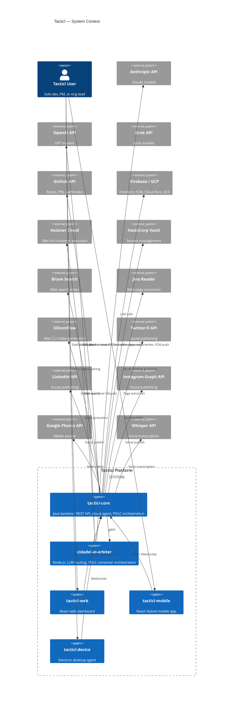

---

## 4. Deployment Topology

### 4.1 GCP / Cloud Run (Control Plane)

All user-facing API traffic runs here.

| Service | Image | Memory | Instances | Region |
|---------|-------|--------|-----------|--------|
| `tacticl-core` (prod) | `tacticl-core:prod` | 4Gi | 1–10 (auto) | us-east1 |
| `tacticl-core` (qa) | `tacticl-core:qa` | 2Gi | 1–3 (auto) | us-east1 |
| `strategiz-vault` | `vault:latest` | 512Mi | 1 (always-on) | us-east1 |

**Firestore** (project `tacticl`, us-east1): all operational data — sparks, tactics, social posts, device commands, social integrations, checkpoints, user settings, agent memory.

**GCS** (project `tacticl`): pipeline workspace archives, generated videos, uploaded media.

**Firebase Cloud Messaging (FCM)**: push notifications to mobile (iOS + Android).

### 4.2 Hetzner (Execution Plane)

PDLC pipeline container execution runs here.

| Host | Spec | Role |
|------|------|------|
| `hetzner-arbiter-01` | CPX31 (4 vCPU, 8GB RAM) | arbiter shell + Docker daemon + MongoDB + Qdrant |
| `hetzner-arbiter-02` (future) | CPX51 (20 vCPU, 32GB RAM) | overflow container execution |

**MongoDB** (on hetzner-arbiter-01, `port 27017`): PDLC pipeline state — `pipeline_runs`, `pipeline_events`, `pipeline_artifacts`, `agent_knowledge`, `checkpoints`.

**Qdrant** (on hetzner-arbiter-01, `port 6333`): vector search over past pipeline runs — collection `past_pipeline_runs`, Voyage-code-3 embeddings.

**Workspace storage** (`/opt/cidadel/agent-workspaces/`): live workspace bind mounts (per pipeline run) + archive directory (30-day retention).

### 4.3 Deployment Topology Diagram

> **Note for HTML rendering:** The below is described as a Mermaid diagram for the `.md` source. The HTML HITL surface for this document uses a draw.io SVG that renders the full topology with color-coded zones (GCP = blue, Hetzner = orange, External = grey).

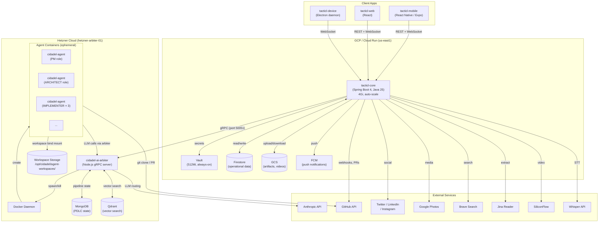

---

## 5. Service Interactions

### 5.1 tacticl-core ↔ cidadel-ai-arbiter (gRPC)

All PDLC pipeline execution is coordinated via gRPC. tacticl-core is the control plane; arbiter is the execution plane.

**Protocol:** gRPC over mTLS (internal Hetzner network). Port 50051.

**Key RPCs:**

| RPC | Direction | Purpose |
|-----|-----------|---------|
| `SubmitPipeline` | core → arbiter | Start a new PDLC pipeline run |
| `ResolveCheckpoint` | core → arbiter | Relay user's approve/reject/feedback |
| `GetPipelineStatus` | core → arbiter | Poll current pipeline state (for recovery) |
| `StreamPipelineEvents` | arbiter → core | Push events as pipeline progresses |

tacticl-core also receives callbacks from arbiter via HTTP POST to `/v1/internal/pipeline/callback` (for non-streaming event delivery).

### 5.2 tacticl-core ↔ Clients (REST + WebSocket)

**REST:** `https://api.tacticl.ai/v1/` — all endpoints use `/v1/` prefix. See individual endpoint docs.

**WebSocket:** `/ws/sparks/{userId}` — real-time spark progress events, tactic updates, checkpoint notifications, device status changes.

**Auth:** PASETO v4.local token in `Authorization: Bearer` header (REST) or initial handshake (WebSocket).

### 5.3 tacticl-core ↔ Devices (WebSocket)

Devices maintain a persistent WebSocket connection to tacticl-core. Commands are dispatched as JSON messages. Device sends back progress events, checkpoint requests, and completion signals.

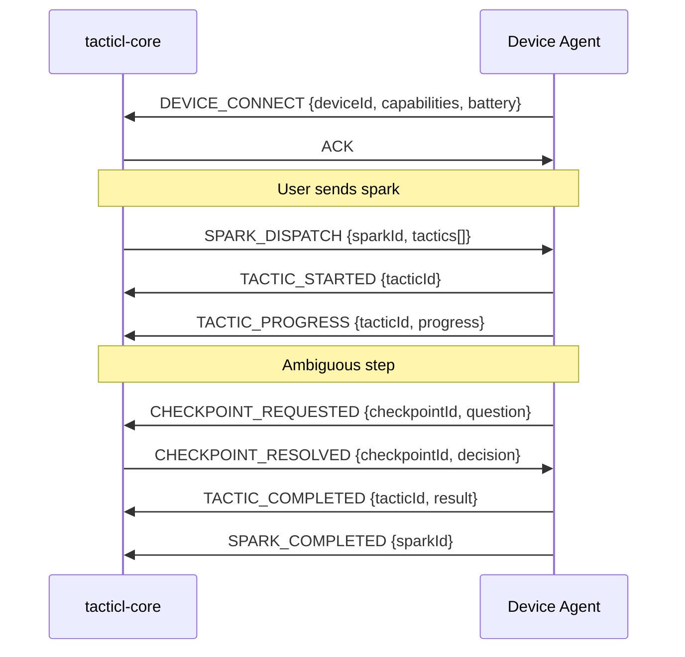

---

## 6. Auth Architecture

### 6.1 PASETO Tokens

Tacticl uses PASETO v4.local (symmetric encryption) for all auth. Tokens are issued by `cidadel-core`'s `framework-token-issuance` library.

**Token lifetime:** 15 minutes (access) + 30 days (refresh)

**Claims:** `userId`, `scopes[]`, `product` (`tacticl`), `deviceId` (optional), `issuedAt`, `expiresAt`

**Cross-product SSO:** Shared symmetric key between Tacticl and Strategiz — a Strategiz token is valid in Tacticl (same cidadel infrastructure). This enables future SSO without token exchange.

### 6.2 Auth Flow

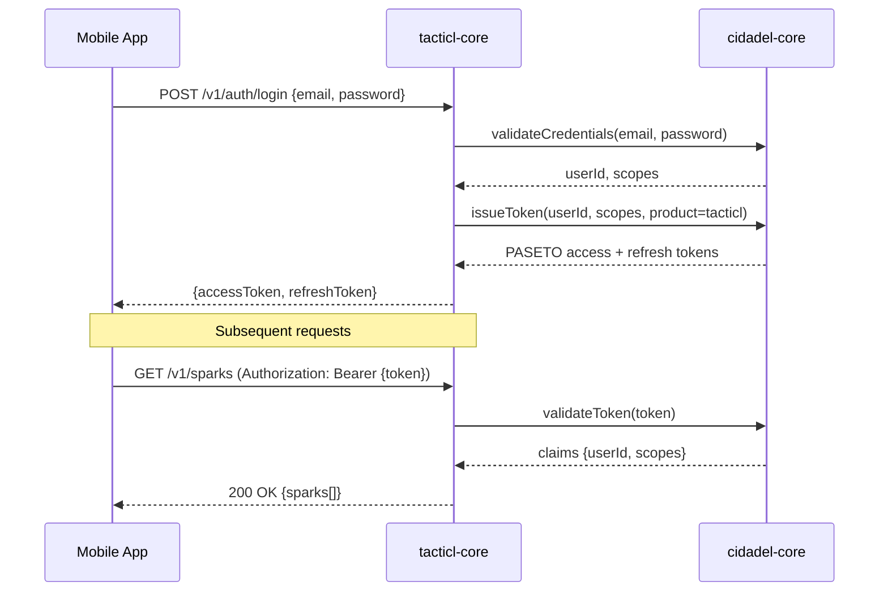

### 6.3 Scope System

| Scope | Controls |
|-------|---------|
| `sparks:read` | Read spark history |
| `sparks:write` | Create sparks (chat commands) |
| `social:read` | Read social posts and connections |
| `social:write` | Create / schedule posts |
| `devices:manage` | Pair / unpair devices |
| `pipeline:read` | Read pipeline status |
| `pipeline:write` | Submit pipelines, resolve checkpoints |
| `console:admin` | Admin endpoints (role overrides, migrations) |

---

## 7. Data Architecture

### 7.1 Firestore (Operational Data)

Project: `tacticl`, region: `us-east1`

**Hybrid schema (Approach B):** User-owned data nested under `tacticl_users/{userId}/`, operational data stays flat.

**Nested under user** (subcollections):
- `tacticl_users/{userId}/devices/` — registered devices + settings
- `tacticl_users/{userId}/social_integrations/` — OAuth tokens per platform
- `tacticl_users/{userId}/repo_grants/` — connected GitHub repos
- `tacticl_users/{userId}/agent_tokens/` — API tokens for agent access
- `tacticl_users/{userId}/agent_memory/` — persistent cross-session memory

**Flat collections** (operational):
- `sparks/` — all user sparks (lifetime entity)
- `tactics/` — device-side decomposition of sparks
- `execution_logs/` — LLM calls, tool invocations, token usage
- `checkpoints/` — user decision gates (v1 pipeline)
- `social_posts/` — post state machine
- `device_commands/` — dispatched commands with sparkId ref
- `action_confirmations/` — pending Tier 1/2 action approvals
- `agent_reminders/` — scheduled reminders
- `agent_audit_log/` — all agent commands (immutable)

### 7.2 MongoDB (PDLC Pipeline State)

Host: `hetzner-arbiter-01:27017`, database: `tacticl_pdlc`

| Collection | Purpose |
|-----------|---------|
| `pipeline_runs` | Full pipeline lifecycle — one doc per run, all state transitions |
| `pipeline_events` | Append-only event log — role start/complete/rework/checkpoint events |
| `pipeline_artifacts` | Artifact metadata + content refs (GitHub path) |
| `agent_knowledge` | Learned patterns with status lifecycle (proposed → approved → active) |
| `checkpoints` | v2 checkpoint records (replaces Firestore `checkpoints/` for PDLC) |

### 7.3 Qdrant (Vector Search)

Host: `hetzner-arbiter-01:6333`

**Collection:** `past_pipeline_runs`
**Embedding model:** Voyage-code-3 (1536 dimensions)
**Indexed content:** role prompt + role output + outcome metadata (one vector per role per run)
**Query:** agents call `find_similar_runs(query, top_k=5)` via Qdrant MCP server available inside containers
**Population:** RETRO_ANALYST indexes successful runs weekly

### 7.4 Data Flow by Feature

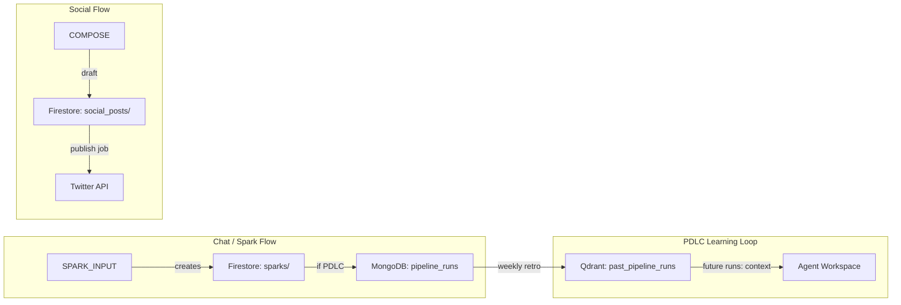

---

## 8. Key Flows

### 8.1 Full Spark Lifecycle

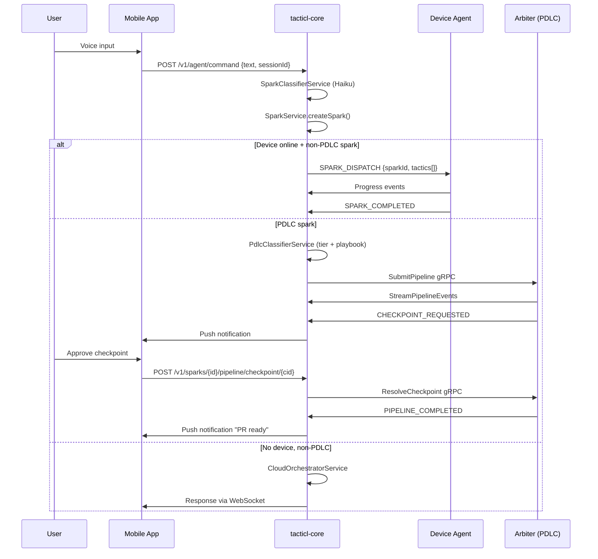

### 8.2 PDLC Checkpoint Flow

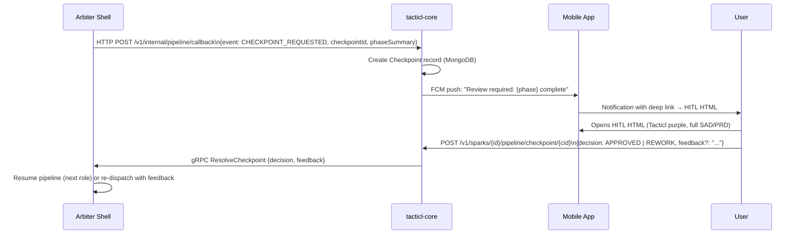

---

## 9. Infrastructure

### 9.1 Hetzner Node Setup

```
hetzner-arbiter-01 (CPX31: 4 vCPU, 8GB RAM, 160GB NVMe)
├── cidadel-ai-arbiter (Node.js, port 50051 gRPC + 3000 HTTP)
├── Docker daemon (container execution)
├── MongoDB 7.x (port 27017, auth enabled)
├── Qdrant 1.x (port 6333)
└── /opt/cidadel/agent-workspaces/
    ├── live/         ← active pipeline workspaces (bind-mounted into containers)
    └── archive/      ← completed pipeline workspaces (30-day retention)
```

### 9.2 Cloud Run Services

Both services deploy to `us-east1` with public access.

**tacticl-core (prod):** `gcr.io/tacticl/tacticl-core:prod`, 4Gi RAM, min 1 / max 10 instances
**tacticl-core (qa):** `gcr.io/tacticl/tacticl-core:qa`, 2Gi RAM, min 1 / max 3 instances

**Build:** `gcloud builds submit --config deployment/cloudbuild/cloudbuild-prod.yaml .`

### 9.3 Vault

Deployed on Cloud Run (`strategiz-vault-*`). Both Tacticl and Strategiz share one Vault cluster. Contexts:
- `tacticl` — tacticl-specific secrets (brave-search, jina, google, siliconflow, github-webhook)
- `strategiz` — shared LLM API keys (anthropic, openai, grok)

---

## 10. External Dependencies

| Service | Purpose | Auth | Cost model |
|---------|---------|------|-----------|
| Anthropic API | LLM (Claude Haiku/Sonnet/Opus) | API key (Vault: `strategiz/anthropic`) | Per token |
| OpenAI API | LLM (GPT-4o) | API key (Vault: `strategiz/openai`) | Per token |
| Grok API | LLM (Grok models) | API key (Vault: `strategiz/grok`) | Per token |
| Whisper API | Voice transcription | OpenAI key | Per minute |
| GitHub API | Webhooks, repo access, PR creation | OAuth per user | Free tier sufficient |
| Firebase / GCP | Firestore, FCM, Cloud Run, GCS | Service account | Pay-per-use |
| Hetzner Cloud | VM execution (PDLC containers) | API key | ~€15/mo per CPX31 |
| Vault (Cloud Run) | Secrets management | VAULT_TOKEN | Included with Hetzner plan |
| Brave Search | Web search | API key (Vault: `tacticl/brave-search`) | $3/1K queries, 2K free/mo |
| Jina Reader | Web extraction | API key (Vault: `tacticl/jina`) | 10M free tokens/mo |
| SiliconFlow | Wan 2.2 video generation | API key (Vault: `tacticl/siliconflow`) | ~$0.21/video |
| Twitter/X API | Social publish | OAuth per user | Paid tier required |
| LinkedIn API | Social publish | OAuth per user | Free (rate limited) |
| Instagram Graph API | Social publish | OAuth per user | Free (rate limited) |
| Google Photos API | Media source | OAuth per user | Free (read-only) |
```

- [ ] **Step 2: Verify the file reads back correctly — check the Mermaid diagrams are syntactically valid**

- [ ] **Step 3: Commit**

```bash
git add docs/superpowers/specs/2026-04-12-tacticl-system-architecture-sad.md
git commit -m "docs: add Level 1 Tacticl System Architecture SAD"
```

---

## Chunk 2: PRD + Taxonomy Updates (Tasks 3–4, parallel)

---

### Task 3: Update PDLC v2 PRD

**File:** Modify `docs/superpowers/specs/2026-04-11-tacticl-pdlc-v2-prd.md`

Two changes:
1. Add dual-format requirement (FR7.5–FR7.8) to Section 7.7 (Output Artifacts)
2. Add a v2-replaces-v1 statement to Section 2

- [ ] **Step 1: Add v2 replaces v1 statement**

Add this paragraph at the end of **Section 2.2 (Why a Refactor, Not a Fix)**:

```markdown
**PDLC v2 replaces v1 entirely.** There is no hybrid state. When v2 is deployed, the Java `PdlcPipelineOrchestrator`, `PipelineStateManager`, `PipelineEventEmitter`, `PipelineArtifactService`, `ReworkTracker`, `PipelineCostManager`, `PipelineRecoveryJob`, and `PipelineWatchdog` are deleted. Firestore `pipeline_runs/`, `pipeline_events/`, and `pipeline_artifacts/` collections are migrated to MongoDB and then removed from Firestore. A feature flag `pdlc.v2.enabled` gates the migration. When enabled, all new pipeline submissions go to v2. Existing running v1 pipelines are allowed to complete before the flag flips.
```

- [ ] **Step 2: Add dual-format requirements to Section 7.7 (Output Artifacts)**

Add after existing FR7.4:

```markdown
- **FR7.5: Dual-format Tier 1 reports** — Every Tier 1 phase report MUST be produced in two formats:
  1. `.md` (Markdown + YAML frontmatter) — the source of truth. Written by agents, version-controlled in GitHub. Full content, every detail. If `.md` and `.html` ever conflict, `.md` wins.
  2. `.html` (self-contained HTML, Tacticl purple theme) — the HITL approval surface. Auto-generated by the `HTML_ASSEMBLER` step that runs after all phase roles complete. Contains approve / request changes / cancel buttons that POST to the tacticl-core checkpoint API via a signed short-TTL URL. Shareable via push notification deep link — user opens it in any browser, no app required.

- **FR7.6: HTML_ASSEMBLER step** — Each phase definition MUST include an `HTML_ASSEMBLER` step after the last role completes. This step is shell-handled (no LLM, no container). It reads the Tier 1 `.md` + Tier 2 artifact links, renders the HITL HTML using the phase-specific template (see `tacticl-docs/architecture/pdlc/templates/`), and commits both files to the pipeline run's GitHub branch.

- **FR7.7: Phase 1 PRD HTML structure** — The Phase 1 HITL HTML MUST include: executive summary, 5 key requirements, research findings summary, mockup thumbnails (linked to `.html` mockup files), approve / request changes / cancel buttons, cost-so-far metadata bar.

- **FR7.8: Phase 2 SAD HTML structure** — The Phase 2 HITL HTML MUST include:
  - Executive summary
  - Architecture decisions (key choices, max 5 bullets)
  - Deployment topology diagram — draw.io SVG exported and embedded inline for the HTML surface; Mermaid code block in the `.md` source
  - Flow diagrams rendered via Mermaid.js (auth flow, API request flow, role orchestration sequence, data model ERD)
  - Story summary ({N} stories, {M} tasks)
  - Links to all Tier 2 supporting artifacts
  - Approve / request changes / cancel buttons
  - Cost-so-far metadata bar
```

- [ ] **Step 3: Verify the edits look correct by reading back the modified sections**

- [ ] **Step 4: Commit**

```bash
git add docs/superpowers/specs/2026-04-11-tacticl-pdlc-v2-prd.md
git commit -m "docs: add dual-format Tier 1 requirements and v2-replaces-v1 statement to PDLC v2 PRD"
```

---

### Task 4: Update Artifact Taxonomy

**File:** Modify `docs/superpowers/specs/2026-04-12-tacticl-pdlc-artifact-taxonomy-design.md`

Two changes:
1. Add `.html` row to each phase's artifact table (Tier 1 only)
2. Add HTML_ASSEMBLER step description

- [ ] **Step 1: Add `.html` to each phase's Tier 1 artifact row and add HTML_ASSEMBLER section**

**For Phase 1 — Product:** Add row after existing Tier 1 row:
```markdown
| 1 | PRD (HITL HTML) | `YYYY-MM-DD-tacticl-{slug}-phase-1-prd.html` | HTML_ASSEMBLER (generated from prd.md) |
```

**For Phase 2 — Design:** Add row after existing Tier 1 row:
```markdown
| 1 | SAD (HITL HTML) | `YYYY-MM-DD-tacticl-{slug}-phase-2-sad.html` | HTML_ASSEMBLER (generated from sad.md) |
```

**For Phase 3 — Development:** Add row after existing Tier 1 row:
```markdown
| 1 | Implementation Report (HITL HTML) | `YYYY-MM-DD-tacticl-{slug}-phase-3-implementation-report.html` | HTML_ASSEMBLER (generated from implementation-report.md) |
```

**For Phase 4 — Quality:** Add row after existing Tier 1 row:
```markdown
| 1 | Quality Report (HITL HTML) | `YYYY-MM-DD-tacticl-{slug}-phase-4-quality-report.html` | HTML_ASSEMBLER (generated from quality-report.md) |
```

**For Phase 5 — Deploy:** Add row after existing Tier 1 row:
```markdown
| 1 | Deployment Report (HITL HTML) | `YYYY-MM-DD-tacticl-{slug}-phase-5-deployment-report.html` | HTML_ASSEMBLER (generated from deployment-report.md) |
```

- [ ] **Step 2: Add HTML_ASSEMBLER section after the existing File Format section**

```markdown
---

### HTML_ASSEMBLER Step

Every phase definition includes a shell-handled `HTML_ASSEMBLER` step that runs after all role containers complete:

1. Reads the Tier 1 `.md` file (the phase report)
2. Reads all linked Tier 2 artifact paths
3. Renders a self-contained `.html` file using the phase-specific template from `tacticl-docs/architecture/pdlc/templates/`
4. Embeds: phase badge, spark title, pipeline cost-so-far, date, approve/request-changes/cancel buttons (signed short-TTL URL to tacticl-core checkpoint API)
5. Commits both `.md` and `.html` to the pipeline run's GitHub branch
6. Emits `CHECKPOINT_REQUESTED` event to tacticl-core

**Source of truth:** The `.md` file is always the source of truth. The `.html` is a derived rendering surface. If a user requests changes at a checkpoint, agents update the `.md` and the HTML_ASSEMBLER regenerates the `.html`.

**Templates location:** `tacticl-docs/architecture/pdlc/templates/`
- `phase-1-prd-hitl.html` — PRD template
- `phase-2-sad-hitl.html` — SAD template (includes Mermaid.js + draw.io SVG injection)
- `phase-3-implementation-hitl.html`
- `phase-4-quality-hitl.html`
- `phase-5-deploy-hitl.html`
```

- [ ] **Step 3: Commit**

```bash
git add docs/superpowers/specs/2026-04-12-tacticl-pdlc-artifact-taxonomy-design.md
git commit -m "docs: add dual-format Tier 1 .html rows and HTML_ASSEMBLER step to artifact taxonomy"
```

---

## Chunk 3: PDLC v2 SAD (Task 5)

---

### Task 5: Create PDLC v2 SAD

**File:** Create `docs/superpowers/specs/2026-04-11-tacticl-pdlc-v2-sad.md`

This is the authoritative component-level architecture document for the PDLC v2 pipeline. It covers everything inside the execution plane: arbiter shell, container architecture, workspace assembly, knowledge system, gRPC contract, MongoDB schema, Qdrant, pipeline registry, and migration from v1.

> **Key architectural clarification to reflect in the SAD:** The `cidadel-ai-arbiter` gRPC service (originally designed for single-turn + agentic API calls on Cloud Run) is extended for PDLC v2. The PDLC execution coordinator (what the v2 PRD calls the "arbiter shell") runs as an additional process on Hetzner — it IS the arbiter, extended with container orchestration. The gRPC server itself moves to Hetzner with the full pipeline execution capability. tacticl-core's `client-ai-arbiter` connects to this same gRPC endpoint regardless of whether it's submitting a single LLM call or a full PDLC pipeline.

- [ ] **Step 1: Create file with frontmatter and sections 1–3**

```markdown
---
name: Tacticl PDLC v2 System Architecture Document
description: Component SAD for PDLC v2 — containers, workspace, gRPC, MongoDB, Qdrant, migration from v1
type: engineering-spec
status: draft
date: 2026-04-11
author: Gabriel Jimenez
related-docs:
  - 2026-04-11-tacticl-pdlc-v2-prd.md
  - 2026-04-12-tacticl-system-architecture-sad.md
  - 2026-04-01-tacticl-arbiter-grpc-integration-design.md
---

# Tacticl PDLC v2 — System Architecture Document

**Date:** 2026-04-11
**Version:** 1.0
**Status:** Draft
**Author:** Gabriel Jimenez
**Related docs:**
- [PDLC v2 PRD](2026-04-11-tacticl-pdlc-v2-prd.md)
- [System Architecture SAD](2026-04-12-tacticl-system-architecture-sad.md)
- [Arbiter gRPC Integration Design](2026-04-01-tacticl-arbiter-grpc-integration-design.md)

---

## 1. Overview

This document describes the internal architecture of Tacticl PDLC v2: the container-based execution engine, workspace assembly system, 4-layer knowledge system, gRPC protocol, MongoDB schema, Qdrant setup, pipeline registry format, and the v1-to-v2 migration path.

PDLC v2 is a complete replacement of the in-JVM v1 pipeline. Every design decision prioritizes output quality over speed or cost.

**What this document does NOT cover:** tacticl-core REST/WebSocket API (see System Architecture SAD), PDLC functional requirements (see PDLC v2 PRD), non-PDLC cloud agent execution (see cloud agent architecture).

---

## 2. Architecture Overview

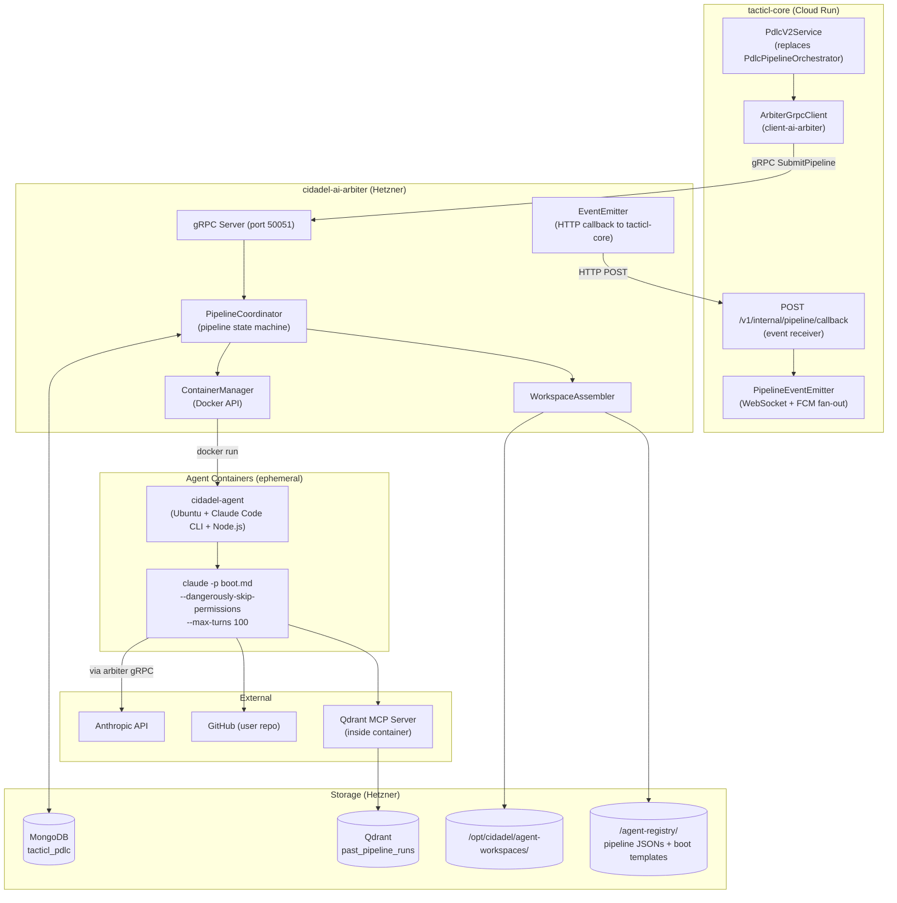

---

## 3. Arbiter Shell

The `cidadel-ai-arbiter` is a Node.js gRPC service running on Hetzner. It has two concerns:

1. **Single-turn + agentic LLM routing** — handles `GenerateRequest` RPCs by routing to Anthropic/OpenAI/Grok via REST (unchanged from v1 arbiter design)
2. **PDLC pipeline coordination** — handles `SubmitPipeline` RPCs by orchestrating Docker containers through an entire multi-role pipeline

These two concerns are cleanly separated into different RPC handlers in the same gRPC server.

### 3.1 Pipeline State Machine

```
PENDING → RUNNING → PAUSED_AT_CHECKPOINT → RUNNING → COMPLETED
                                         ↘ REWORK_REQUESTED → RUNNING
PENDING → FAILED
RUNNING → CANCELLED
```

State is persisted to MongoDB `pipeline_runs` on every transition. In-memory `PipelineTracker` caches hot state for performance. On arbiter restart, hydrates from MongoDB and resumes all `RUNNING` pipelines.

### 3.2 Role Dispatch

The arbiter dispatches roles according to the pipeline's dependency graph (defined in the pipeline JSON registry). Roles can be:

- **Sequential:** role B only starts after role A completes
- **Parallel:** roles B, C, D start simultaneously (e.g., TEST phase: TESTER + REVIEWER + SECURITY_ANALYST run in parallel)
- **Fan-out → Fan-in:** IMPLEMENTER runs 3 parallel candidate containers; CRITIC sub-process selects the best; pipeline continues with winning candidate

### 3.3 Shell-Handled vs Container-Handled Agents

| Type | How it runs | Examples |
|------|------------|---------|
| Container-handled | Spawns `cidadel-agent` Docker container, runs Claude Code CLI | All 12 PDLC roles |
| Shell-handled | Runs directly in arbiter shell (Node.js), no LLM | HTML_ASSEMBLER, CRITIC (candidate selection via deterministic scoring), workspace cleanup |

---
```

- [ ] **Step 2: Write sections 4–6 (Container Architecture, Workspace Assembly, Knowledge System)**

```markdown
## 4. Container Architecture

### 4.1 cidadel-agent Base Image

Single Docker image — agent identity comes from `boot.md` + `CLAUDE.md`, not the container type.

```dockerfile
FROM ubuntu:24.04
# Node.js 22 (required by Claude Code CLI)
RUN curl -fsSL https://deb.nodesource.com/setup_22.x | bash - && apt-get install -y nodejs
# Claude Code CLI
RUN npm install -g @anthropic-ai/claude-code
# Common dev tools (git, curl, jq, python3, java)
RUN apt-get install -y git curl jq python3 openjdk-21-jdk
# Non-root user
RUN useradd -m -s /bin/bash agent
USER agent
WORKDIR /workspace
```

Image is built once and cached. All role identity is injected at runtime via workspace bind mount.

### 4.2 Boot Protocol

When the arbiter spawns a container, it bind-mounts the pre-assembled workspace and runs:

```bash
docker run \
  --rm \
  --user agent \
  --memory=4g \
  --cpus=2 \
  -v /opt/cidadel/agent-workspaces/live/{runId}-{role}/:/workspace \
  -e ANTHROPIC_API_KEY=${apiKey} \
  -e PIPELINE_RUN_ID=${runId} \
  -e ROLE=${role} \
  cidadel-agent:latest \
  claude -p "$(cat /workspace/boot.md)" \
    --dangerously-skip-permissions \
    --max-turns 100 \
    --output-format stream-json \
    --model ${model}
```

Claude Code CLI reads `boot.md` as the initial prompt (role identity + instructions), uses `CLAUDE.md` for persistent settings, and executes against the workspace filesystem.

### 4.3 Resource Classes

| Class | CPU | Memory | Used by |
|-------|-----|--------|---------|
| `light` | 0.5 | 1Gi | PM, RESEARCHER, TECHNICAL_WRITER, RETRO_ANALYST |
| `medium` | 1.0 | 2Gi | ARCHITECT, DESIGNER, PLANNER, REVIEWER, SECURITY_ANALYST |
| `heavy` | 2.0 | 4Gi | IMPLEMENTER, TESTER, DEVOPS |

### 4.4 Container Lifecycle

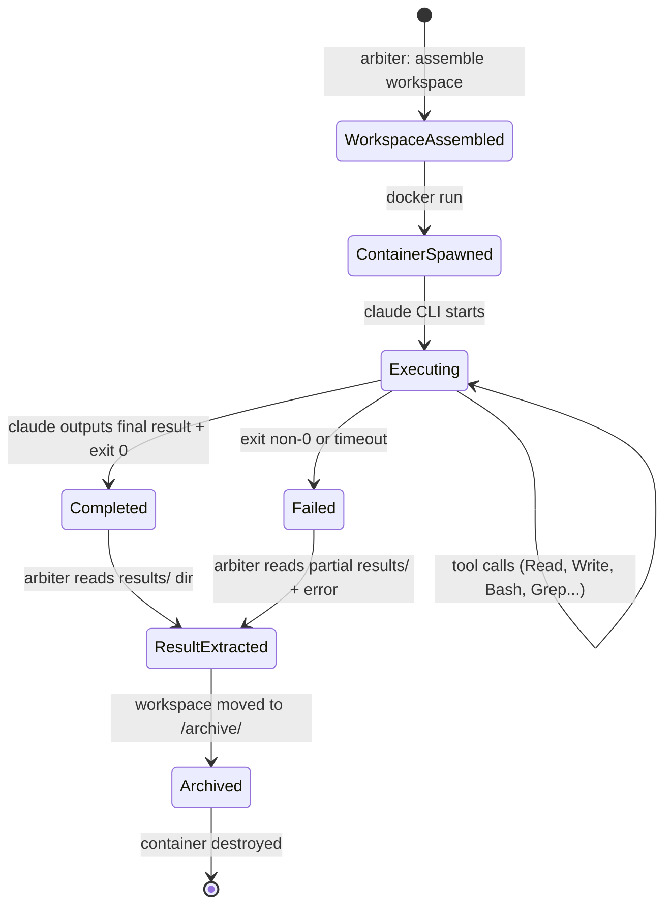

---

## 5. Workspace Assembly

Each role's workspace is assembled by the arbiter `WorkspaceAssembler` before the container starts. The workspace is a directory structure that becomes the container's `/workspace`.

### 5.1 Directory Structure

```
/workspace/
├── CLAUDE.md                    ← persistent settings (tools, MCP servers, permissions)
├── boot.md                      ← role identity + task prompt (read by claude -p)
├── context/                     ← inputs this role reads
│   ├── repo/                    ← live git clone of user's repo (Layer 1)
│   ├── prior-agent-output.md    ← output from previous role(s) in pipeline
│   ├── checkpoint-feedback.md   ← user feedback (populated on rework)
│   └── spark-request.md         ← original user request
├── knowledge/                   ← what the agent knows
│   ├── authored/                ← Layer 2: curated knowledge files per role type
│   │   ├── codebase-conventions.md
│   │   ├── architecture-overview.md
│   │   └── role-specific-guide.md
│   └── learned/                 ← Layer 3: approved learnings from past runs
│       └── patterns.md
├── results/                     ← outputs this role writes (arbiter reads these after exit)
│   ├── output.md                ← role's primary output (what becomes Tier 2 artifact)
│   ├── metadata.json            ← {shouldRework, reworkReason, confidence, tokensUsed}
│   └── [role-specific files]    ← e.g., IMPLEMENTER writes code here
└── logs/
    └── execution.jsonl          ← structured logs written by Claude Code CLI
```

### 5.2 Assembly Sequence

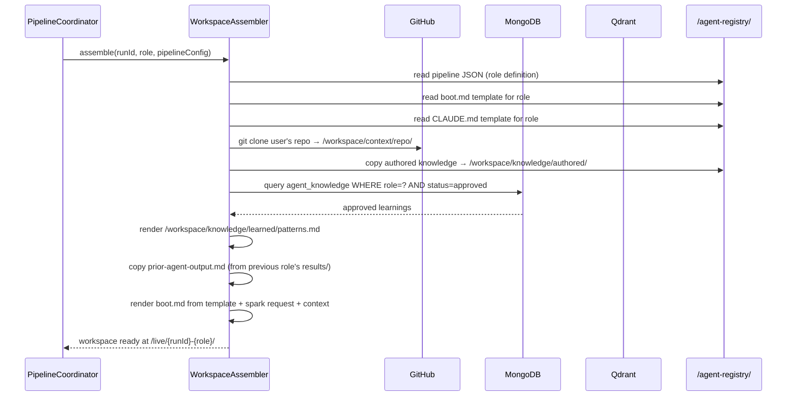

---

## 6. Knowledge System (4 Layers)

Every agent workspace includes knowledge from up to 4 layers, assembled in priority order (later layers can augment but not contradict earlier ones).

### Layer 1 — Live Repo

**What:** Fresh `git clone` of the user's connected repo into `/workspace/context/repo/`

**Freshness:** Cloned on every role dispatch (not cached)

**Purpose:** Agents use native `Grep`, `Glob`, `Read`, `Bash` to explore the codebase. This is ground truth for the current state of the repo.

**Not used for:** Semantic similarity search — that's Qdrant's job.

### Layer 2 — Authored Knowledge

**What:** Curated markdown files from `/agent-registry/knowledge/{role-type}/`

**Written by:** Engineering team, updated manually

**Contents (per role):**
- `codebase-conventions.md` — naming, formatting, import patterns for this codebase
- `architecture-overview.md` — key services, modules, data flow (high-level, not full SAD)
- `role-specific-guide.md` — role-specific instructions (e.g., IMPLEMENTER: "always write Jackson 3 imports")

**Update cadence:** As needed, deployed via SSH sync to `/agent-registry/`

### Layer 3 — Learned Patterns

**What:** AI-approved learnings from past pipeline runs, rendered into `/workspace/knowledge/learned/patterns.md`

**Source:** MongoDB `agent_knowledge` collection (`status = approved`, `product = tacticl`, `agent_types includes currentRole`)

**Written by:** RETRO_ANALYST agent weekly, approved by engineering lead

**Example entry:**
```
Pattern: Jackson imports
This codebase uses Jackson 3 (tools.jackson.*). Never use Jackson 2 (com.fasterxml.jackson.databind.*).
Always import: tools.jackson.databind.json.JsonMapper (not ObjectMapper)
Approved: 2026-04-01
```

### Layer 4 — Past Runs (Vector Search)

**What:** Semantically similar past successful pipeline runs, retrieved from Qdrant

**How agents access it:** Qdrant MCP server is registered in `CLAUDE.md` under `[[mcpServers]]`. Agents call `find_similar_runs(query, top_k=5)` as a tool.

**What's indexed:** One vector per role per successful run. Content: role prompt + role output + outcome metadata. Embedding: Voyage-code-3 (1536 dimensions).

**When useful:** IMPLEMENTER finding that a similar auth flow was implemented 2 weeks ago and the approach worked. ARCHITECT recalling a past data model decision for a similar problem.

**Not a crutch:** Agents MUST still use Layer 1 (live repo grep) as primary source. Past runs are suggestions, not templates.

---
```

- [ ] **Step 3: Write sections 7–10 (gRPC Contract, MongoDB Schema, Qdrant, Pipeline Registry)**

```markdown
## 7. gRPC Contract

The full proto file lives in `cidadel-ai-arbiter/proto/arbiter.proto` and is mirrored in `cidadel-core` for Java stub generation.

### 7.1 Core RPCs

```protobuf
service ArbiterService {
  // Single-turn LLM call (existing)
  rpc Generate(GenerateRequest) returns (GenerateResponse);

  // Agentic multi-turn LLM call (existing)
  rpc GenerateAgentic(AgenticRequest) returns (AgenticResponse);

  // PDLC pipeline (new in v2)
  rpc SubmitPipeline(SubmitPipelineRequest) returns (SubmitPipelineResponse);
  rpc ResolveCheckpoint(ResolveCheckpointRequest) returns (ResolveCheckpointResponse);
  rpc GetPipelineStatus(GetPipelineStatusRequest) returns (PipelineStatusResponse);
  rpc StreamPipelineEvents(StreamEventsRequest) returns (stream PipelineEvent);
  rpc CancelPipeline(CancelPipelineRequest) returns (CancelPipelineResponse);
}
```

### 7.2 Key Messages

```protobuf
message SubmitPipelineRequest {
  string pipeline_run_id = 1;   // UUID, generated by tacticl-core
  string spark_id = 2;
  string user_id = 3;
  string playbook = 4;          // FULL_PDLC | BUG_FIX | SMALL_FEATURE | ...
  string spark_request = 5;     // original user text
  string repo_url = 6;          // github.com/user/repo
  string github_token = 7;      // per-user OAuth token (short-lived)
  repeated string skip_roles = 8; // roles to skip (user requested)
  PipelineCostConfig cost_config = 9;
  string callback_url = 10;     // tacticl-core endpoint for HTTP push events
}

message SubmitPipelineResponse {
  string pipeline_run_id = 1;
  PipelineStatus status = 2;    // PENDING initially
}

message ResolveCheckpointRequest {
  string pipeline_run_id = 1;
  string checkpoint_id = 2;
  CheckpointDecision decision = 3;  // APPROVED | REWORK | CANCEL
  string feedback = 4;              // user feedback text (populated if REWORK)
}

message PipelineEvent {
  string pipeline_run_id = 1;
  string event_type = 2;        // ROLE_STARTED | ROLE_COMPLETED | ROLE_REWORK |
                                //   CHECKPOINT_REQUESTED | PIPELINE_COMPLETED | PIPELINE_FAILED
  string role = 3;
  string phase = 4;
  google.protobuf.Timestamp timestamp = 5;
  string payload_json = 6;      // event-type-specific JSON blob
}
```

### 7.3 tacticl-core Integration Points

**New module:** `client/client-ai-arbiter` — Java gRPC client wrapping the proto stubs.

**Modified:** `business-agent/PdlcV2Service` — replaces `PdlcPipelineOrchestrator`. Calls `ArbiterGrpcClient.submitPipeline()` instead of running roles in-JVM.

**New endpoint:** `POST /v1/internal/pipeline/callback` — receives HTTP push events from arbiter (for events that don't fit the gRPC stream). No auth required on this endpoint — it's internal-network only, protected by VPC firewall rules.

**Event fan-out:** `PipelineEventEmitter` (unchanged interface) — receives events from both gRPC stream and HTTP callback, fans out to WebSocket clients + FCM push.

---

## 8. MongoDB Schema

Database: `tacticl_pdlc` on `hetzner-arbiter-01:27017`

### 8.1 `pipeline_runs`

One document per pipeline run. Source of truth for pipeline lifecycle.

```json
{
  "_id": "run-abc123",
  "sparkId": "spark-xyz789",
  "userId": "user-111",
  "playbook": "FULL_PDLC",
  "status": "RUNNING",
  "sparkRequest": "Add password reset flow to auth service...",
  "repoUrl": "github.com/user/myapp",
  "skipRoles": [],
  "costCeilingUsd": 100.0,
  "totalCostUsd": 12.47,
  "phases": {
    "PRODUCT": {
      "status": "COMPLETED",
      "startedAt": "2026-04-12T10:00:00Z",
      "completedAt": "2026-04-12T10:23:00Z",
      "roles": {
        "PM": { "status": "COMPLETED", "reworkCount": 0, "costUsd": 2.10 },
        "RESEARCHER": { "status": "COMPLETED", "reworkCount": 0, "costUsd": 1.85 }
      },
      "checkpointId": "cp-111",
      "checkpointStatus": "APPROVED"
    },
    "DESIGN": { "status": "RUNNING", ... }
  },
  "artifacts": {
    "phase1Prd": "github.com/user/myapp/tree/tacticl/run-abc123/phase-1-prd.md",
    "phase2Sad": null
  },
  "createdAt": "2026-04-12T10:00:00Z",
  "updatedAt": "2026-04-12T10:47:00Z"
}
```

### 8.2 `pipeline_events`

Append-only event log. Never updated, only inserted.

```json
{
  "_id": "evt-001",
  "pipelineRunId": "run-abc123",
  "eventType": "ROLE_COMPLETED",
  "role": "PM",
  "phase": "PRODUCT",
  "timestamp": "2026-04-12T10:18:00Z",
  "payload": {
    "reworkCount": 0,
    "costUsd": 2.10,
    "tokensIn": 4200,
    "tokensOut": 1800,
    "artifactPath": "phase-1-product-requirements.md"
  }
}
```

### 8.3 `agent_knowledge`

Learned patterns from the retro loop.

```json
{
  "_id": "know-001",
  "product": "tacticl",
  "agentTypes": ["IMPLEMENTER", "REVIEWER"],
  "title": "Jackson 3 imports",
  "body": "This codebase uses Jackson 3 (tools.jackson.*). Never use Jackson 2...",
  "status": "approved",
  "proposedBy": "RETRO_ANALYST",
  "proposedAt": "2026-04-06T02:00:00Z",
  "approvedBy": "gabriel",
  "approvedAt": "2026-04-07T09:30:00Z",
  "applicableSince": "run-abc100",
  "hitCount": 14
}
```

**Status lifecycle:** `proposed → approved → active | rejected | superseded`

### 8.4 `checkpoints`

```json
{
  "_id": "cp-111",
  "pipelineRunId": "run-abc123",
  "phase": "PRODUCT",
  "type": "PHASE_COMPLETE",
  "status": "PENDING",
  "artifactPaths": {
    "tier1": "phase-1-prd.md",
    "tier1Html": "phase-1-prd.html",
    "tier2": ["phase-1-product-requirements.md", "phase-1-research-summary.md"]
  },
  "hitlUrl": "https://api.tacticl.ai/v1/hitl/cp-111?token=abc...xyz",
  "createdAt": "2026-04-12T10:23:00Z",
  "resolvedAt": null,
  "decision": null,
  "feedback": null
}
```

---

## 9. Qdrant Setup

### 9.1 Collection: `past_pipeline_runs`

```json
{
  "name": "past_pipeline_runs",
  "vectors": {
    "size": 1536,
    "distance": "Cosine"
  },
  "payload_schema": {
    "pipeline_run_id": "keyword",
    "role": "keyword",
    "product": "keyword",
    "playbook": "keyword",
    "outcome": "keyword",
    "spark_category": "keyword",
    "indexed_at": "datetime"
  }
}
```

### 9.2 Indexing (RETRO_ANALYST, weekly)

For each successful pipeline run in the past 7 days:
1. For each completed role, concatenate: `role prompt + "\n\n" + role output`
2. Embed with Voyage-code-3 (1536-dim)
3. Upsert to Qdrant with payload: `{pipeline_run_id, role, product, playbook, outcome: "SUCCESS", spark_category}`

### 9.3 Query Pattern (inside agent containers)

Agents access Qdrant via the Qdrant MCP server registered in their `CLAUDE.md`:

```toml
[[mcpServers]]
name = "qdrant"
command = "npx"
args = ["-y", "qdrant-mcp-server"]
env = { QDRANT_URL = "http://hetzner-arbiter-01:6333", COLLECTION = "past_pipeline_runs" }
```

Tool available to agents: `find_similar_runs(query: string, top_k: number) → RunChunk[]`

---

## 10. Pipeline Registry

Pipeline definitions live in `/agent-registry/pipelines/` on Hetzner (synced from `tacticl-docs/pipelines/`). No code changes needed to add or modify a pipeline.

### 10.1 Pipeline JSON Format

```json
{
  "id": "FULL_PDLC",
  "displayName": "Full PDLC",
  "phases": [
    {
      "id": "PRODUCT",
      "displayName": "Product",
      "roles": [
        {
          "id": "PM",
          "type": "container",
          "model": "claude-opus-4-6",
          "maxTurns": 100,
          "resourceClass": "light",
          "bootTemplate": "boot/pm.md",
          "claudeMdTemplate": "claude-md/standard.md",
          "knowledgeFiles": ["knowledge/shared/codebase-conventions.md", "knowledge/pm/product-guide.md"],
          "checkpoint": false
        },
        {
          "id": "RESEARCHER",
          "type": "container",
          "model": "claude-sonnet-4-6",
          "maxTurns": 80,
          "resourceClass": "light",
          "bootTemplate": "boot/researcher.md",
          "claudeMdTemplate": "claude-md/standard.md",
          "knowledgeFiles": ["knowledge/researcher/research-guide.md"],
          "dependsOn": [],
          "checkpoint": false
        }
      ],
      "checkpoint": {
        "required": true,
        "tier1Template": "templates/phase-1-prd-hitl.html",
        "htmlAssembler": "shell"
      }
    },
    {
      "id": "DESIGN",
      "roles": [
        { "id": "ARCHITECT", "type": "container", "model": "claude-opus-4-6", ... },
        { "id": "DESIGNER",  "type": "container", "model": "claude-sonnet-4-6", ... },
        { "id": "PLANNER",   "type": "container", "model": "claude-sonnet-4-6", "dependsOn": ["ARCHITECT"] }
      ],
      "checkpoint": { "required": true, "tier1Template": "templates/phase-2-sad-hitl.html" }
    },
    {
      "id": "DEVELOPMENT",
      "roles": [
        {
          "id": "IMPLEMENTER",
          "type": "container",
          "candidateCount": 3,
          "criticType": "shell",
          "model": "claude-sonnet-4-6",
          "maxTurns": 100,
          "resourceClass": "heavy"
        }
      ],
      "checkpoint": { "required": false }
    },
    {
      "id": "QUALITY",
      "roles": [
        { "id": "TESTER",            "type": "container", "parallel": true, "model": "claude-sonnet-4-6" },
        { "id": "REVIEWER",          "type": "container", "parallel": true, "model": "claude-sonnet-4-6" },
        { "id": "SECURITY_ANALYST",  "type": "container", "parallel": true, "model": "claude-opus-4-6" }
      ],
      "allMustApprove": true,
      "maxReworkIterations": 5,
      "checkpoint": { "required": false }
    },
    {
      "id": "DEPLOY",
      "roles": [
        { "id": "TECHNICAL_WRITER", "type": "container", "model": "claude-sonnet-4-6" },
        { "id": "DEVOPS",           "type": "container", "model": "claude-sonnet-4-6" }
      ],
      "checkpoint": { "required": true, "tier1Template": "templates/phase-5-deploy-hitl.html" }
    }
  ],
  "postPipeline": [
    { "id": "RETRO_ANALYST", "type": "container", "model": "claude-opus-4-6" }
  ]
}
```

---

## 11. Key Flows

### 11.1 Full PDLC Execution Sequence

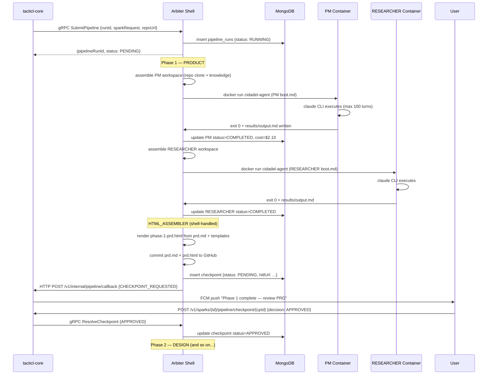

### 11.2 Rework Loop

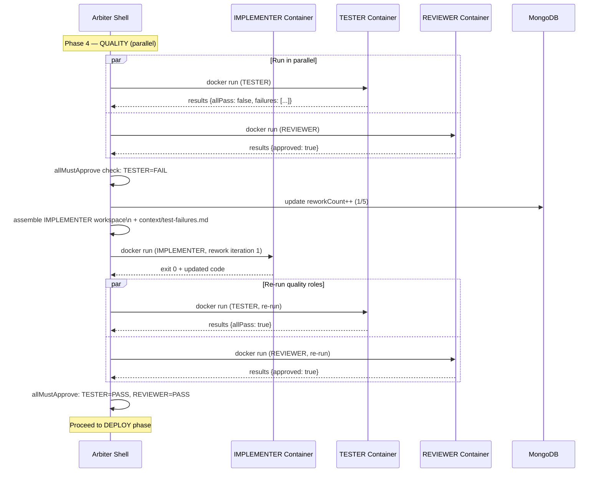

---

## 12. tacticl-core Changes

### 12.1 New Module: `client/client-ai-arbiter`

Java gRPC client. Wraps proto-generated stubs. Exposes:
```java
public class ArbiterGrpcClient {
    public SubmitPipelineResponse submitPipeline(SubmitPipelineRequest request);
    public void resolveCheckpoint(ResolveCheckpointRequest request);
    public PipelineStatusResponse getPipelineStatus(String pipelineRunId);
    public void streamPipelineEvents(String pipelineRunId, Consumer<PipelineEvent> handler);
}
```

### 12.2 Modified: `business-agent`

| Before | After |
|--------|-------|
| `PdlcPipelineOrchestrator` | `PdlcV2Service` (gRPC-backed) |
| `PipelineStateManager` (Firestore) | Removed — state lives in MongoDB (arbiter-side) |
| `PipelineEventEmitter` (Firestore+WS) | Updated — receives events from HTTP callback, fans out to WS+FCM |
| `ReworkTracker` | Removed — rework logic lives in arbiter shell |
| `PipelineCostManager` | Removed — cost tracked in MongoDB by arbiter |
| `PipelineRecoveryJob` | Removed — arbiter shell handles its own recovery |
| `PipelineWatchdog` | Removed — arbiter shell has role timeout logic |

### 12.3 New Endpoint: `POST /v1/internal/pipeline/callback`

Receives HTTP push events from arbiter for non-streaming delivery:

```java
@PostMapping("/v1/internal/pipeline/callback")
public ResponseEntity<Void> pipelineCallback(@RequestBody PipelineCallbackEvent event) {
    pipelineEventEmitter.onEvent(event);
    return ResponseEntity.ok().build();
}
```

This endpoint is internal-only — protected by Cloud Armor VPC firewall rules (Hetzner IP range only).

---

## 13. Migration from v1

### 13.1 Feature Flag

Config property: `pdlc.v2.enabled` (default: `false`)

When `false`: all PDLC sparks route to `PdlcPipelineOrchestrator` (v1, in-JVM).
When `true`: all new PDLC sparks route to `PdlcV2Service` (v2, arbiter gRPC). Running v1 pipelines are allowed to complete.

### 13.2 Migration Steps

1. Deploy arbiter v2 to Hetzner with pipeline coordinator
2. Deploy tacticl-core with `client-ai-arbiter` + `PdlcV2Service` (flag still false)
3. Run smoke test: submit one FULL_PDLC pipeline via v2 in QA environment, verify end-to-end
4. Enable flag in QA: `pdlc.v2.enabled=true`
5. Run acceptance tests against QA
6. Enable flag in prod during low-traffic window
7. Monitor for 48 hours — fallback by flipping flag
8. Once stable: delete v1 classes, migrate Firestore `pipeline_runs/` data to MongoDB, remove Firestore collections

### 13.3 Data Migration

Firestore `pipeline_runs/`, `pipeline_events/`, `pipeline_artifacts/` → MongoDB.

Migration script: `scripts/migrate-pdlc-firestore-to-mongo.js` (Node.js, runs once against prod Firestore + prod MongoDB).

After migration: Firestore collections are soft-deleted (documents marked `migrated: true`). Hard delete after 30-day rollback window.

---

## 14. Operational Concerns

### 14.1 Container Cleanup

Containers use `--rm` flag — auto-destroyed on exit. Workspace is moved to `/archive/` by arbiter before container is released.

### 14.2 Workspace Archival

After container exit:
```
/opt/cidadel/agent-workspaces/live/{runId}-{role}/
  → /opt/cidadel/agent-workspaces/archive/{YYYY-MM-DD}/{runId}-{role}/
```
Archive retention: 30 days. Cron job: `find /archive -mtime +30 -exec rm -rf {} \;` daily at 3 AM.

### 14.3 Arbiter Restart Recovery

On startup, arbiter queries MongoDB for all `pipeline_runs` with `status = RUNNING`. For each:
1. Identify last completed role (from `pipeline_events`)
2. Re-dispatch next role with workspace re-assembled from archive
3. Emit `PIPELINE_RESUMED` event

### 14.4 Cost Tracking

Per-role cost is extracted from the arbiter's LLM response metadata (tokens_in, tokens_out × model pricing). Written to MongoDB `pipeline_runs.phases.{phase}.roles.{role}.costUsd` on role completion. Running total in `pipeline_runs.totalCostUsd`. Pipeline pauses if total exceeds `costCeilingUsd` — emits `COST_CEILING_REACHED` checkpoint event.
```

- [ ] **Step 4: Verify the full file is coherent — read back and check all sections present**

- [ ] **Step 5: Commit**

```bash
git add docs/superpowers/specs/2026-04-11-tacticl-pdlc-v2-sad.md
git commit -m "docs: add PDLC v2 System Architecture Document"
```

---

## Final Step: Verify All Docs

- [ ] **Read back all 5 files and verify section count + content integrity**
- [ ] **Final commit if any cleanup edits were needed**

```bash
git log --oneline -6
```

Expected output: 5 commits for the 5 docs, plus this plan file.

- [ ] **Commit this plan file**

```bash
git add docs/superpowers/plans/2026-04-12-tacticl-product-prd-sad-pdlc-v2-docs.md
git commit -m "docs: add implementation plan for Tacticl product PRD, system SAD, and PDLC v2 SAD"
```
