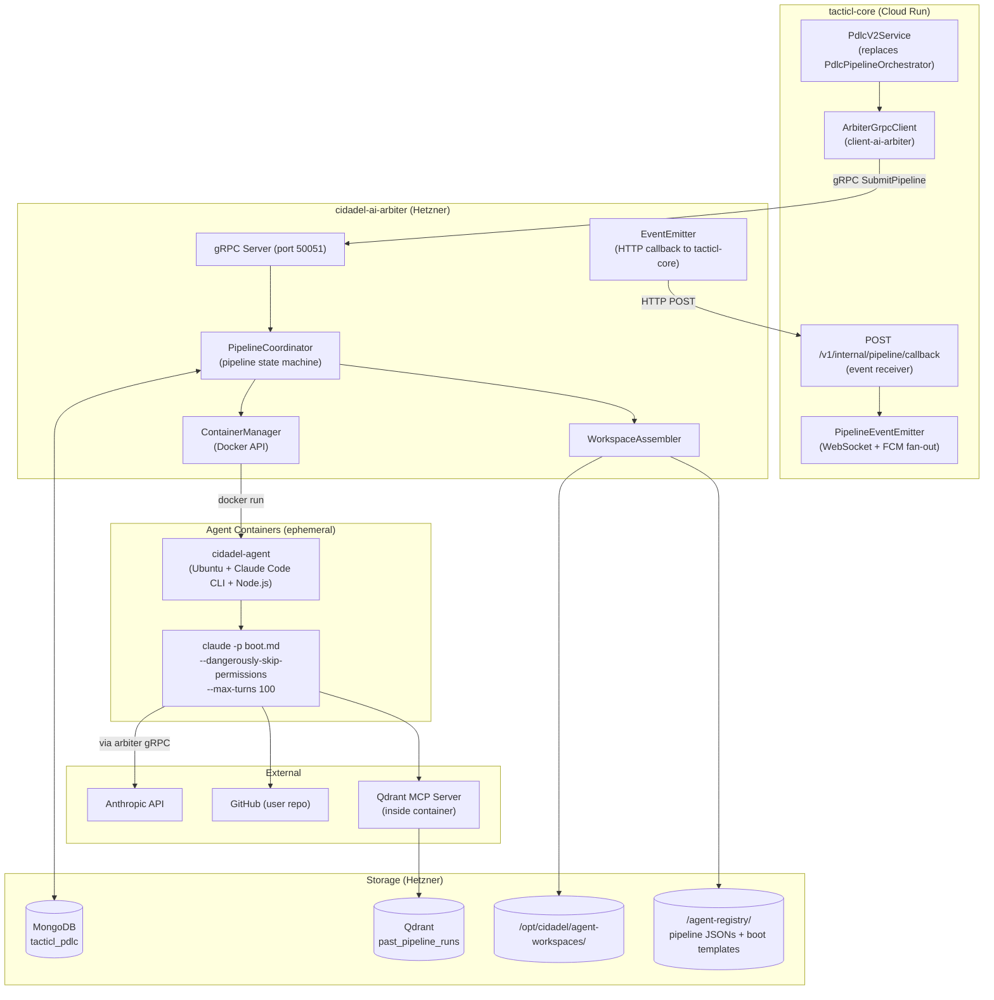
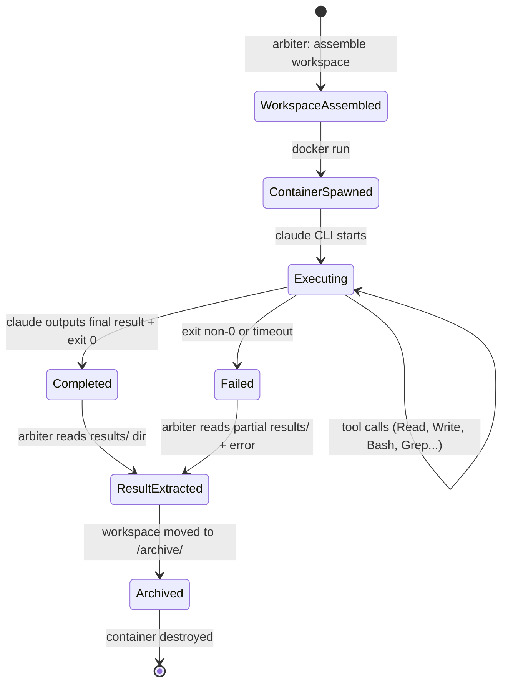
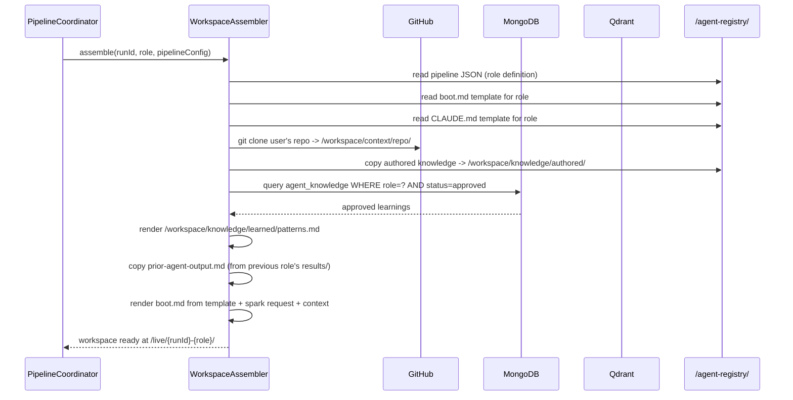
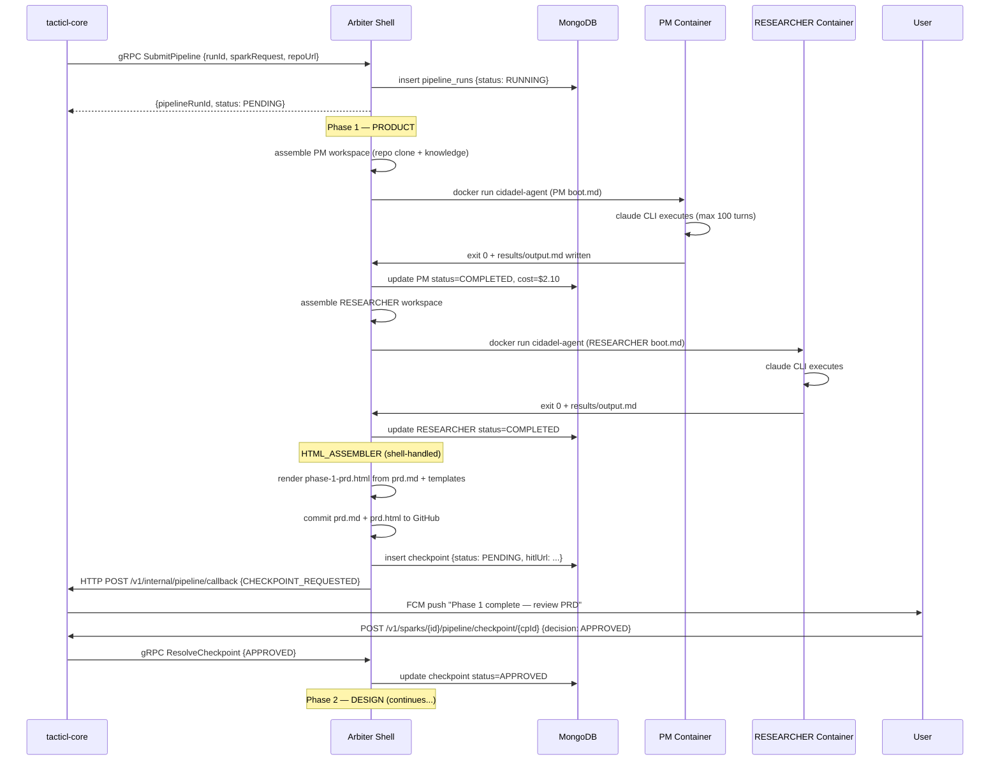
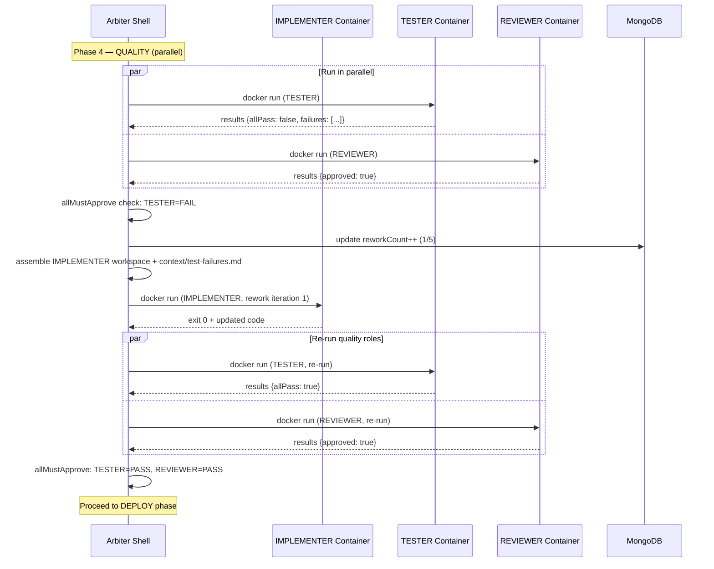

# Tacticl PDLC v2 — System Architecture Document

**Date:** 2026-04-11
**Version:** 1.0
**Status:** Draft
**Author:** Gabriel Jimenez
**Related docs:**
- [PDLC v2 PRD](2026-04-11-tacticl-pdlc-v2-prd.md)
- [System Architecture SAD](2026-04-12-tacticl-system-architecture-sad.md)
- [Arbiter gRPC Integration Design](2026-04-01-tacticl-arbiter-grpc-integration-design.md)

---

## 1. Overview

This document describes the internal architecture of Tacticl PDLC v2: the container-based execution engine, workspace assembly system, 4-layer knowledge system, gRPC protocol, MongoDB schema, Qdrant setup, pipeline registry format, and the v1-to-v2 migration path.

PDLC v2 is a complete replacement of the in-JVM v1 pipeline. Every design decision prioritizes output quality over speed or cost.

**What this document does NOT cover:** tacticl-core REST/WebSocket API (see System Architecture SAD), PDLC functional requirements (see PDLC v2 PRD), non-PDLC cloud agent execution.

---

## 2. Architecture Overview



---

## 3. Arbiter Shell

The `cidadel-ai-arbiter` is a Node.js gRPC service running on Hetzner. It has two concerns:

1. **Single-turn + agentic LLM routing** — handles `GenerateRequest` RPCs by routing to Anthropic/OpenAI/Grok via REST (unchanged from v1 arbiter design)
2. **PDLC pipeline coordination** — handles `SubmitPipeline` RPCs by orchestrating Docker containers through an entire multi-role pipeline

These two concerns are cleanly separated into different RPC handlers in the same gRPC server.

### 3.1 Pipeline State Machine

```
PENDING → RUNNING → PAUSED_AT_CHECKPOINT → RUNNING → COMPLETED
                                         ↘ REWORK_REQUESTED → RUNNING
PENDING → FAILED
RUNNING → CANCELLED
```

State is persisted to MongoDB `pipeline_runs` on every transition. In-memory `PipelineTracker` caches hot state for performance. On arbiter restart, hydrates from MongoDB and resumes all `RUNNING` pipelines.

### 3.2 Role Dispatch

The arbiter dispatches roles according to the pipeline's dependency graph (defined in the pipeline JSON registry). Roles can be:

- **Sequential:** role B only starts after role A completes
- **Parallel:** roles B, C, D start simultaneously (e.g., TEST phase: TESTER + REVIEWER + SECURITY_ANALYST run in parallel)
- **Fan-out → Fan-in:** IMPLEMENTER runs 3 parallel candidate containers; CRITIC sub-process selects the best; pipeline continues with winning candidate

### 3.3 Shell-Handled vs Container-Handled Agents

| Type | How it runs | Examples |
|------|------------|---------|
| Container-handled | Spawns `cidadel-agent` Docker container, runs Claude Code CLI | All 12 PDLC roles |
| Shell-handled | Runs directly in arbiter shell (Node.js), no LLM | HTML_ASSEMBLER, CRITIC (candidate selection via deterministic scoring), workspace cleanup |

---

## 4. Container Architecture

### 4.1 cidadel-agent Base Image

Single Docker image — agent identity comes from `boot.md` + `CLAUDE.md`, not the container type.

```dockerfile
FROM ubuntu:24.04
# Node.js 22 (required by Claude Code CLI)
RUN curl -fsSL https://deb.nodesource.com/setup_22.x | bash - && apt-get install -y nodejs
# Claude Code CLI
RUN npm install -g @anthropic-ai/claude-code
# Common dev tools (git, curl, jq, python3, java)
RUN apt-get install -y git curl jq python3 openjdk-21-jdk
# Non-root user
RUN useradd -m -s /bin/bash agent
USER agent
WORKDIR /workspace
```

Image is built once and cached. All role identity is injected at runtime via workspace bind mount.

### 4.2 Boot Protocol

When the arbiter spawns a container, it bind-mounts the pre-assembled workspace and runs:

```bash
docker run \
  --rm \
  --user agent \
  --memory=4g \
  --cpus=2 \
  -v /opt/cidadel/agent-workspaces/live/{runId}-{role}/:/workspace \
  -e ANTHROPIC_API_KEY=${apiKey} \
  -e PIPELINE_RUN_ID=${runId} \
  -e ROLE=${role} \
  cidadel-agent:latest \
  claude -p "$(cat /workspace/boot.md)" \
    --dangerously-skip-permissions \
    --max-turns 100 \
    --output-format stream-json \
    --model ${model}
```

Claude Code CLI reads `boot.md` as the initial prompt (role identity + instructions), uses `CLAUDE.md` for persistent settings, and executes against the workspace filesystem.

### 4.3 Resource Classes

| Class | CPU | Memory | Used by |
|-------|-----|--------|---------|
| `light` | 0.5 | 1Gi | PM, RESEARCHER, TECHNICAL_WRITER, RETRO_ANALYST |
| `medium` | 1.0 | 2Gi | ARCHITECT, DESIGNER, PLANNER, REVIEWER, SECURITY_ANALYST |
| `heavy` | 2.0 | 4Gi | IMPLEMENTER, TESTER, DEVOPS |

### 4.4 Container Lifecycle



---

## 5. Workspace Assembly

Each role's workspace is assembled by the arbiter `WorkspaceAssembler` before the container starts. The workspace is a directory structure that becomes the container's `/workspace`.

### 5.1 Directory Structure

```
/workspace/
├── CLAUDE.md                    <- persistent settings (tools, MCP servers, permissions)
├── boot.md                      <- role identity + task prompt (read by claude -p)
├── context/                     <- inputs this role reads
│   ├── repo/                    <- live git clone of user's repo (Layer 1)
│   ├── prior-agent-output.md    <- output from previous role(s) in pipeline
│   ├── checkpoint-feedback.md   <- user feedback (populated on rework)
│   └── spark-request.md         <- original user request
├── knowledge/                   <- what the agent knows
│   ├── authored/                <- Layer 2: curated knowledge files per role type
│   │   ├── codebase-conventions.md
│   │   ├── architecture-overview.md
│   │   └── role-specific-guide.md
│   └── learned/                 <- Layer 3: approved learnings from past runs
│       └── patterns.md
├── results/                     <- outputs this role writes (arbiter reads these after exit)
│   ├── output.md                <- role's primary output (what becomes Tier 2 artifact)
│   ├── metadata.json            <- {shouldRework, reworkReason, confidence, tokensUsed}
│   └── [role-specific files]    <- e.g., IMPLEMENTER writes code here
└── logs/
    └── execution.jsonl          <- structured logs written by Claude Code CLI
```

### 5.2 Assembly Sequence



---

## 6. Knowledge System (4 Layers)

Every agent workspace includes knowledge from up to 4 layers, assembled in priority order (later layers augment but do not contradict earlier ones).

### Layer 1 — Live Repo

**What:** Fresh `git clone` of the user's connected repo into `/workspace/context/repo/`

**Freshness:** Cloned on every role dispatch (not cached)

**Purpose:** Agents use native `Grep`, `Glob`, `Read`, `Bash` to explore the codebase. This is ground truth for the current state of the repo.

**Not used for:** Semantic similarity search — that is Qdrant's job.

### Layer 2 — Authored Knowledge

**What:** Curated markdown files from `/agent-registry/knowledge/{role-type}/`

**Written by:** Engineering team, updated manually

**Contents (per role):**
- `codebase-conventions.md` — naming, formatting, import patterns for this codebase
- `architecture-overview.md` — key services, modules, data flow (high-level, not full SAD)
- `role-specific-guide.md` — role-specific instructions (e.g., IMPLEMENTER: "always write Jackson 3 imports")

**Update cadence:** As needed, deployed via SSH sync to `/agent-registry/`

### Layer 3 — Learned Patterns

**What:** AI-approved learnings from past pipeline runs, rendered into `/workspace/knowledge/learned/patterns.md`

**Source:** MongoDB `agent_knowledge` collection (`status = approved`, `product = tacticl`, `agent_types includes currentRole`)

**Written by:** RETRO_ANALYST agent weekly, approved by engineering lead

**Example entry:**
```
Pattern: Jackson imports
This codebase uses Jackson 3 (tools.jackson.*). Never use Jackson 2 (com.fasterxml.jackson.databind.*).
Always import: tools.jackson.databind.json.JsonMapper (not ObjectMapper)
Approved: 2026-04-01
```

### Layer 4 — Past Runs (Vector Search)

**What:** Semantically similar past successful pipeline runs, retrieved from Qdrant

**How agents access it:** Qdrant MCP server is registered in `CLAUDE.md` under `[[mcpServers]]`. Agents call `find_similar_runs(query, top_k=5)` as a tool.

**What is indexed:** One vector per role per successful run. Content: role prompt + role output + outcome metadata. Embedding: Voyage-code-3 (1536 dimensions).

**When useful:** IMPLEMENTER finding that a similar auth flow was implemented 2 weeks ago and the approach worked. ARCHITECT recalling a past data model decision for a similar problem.

**Not a crutch:** Agents MUST still use Layer 1 (live repo grep) as primary source. Past runs are suggestions, not templates.

---

## 7. gRPC Contract

The full proto file lives in `cidadel-ai-arbiter/proto/arbiter.proto` and is mirrored in `cidadel-core` for Java stub generation.

### 7.1 Core RPCs

```protobuf
service ArbiterService {
  // Single-turn LLM call (existing)
  rpc Generate(GenerateRequest) returns (GenerateResponse);

  // Agentic multi-turn LLM call (existing)
  rpc GenerateAgentic(AgenticRequest) returns (AgenticResponse);

  // PDLC pipeline (new in v2)
  rpc SubmitPipeline(SubmitPipelineRequest) returns (SubmitPipelineResponse);
  rpc ResolveCheckpoint(ResolveCheckpointRequest) returns (ResolveCheckpointResponse);
  rpc GetPipelineStatus(GetPipelineStatusRequest) returns (PipelineStatusResponse);
  rpc StreamPipelineEvents(StreamEventsRequest) returns (stream PipelineEvent);
  rpc CancelPipeline(CancelPipelineRequest) returns (CancelPipelineResponse);
}
```

### 7.2 Key Messages

```protobuf
message SubmitPipelineRequest {
  string pipeline_run_id = 1;   // UUID, generated by tacticl-core
  string spark_id = 2;
  string user_id = 3;
  string playbook = 4;          // FULL_PDLC | BUG_FIX | SMALL_FEATURE | ...
  string spark_request = 5;     // original user text
  string repo_url = 6;          // github.com/user/repo
  string github_token = 7;      // per-user OAuth token (short-lived)
  repeated string skip_roles = 8; // roles to skip (user requested)
  PipelineCostConfig cost_config = 9;
  string callback_url = 10;     // tacticl-core endpoint for HTTP push events
}

message SubmitPipelineResponse {
  string pipeline_run_id = 1;
  PipelineStatus status = 2;    // PENDING initially
}

message ResolveCheckpointRequest {
  string pipeline_run_id = 1;
  string checkpoint_id = 2;
  CheckpointDecision decision = 3;  // APPROVED | REWORK | CANCEL
  string feedback = 4;              // user feedback text (populated if REWORK)
}

message PipelineEvent {
  string pipeline_run_id = 1;
  string event_type = 2;        // ROLE_STARTED | ROLE_COMPLETED | ROLE_REWORK |
                                //   CHECKPOINT_REQUESTED | PIPELINE_COMPLETED | PIPELINE_FAILED
  string role = 3;
  string phase = 4;
  google.protobuf.Timestamp timestamp = 5;
  string payload_json = 6;      // event-type-specific JSON blob
}
```

### 7.3 tacticl-core Integration Points

**New module:** `client/client-ai-arbiter` — Java gRPC client wrapping the proto stubs.

**Modified:** `business-agent/PdlcV2Service` — replaces `PdlcPipelineOrchestrator`. Calls `ArbiterGrpcClient.submitPipeline()` instead of running roles in-JVM.

**New endpoint:** `POST /v1/internal/pipeline/callback` — receives HTTP push events from arbiter (for events that do not fit the gRPC stream). This endpoint is internal-only — protected by VPC firewall rules (Hetzner IP range only).

**Event fan-out:** `PipelineEventEmitter` (unchanged interface) — receives events from both gRPC stream and HTTP callback, fans out to WebSocket clients + FCM push.

---

## 8. MongoDB Schema

Database: `tacticl_pdlc` on `hetzner-arbiter-01:27017`

### 8.1 `pipeline_runs`

One document per pipeline run. Source of truth for pipeline lifecycle.

```json
{
  "_id": "run-abc123",
  "sparkId": "spark-xyz789",
  "userId": "user-111",
  "playbook": "FULL_PDLC",
  "status": "RUNNING",
  "sparkRequest": "Add password reset flow to auth service...",
  "repoUrl": "github.com/user/myapp",
  "skipRoles": [],
  "costCeilingUsd": 100.0,
  "totalCostUsd": 12.47,
  "phases": {
    "PRODUCT": {
      "status": "COMPLETED",
      "startedAt": "2026-04-12T10:00:00Z",
      "completedAt": "2026-04-12T10:23:00Z",
      "roles": {
        "PM": { "status": "COMPLETED", "reworkCount": 0, "costUsd": 2.10 },
        "RESEARCHER": { "status": "COMPLETED", "reworkCount": 0, "costUsd": 1.85 }
      },
      "checkpointId": "cp-111",
      "checkpointStatus": "APPROVED"
    },
    "DESIGN": { "status": "RUNNING" }
  },
  "artifacts": {
    "phase1Prd": "github.com/user/myapp/tree/tacticl/run-abc123/phase-1-prd.md",
    "phase2Sad": null
  },
  "createdAt": "2026-04-12T10:00:00Z",
  "updatedAt": "2026-04-12T10:47:00Z"
}
```

### 8.2 `pipeline_events`

Append-only event log. Never updated, only inserted.

```json
{
  "_id": "evt-001",
  "pipelineRunId": "run-abc123",
  "eventType": "ROLE_COMPLETED",
  "role": "PM",
  "phase": "PRODUCT",
  "timestamp": "2026-04-12T10:18:00Z",
  "payload": {
    "reworkCount": 0,
    "costUsd": 2.10,
    "tokensIn": 4200,
    "tokensOut": 1800,
    "artifactPath": "phase-1-product-requirements.md"
  }
}
```

### 8.3 `agent_knowledge`

Learned patterns from the retro loop.

```json
{
  "_id": "know-001",
  "product": "tacticl",
  "agentTypes": ["IMPLEMENTER", "REVIEWER"],
  "title": "Jackson 3 imports",
  "body": "This codebase uses Jackson 3 (tools.jackson.*). Never use Jackson 2...",
  "status": "approved",
  "proposedBy": "RETRO_ANALYST",
  "proposedAt": "2026-04-06T02:00:00Z",
  "approvedBy": "gabriel",
  "approvedAt": "2026-04-07T09:30:00Z",
  "applicableSince": "run-abc100",
  "hitCount": 14
}
```

**Status lifecycle:** `proposed → approved → active | rejected | superseded`

### 8.4 `checkpoints`

```json
{
  "_id": "cp-111",
  "pipelineRunId": "run-abc123",
  "phase": "PRODUCT",
  "type": "PHASE_COMPLETE",
  "status": "PENDING",
  "artifactPaths": {
    "tier1": "phase-1-prd.md",
    "tier1Html": "phase-1-prd.html",
    "tier2": ["phase-1-product-requirements.md", "phase-1-research-summary.md"]
  },
  "hitlUrl": "https://api.tacticl.ai/v1/hitl/cp-111?token=abc...xyz",
  "createdAt": "2026-04-12T10:23:00Z",
  "resolvedAt": null,
  "decision": null,
  "feedback": null
}
```

---

## 9. Qdrant Setup

### 9.1 Collection: `past_pipeline_runs`

```json
{
  "name": "past_pipeline_runs",
  "vectors": {
    "size": 1536,
    "distance": "Cosine"
  },
  "payload_schema": {
    "pipeline_run_id": "keyword",
    "role": "keyword",
    "product": "keyword",
    "playbook": "keyword",
    "outcome": "keyword",
    "spark_category": "keyword",
    "indexed_at": "datetime"
  }
}
```

### 9.2 Indexing (RETRO_ANALYST, weekly)

For each successful pipeline run in the past 7 days:
1. For each completed role, concatenate: `role prompt + "\n\n" + role output`
2. Embed with Voyage-code-3 (1536-dim)
3. Upsert to Qdrant with payload: `{pipeline_run_id, role, product, playbook, outcome: "SUCCESS", spark_category}`

### 9.3 Query Pattern (inside agent containers)

Agents access Qdrant via the Qdrant MCP server registered in their `CLAUDE.md`:

```toml
[[mcpServers]]
name = "qdrant"
command = "npx"
args = ["-y", "qdrant-mcp-server"]
env = { QDRANT_URL = "http://hetzner-arbiter-01:6333", COLLECTION = "past_pipeline_runs" }
```

Tool available to agents: `find_similar_runs(query: string, top_k: number) → RunChunk[]`

---

## 10. Pipeline Registry

Pipeline definitions live in `/agent-registry/pipelines/` on Hetzner (synced from `tacticl-docs/pipelines/`). No code changes needed to add or modify a pipeline.

### 10.1 Pipeline JSON Format

```json
{
  "id": "FULL_PDLC",
  "displayName": "Full PDLC",
  "phases": [
    {
      "id": "PRODUCT",
      "displayName": "Product",
      "roles": [
        {
          "id": "PM",
          "type": "container",
          "model": "claude-opus-4-6",
          "maxTurns": 100,
          "resourceClass": "light",
          "bootTemplate": "boot/pm.md",
          "claudeMdTemplate": "claude-md/standard.md",
          "knowledgeFiles": ["knowledge/shared/codebase-conventions.md", "knowledge/pm/product-guide.md"],
          "checkpoint": false
        },
        {
          "id": "RESEARCHER",
          "type": "container",
          "model": "claude-sonnet-4-6",
          "maxTurns": 80,
          "resourceClass": "light",
          "bootTemplate": "boot/researcher.md",
          "claudeMdTemplate": "claude-md/standard.md",
          "knowledgeFiles": ["knowledge/researcher/research-guide.md"],
          "dependsOn": [],
          "checkpoint": false
        }
      ],
      "checkpoint": {
        "required": true,
        "tier1Template": "templates/phase-1-prd-hitl.html",
        "htmlAssembler": "shell"
      }
    },
    {
      "id": "DESIGN",
      "roles": [
        { "id": "ARCHITECT", "type": "container", "model": "claude-opus-4-6", "maxTurns": 100, "resourceClass": "medium" },
        { "id": "DESIGNER",  "type": "container", "model": "claude-sonnet-4-6", "maxTurns": 80, "resourceClass": "medium" },
        { "id": "PLANNER",   "type": "container", "model": "claude-sonnet-4-6", "maxTurns": 60, "resourceClass": "light", "dependsOn": ["ARCHITECT"] }
      ],
      "checkpoint": { "required": true, "tier1Template": "templates/phase-2-sad-hitl.html" }
    },
    {
      "id": "DEVELOPMENT",
      "roles": [
        {
          "id": "IMPLEMENTER",
          "type": "container",
          "candidateCount": 3,
          "criticType": "shell",
          "model": "claude-sonnet-4-6",
          "maxTurns": 100,
          "resourceClass": "heavy"
        }
      ],
      "checkpoint": { "required": false }
    },
    {
      "id": "QUALITY",
      "roles": [
        { "id": "TESTER",            "type": "container", "parallel": true, "model": "claude-sonnet-4-6", "resourceClass": "heavy" },
        { "id": "REVIEWER",          "type": "container", "parallel": true, "model": "claude-sonnet-4-6", "resourceClass": "medium" },
        { "id": "SECURITY_ANALYST",  "type": "container", "parallel": true, "model": "claude-opus-4-6",  "resourceClass": "medium" }
      ],
      "allMustApprove": true,
      "maxReworkIterations": 5,
      "checkpoint": { "required": false }
    },
    {
      "id": "DEPLOY",
      "roles": [
        { "id": "TECHNICAL_WRITER", "type": "container", "model": "claude-sonnet-4-6", "resourceClass": "light" },
        { "id": "DEVOPS",           "type": "container", "model": "claude-sonnet-4-6", "resourceClass": "heavy" }
      ],
      "checkpoint": { "required": true, "tier1Template": "templates/phase-5-deploy-hitl.html" }
    }
  ],
  "postPipeline": [
    { "id": "RETRO_ANALYST", "type": "container", "model": "claude-opus-4-6", "resourceClass": "light" }
  ]
}
```

---

## 11. Key Flows

### 11.1 Full PDLC Execution Sequence



### 11.2 Rework Loop



---

## 12. tacticl-core Changes

### 12.1 New Module: `client/client-ai-arbiter`

Java gRPC client. Wraps proto-generated stubs. Exposes:

```java
public class ArbiterGrpcClient {
    public SubmitPipelineResponse submitPipeline(SubmitPipelineRequest request);
    public void resolveCheckpoint(ResolveCheckpointRequest request);
    public PipelineStatusResponse getPipelineStatus(String pipelineRunId);
    public void streamPipelineEvents(String pipelineRunId, Consumer<PipelineEvent> handler);
}
```

### 12.2 Modified: `business-agent`

| Before | After |
|--------|-------|
| `PdlcPipelineOrchestrator` | `PdlcV2Service` (gRPC-backed) |
| `PipelineStateManager` (Firestore) | Removed — state lives in MongoDB (arbiter-side) |
| `PipelineEventEmitter` (Firestore+WS) | Updated — receives events from HTTP callback, fans out to WS+FCM |
| `ReworkTracker` | Removed — rework logic lives in arbiter shell |
| `PipelineCostManager` | Removed — cost tracked in MongoDB by arbiter |
| `PipelineRecoveryJob` | Removed — arbiter shell handles its own recovery |
| `PipelineWatchdog` | Removed — arbiter shell has role timeout logic |

### 12.3 New Endpoint: `POST /v1/internal/pipeline/callback`

Receives HTTP push events from arbiter for non-streaming delivery:

```java
@PostMapping("/v1/internal/pipeline/callback")
public ResponseEntity<Void> pipelineCallback(@RequestBody PipelineCallbackEvent event) {
    pipelineEventEmitter.onEvent(event);
    return ResponseEntity.ok().build();
}
```

This endpoint is internal-only — protected by Cloud Armor VPC firewall rules (Hetzner IP range only).

---

## 13. Migration from v1

### 13.1 Feature Flag

Config property: `pdlc.v2.enabled` (default: `false`)

When `false`: all PDLC sparks route to `PdlcPipelineOrchestrator` (v1, in-JVM).
When `true`: all new PDLC sparks route to `PdlcV2Service` (v2, arbiter gRPC). Running v1 pipelines are allowed to complete.

### 13.2 Migration Steps

1. Deploy arbiter v2 to Hetzner with pipeline coordinator
2. Deploy tacticl-core with `client-ai-arbiter` + `PdlcV2Service` (flag still false)
3. Run smoke test: submit one FULL_PDLC pipeline via v2 in QA environment, verify end-to-end
4. Enable flag in QA: `pdlc.v2.enabled=true`
5. Run acceptance tests against QA
6. Enable flag in prod during low-traffic window
7. Monitor for 48 hours — rollback by flipping flag back
8. Once stable: delete v1 classes, migrate Firestore `pipeline_runs/` data to MongoDB, remove Firestore collections

### 13.3 Data Migration

Firestore `pipeline_runs/`, `pipeline_events/`, `pipeline_artifacts/` → MongoDB.

Migration script: `scripts/migrate-pdlc-firestore-to-mongo.js` (Node.js, runs once against prod Firestore + prod MongoDB).

After migration: Firestore collections are soft-deleted (documents marked `migrated: true`). Hard delete after 30-day rollback window.

---

## 14. Operational Concerns

### 14.1 Container Cleanup

Containers use `--rm` flag — auto-destroyed on exit. Workspace is moved to `/archive/` by arbiter before container is released.

### 14.2 Workspace Archival

After container exit:
```
/opt/cidadel/agent-workspaces/live/{runId}-{role}/
  -> /opt/cidadel/agent-workspaces/archive/{YYYY-MM-DD}/{runId}-{role}/
```
Archive retention: 30 days. Cron job: `find /archive -mtime +30 -exec rm -rf {} \;` daily at 3 AM.

### 14.3 Arbiter Restart Recovery

On startup, arbiter queries MongoDB for all `pipeline_runs` with `status = RUNNING`. For each:
1. Identify last completed role (from `pipeline_events`)
2. Re-dispatch next role with workspace re-assembled from archive
3. Emit `PIPELINE_RESUMED` event

### 14.4 Cost Tracking

Per-role cost is extracted from the arbiter's LLM response metadata (tokens_in, tokens_out × model pricing). Written to MongoDB `pipeline_runs.phases.{phase}.roles.{role}.costUsd` on role completion. Running total in `pipeline_runs.totalCostUsd`. Pipeline pauses if total exceeds `costCeilingUsd` — emits `COST_CEILING_REACHED` checkpoint event.
