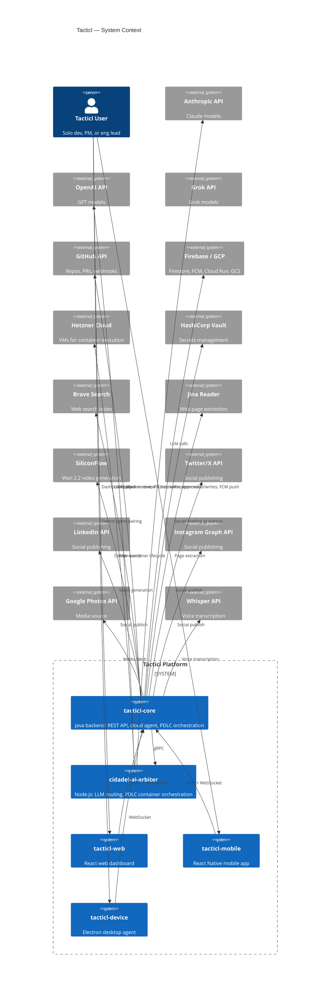
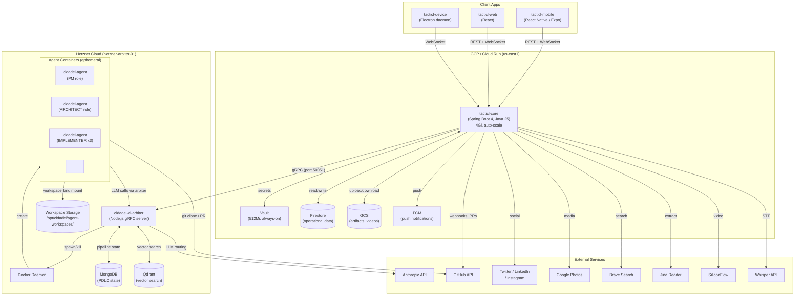
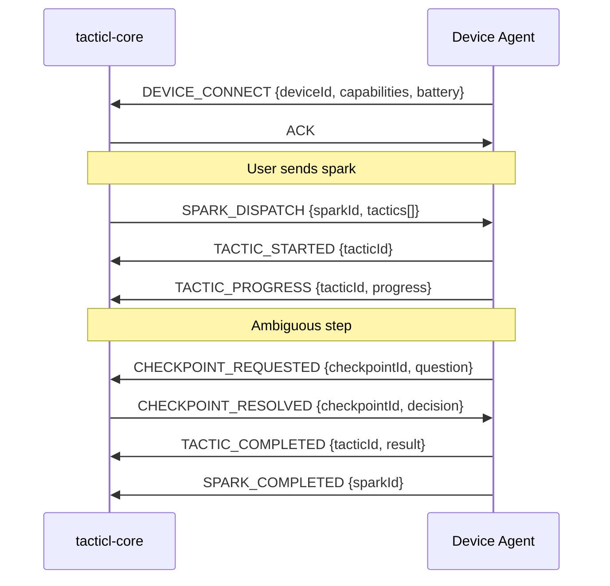
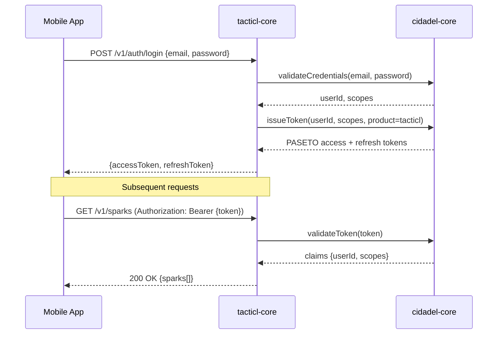
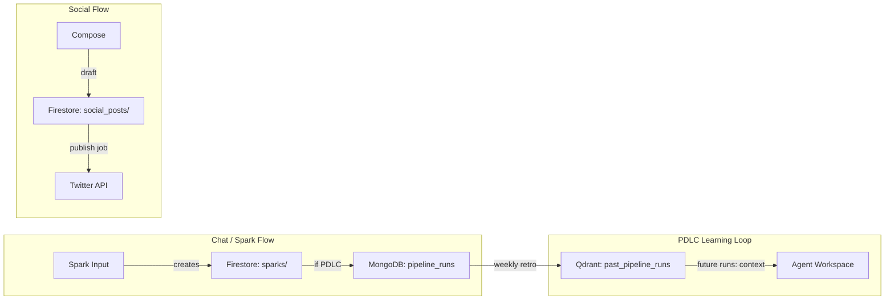
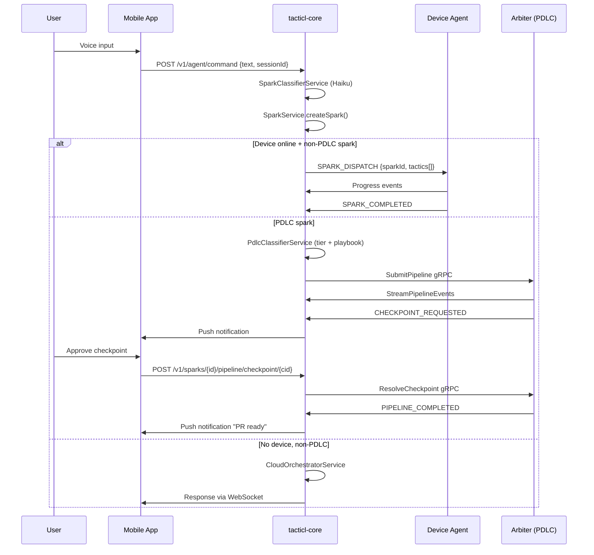
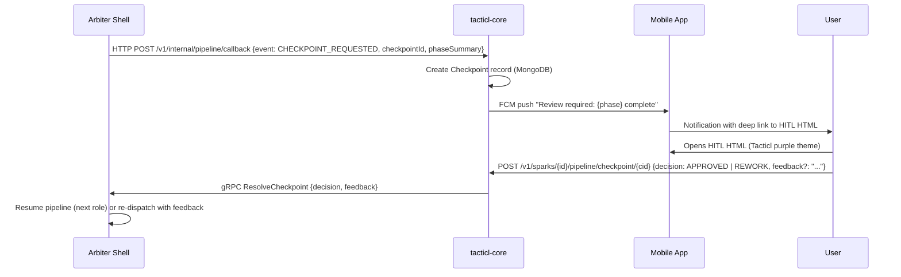

# Tacticl — System Architecture Document

**Date:** 2026-04-12
**Version:** 1.0
**Status:** Draft
**Author:** Gabriel Jimenez
**Related docs:**
- [Product PRD](2026-04-12-tacticl-product-prd.md)
- [PDLC v2 SAD](2026-04-11-tacticl-pdlc-v2-sad.md)

---

## 1. Overview

This document describes the full system architecture of Tacticl: all repositories, services, infrastructure components, and the interactions between them. It covers the Cloud Run control plane, the Hetzner execution plane, all client applications, and the shared CIDADEL platform infrastructure.

For PDLC pipeline internals (container lifecycle, workspace assembly, arbiter shell), see the [PDLC v2 SAD](2026-04-11-tacticl-pdlc-v2-sad.md).

---

## 2. Repository Map

| Repo | Language | Role | Deploy target |
|------|----------|------|---------------|
| `tacticl-core` | Java 25 / Spring Boot 4 | Backend API, cloud agent, PDLC orchestration | Cloud Run (GCP `tacticl`) |
| `tacticl-web` | React / TypeScript | Web dashboard (Spark Control, Chat) | CDN / Firebase Hosting |
| `tacticl-mobile` | React Native / Expo | Mobile app (Chat, Push-to-talk, Device agent) | App Store / Google Play |
| `tacticl-device` | Electron | Desktop agent daemon | macOS / Windows / Linux local |
| `cidadel-core` | Java 25 / Gradle | Shared infrastructure library | GitHub Packages (Maven) |
| `cidadel-ai-arbiter` | Node.js | gRPC LLM routing + PDLC container orchestrator | Hetzner (CPX31+) |
| `tacticl-docs` | Markdown / HTML | Architecture docs, PDLC templates, design system | GitHub Pages / local viewer |

---

## 3. System Context Diagram

Full system boundary showing Tacticl and all external dependencies.



---

## 4. Deployment Topology

### 4.1 GCP / Cloud Run (Control Plane)

All user-facing API traffic runs here.

| Service | Image | Memory | Instances | Region |
|---------|-------|--------|-----------|--------|
| `tacticl-core` (prod) | `tacticl-core:prod` | 4Gi | 1–10 (auto) | us-east1 |
| `tacticl-core` (qa) | `tacticl-core:qa` | 2Gi | 1–3 (auto) | us-east1 |
| `strategiz-vault` | `vault:latest` | 512Mi | 1 (always-on) | us-east1 |

**Firestore** (project `tacticl`, us-east1): all operational data — sparks, tactics, social posts, device commands, social integrations, checkpoints, user settings, agent memory.

**GCS** (project `tacticl`): pipeline workspace archives, generated videos, uploaded media.

**Firebase Cloud Messaging (FCM)**: push notifications to mobile (iOS + Android).

### 4.2 Hetzner (Execution Plane)

PDLC pipeline container execution runs here.

| Host | Spec | Role |
|------|------|------|
| `hetzner-arbiter-01` | CPX31 (4 vCPU, 8GB RAM) | arbiter shell + Docker daemon + MongoDB + Qdrant |
| `hetzner-arbiter-02` (future) | CPX51 (20 vCPU, 32GB RAM) | overflow container execution |

**MongoDB** (on hetzner-arbiter-01, `port 27017`): PDLC pipeline state — `pipeline_runs`, `pipeline_events`, `pipeline_artifacts`, `agent_knowledge`, `checkpoints`.

**Qdrant** (on hetzner-arbiter-01, `port 6333`): vector search over past pipeline runs — collection `past_pipeline_runs`, Voyage-code-3 embeddings.

**Workspace storage** (`/opt/cidadel/agent-workspaces/`): live workspace bind mounts (per pipeline run) + archive directory (30-day retention).

### 4.3 Deployment Topology Diagram

> **Note for HTML rendering:** The below is described as a Mermaid diagram for the `.md` source. The HTML HITL surface for this document uses a draw.io SVG that renders the full topology with color-coded zones (GCP = blue, Hetzner = orange, External = grey).



---

## 5. Service Interactions

### 5.1 tacticl-core ↔ cidadel-ai-arbiter (gRPC)

All PDLC pipeline execution is coordinated via gRPC. tacticl-core is the control plane; arbiter is the execution plane.

**Protocol:** gRPC over mTLS (internal Hetzner network). Port 50051.

**Key RPCs:**

| RPC | Direction | Purpose |
|-----|-----------|---------|
| `SubmitPipeline` | core → arbiter | Start a new PDLC pipeline run |
| `ResolveCheckpoint` | core → arbiter | Relay user's approve/reject/feedback |
| `GetPipelineStatus` | core → arbiter | Poll current pipeline state (for recovery) |
| `StreamPipelineEvents` | arbiter → core | Push events as pipeline progresses |

tacticl-core also receives callbacks from arbiter via HTTP POST to `/v1/internal/pipeline/callback` (for non-streaming event delivery).

### 5.2 tacticl-core ↔ Clients (REST + WebSocket)

**REST:** `https://api.tacticl.ai/v1/` — all endpoints use `/v1/` prefix.

**WebSocket:** `/ws/sparks/{userId}` — real-time spark progress events, tactic updates, checkpoint notifications, device status changes.

**Auth:** PASETO v4.local token in `Authorization: Bearer` header (REST) or initial handshake (WebSocket).

### 5.3 tacticl-core ↔ Devices (WebSocket)

Devices maintain a persistent WebSocket connection to tacticl-core. Commands are dispatched as JSON messages. Device sends back progress events, checkpoint requests, and completion signals.



---

## 6. Auth Architecture

### 6.1 PASETO Tokens

Tacticl uses PASETO v4.local (symmetric encryption) for all auth. Tokens are issued by `cidadel-core`'s `framework-token-issuance` library.

**Token lifetime:** 15 minutes (access) + 30 days (refresh)

**Claims:** `userId`, `scopes[]`, `product` (`tacticl`), `deviceId` (optional), `issuedAt`, `expiresAt`

**Cross-product SSO:** Shared symmetric key between Tacticl and Strategiz — a Strategiz token is valid in Tacticl (same cidadel infrastructure).

### 6.2 Auth Flow



### 6.3 Scope System

| Scope | Controls |
|-------|---------|
| `sparks:read` | Read spark history |
| `sparks:write` | Create sparks (chat commands) |
| `social:read` | Read social posts and connections |
| `social:write` | Create / schedule posts |
| `devices:manage` | Pair / unpair devices |
| `pipeline:read` | Read pipeline status |
| `pipeline:write` | Submit pipelines, resolve checkpoints |
| `console:admin` | Admin endpoints (role overrides, migrations) |

---

## 7. Data Architecture

### 7.1 Firestore (Operational Data)

Project: `tacticl`, region: `us-east1`

**Hybrid schema (Approach B):** User-owned data nested under `tacticl_users/{userId}/`, operational data stays flat.

**Nested under user** (subcollections):
- `tacticl_users/{userId}/devices/` — registered devices + settings
- `tacticl_users/{userId}/social_integrations/` — OAuth tokens per platform
- `tacticl_users/{userId}/repo_grants/` — connected GitHub repos
- `tacticl_users/{userId}/agent_tokens/` — API tokens for agent access
- `tacticl_users/{userId}/agent_memory/` — persistent cross-session memory

**Flat collections** (operational):
- `sparks/` — all user sparks (lifetime entity)
- `tactics/` — device-side decomposition of sparks
- `execution_logs/` — LLM calls, tool invocations, token usage
- `checkpoints/` — user decision gates (v1 pipeline)
- `social_posts/` — post state machine
- `device_commands/` — dispatched commands with sparkId ref
- `action_confirmations/` — pending Tier 1/2 action approvals
- `agent_reminders/` — scheduled reminders
- `agent_audit_log/` — all agent commands (immutable)

### 7.2 MongoDB (PDLC Pipeline State)

Host: `hetzner-arbiter-01:27017`, database: `tacticl_pdlc`

| Collection | Purpose |
|-----------|---------|
| `pipeline_runs` | Full pipeline lifecycle — one doc per run, all state transitions |
| `pipeline_events` | Append-only event log — role start/complete/rework/checkpoint events |
| `pipeline_artifacts` | Artifact metadata + content refs (GitHub path) |
| `agent_knowledge` | Learned patterns with status lifecycle (proposed → approved → active) |
| `checkpoints` | v2 checkpoint records (replaces Firestore `checkpoints/` for PDLC) |

### 7.3 Qdrant (Vector Search)

Host: `hetzner-arbiter-01:6333`

**Collection:** `past_pipeline_runs`
**Embedding model:** Voyage-code-3 (1536 dimensions)
**Indexed content:** role prompt + role output + outcome metadata (one vector per role per run)
**Query:** agents call `find_similar_runs(query, top_k=5)` via Qdrant MCP server inside containers
**Population:** RETRO_ANALYST indexes successful runs weekly

### 7.4 Data Flow by Feature



---

## 8. Key Flows

### 8.1 Full Spark Lifecycle



### 8.2 PDLC Checkpoint Flow



---

## 9. Infrastructure

### 9.1 Hetzner Node Setup

```
hetzner-arbiter-01 (CPX31: 4 vCPU, 8GB RAM, 160GB NVMe)
├── cidadel-ai-arbiter (Node.js, port 50051 gRPC + 3000 HTTP)
├── Docker daemon (container execution)
├── MongoDB 7.x (port 27017, auth enabled)
├── Qdrant 1.x (port 6333)
└── /opt/cidadel/agent-workspaces/
    ├── live/         <- active pipeline workspaces (bind-mounted into containers)
    └── archive/      <- completed pipeline workspaces (30-day retention)
```

### 9.2 Cloud Run Services

Both services deploy to `us-east1` with public access.

**tacticl-core (prod):** `gcr.io/tacticl/tacticl-core:prod`, 4Gi RAM, min 1 / max 10 instances
**tacticl-core (qa):** `gcr.io/tacticl/tacticl-core:qa`, 2Gi RAM, min 1 / max 3 instances

**Build:** `gcloud builds submit --config deployment/cloudbuild/cloudbuild-prod.yaml .`

### 9.3 Vault

Deployed on Cloud Run (`strategiz-vault-*`). Both Tacticl and Strategiz share one Vault cluster. Contexts:
- `tacticl` — tacticl-specific secrets (brave-search, jina, google, siliconflow, github-webhook)
- `strategiz` — shared LLM API keys (anthropic, openai, grok)

---

## 10. External Dependencies

| Service | Purpose | Auth | Cost model |
|---------|---------|------|-----------|
| Anthropic API | LLM (Claude Haiku/Sonnet/Opus) | API key (Vault: `strategiz/anthropic`) | Per token |
| OpenAI API | LLM (GPT-4o) | API key (Vault: `strategiz/openai`) | Per token |
| Grok API | LLM (Grok models) | API key (Vault: `strategiz/grok`) | Per token |
| Whisper API | Voice transcription | OpenAI key | Per minute |
| GitHub API | Webhooks, repo access, PR creation | OAuth per user | Free tier sufficient |
| Firebase / GCP | Firestore, FCM, Cloud Run, GCS | Service account | Pay-per-use |
| Hetzner Cloud | VM execution (PDLC containers) | API key | ~€15/mo per CPX31 |
| Vault (Cloud Run) | Secrets management | VAULT_TOKEN | Included with Hetzner plan |
| Brave Search | Web search | API key (Vault: `tacticl/brave-search`) | $3/1K queries, 2K free/mo |
| Jina Reader | Web extraction | API key (Vault: `tacticl/jina`) | 10M free tokens/mo |
| SiliconFlow | Wan 2.2 video generation | API key (Vault: `tacticl/siliconflow`) | ~$0.21/video |
| Twitter/X API | Social publish | OAuth per user | Paid tier required |
| LinkedIn API | Social publish | OAuth per user | Free (rate limited) |
| Instagram Graph API | Social publish | OAuth per user | Free (rate limited) |
| Google Photos API | Media source | OAuth per user | Free (read-only) |
