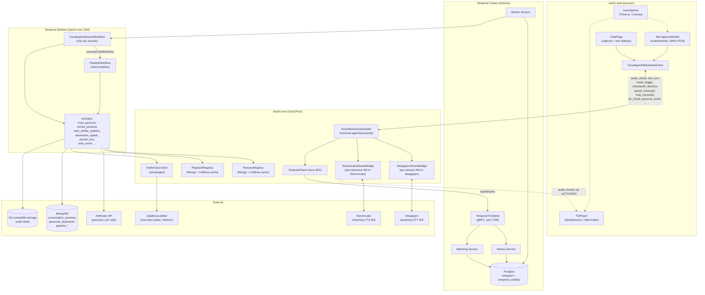

# Cloud Agent Orchestrator — System Architecture Document

**Date:** 2026-05-25
**Version:** 1.0
**Status:** Draft
**Author:** Gabriel Jimenez
**Companion PRD:** [Cloud Agent Orchestrator PRD](2026-05-25-cloud-agent-orchestrator-prd.md)
**Supersedes:** [Tacticl PDLC v2 SAD (2026-04-11)](2026-04-11-tacticl-pdlc-v2-sad.md)

---

## 1. Scope

This document defines:

- The Temporal workflow + activity model for `CloudAgentSessionWorkflow` and child `PipelineWorkflow`
- The voice plane: Deepgram streaming STT, ElevenLabs streaming TTS, WebSocket protocol
- The persona registry and routing logic
- The data-driven playbook registry
- The voice sphere UI architecture in tacticl-web
- MongoDB schema additions, Temporal cluster topology
- Migration path from current PDLC v2 (Arbiter-backed) to the Cloud Agent Orchestrator

This document does **not** redefine the Arbiter execution plane, the 4-layer knowledge injection inside containers, or the gRPC protocol between tacticl-core and Arbiter. Those remain as specified in [PDLC v2 SAD §3–§7](2026-04-11-tacticl-pdlc-v2-sad.md) and [Arbiter gRPC Integration Design](2026-04-01-tacticl-arbiter-grpc-integration-design.md).

### 1.1 Scope reminder (per PRD §1.5)

The Cloud Agent Orchestrator is a **conversation brain**, not an execution engine. The workflow:
- **Owns**: turn loop, persona selection, voice plane state, conversation transcript
- **Does not own**: pipeline execution (Arbiter), cloud skill execution (`CloudOrchestratorService`), device-side execution (device daemons), LLM provider routing

Persona tool calls translate to downstream handoffs:
- `start_pipeline` → spawn `PipelineWorkflow` (child) → Arbiter
- `start_cloud_skill` → activity calling existing `CloudOrchestratorService`
- `dispatch_to_device` → signal existing device WebSocket dispatch

A **Device Agent Orchestrator** is anticipated as a sibling system (runs on user's device, mirrors the conversation model with local STT/TTS). Out of scope for this SAD but informs interface design: keep workflow signals/queries provider-neutral and persistence-neutral so a device implementation can adopt a compatible contract.

---

## 2. Architecture Overview



### 2.1 Plane Separation

| Plane | What it does | Where it runs |
|-------|--------------|---------------|
| **UI plane** | Sphere, mic capture, TTS playback, captions, text fallback | Browser (tacticl-web) |
| **Edge plane** | WebSocket termination, bridges to Deepgram/ElevenLabs, signal dispatch to Temporal | tacticl-core (Cloud Run) |
| **Orchestration plane** | Durable workflow state, persona selection, turn loop | Temporal cluster + tacticl-core workers (Hetzner-co-located workers eventually; v1 runs workers inside the Cloud Run JVM) |
| **Execution plane** | Pipeline activities — Arbiter dispatch, container runs, code generation | Arbiter (Hetzner) — unchanged from PDLC v2 |
| **Persistence plane** | Mongo (state, transcripts, registries), Postgres (Temporal), S3 (audio) | Hetzner |

### 2.2 Why Temporal Owns the Turn Loop (Not Spring)

A conversational turn is `transcript → persona-route → LLM call → TTS → persist → emit`. Five activities, one of which (LLM) can take 1-30 seconds, another of which (TTS) streams chunks. Doing this in Spring `@Async` means:

- No durable state. JVM restart mid-turn loses the in-flight turn.
- Hand-rolled retry/timeout logic per step.
- No first-class signal handling for user interrupts (barge-in) — would need ad-hoc cancellation tokens.
- Cross-turn state in Mongo means every turn does multiple round-trips.

Temporal gives us:
- Durable workflow state (the conversation history *is* the workflow state, queryable via `@QueryMethod`).
- First-class signals (`onUserTranscript`, `onUserText`, `onCheckpointDecision`, `onCancel`, `onModeChange`) — exactly what barge-in needs.
- Per-activity retry policies and timeouts.
- Child workflows for pipelines — a pipeline is no longer a sibling state machine but a structured child with bidirectional signaling.

---

## 3. Temporal Topology

### 3.1 Cluster

- **Self-hosted Temporal**, Postgres-backed.
- **Postgres**: managed instance on Hetzner (separate from arbiter/tacticl Mongo — Temporal needs its own DB).
- **Cluster services**: frontend, history, matching, worker — all in Temporal's own service deployment (Docker Compose or k3s). Single-host v1; HA later.
- **Co-location**: same Hetzner host as Arbiter to minimize hop latency between workflow → arbiter activity. v1 acceptable trade-off: noisy-neighbor risk vs. ~5-15ms shaved off pipeline submissions.
- **Namespace**: `tacticl-prod`; separate `tacticl-qa` for the QA environment.
- **Retention**: workflow history retained 90 days (covers post-mortem window for any pipeline).
- **Visibility**: SQL visibility on the same Postgres for v1; advanced visibility (Elasticsearch) only if needed.

### 3.2 Workers

- Workers are **Spring beans inside the tacticl-core JVM** for v1. The `@WorkflowMethod`/`@ActivityMethod` Java SDK lets us co-locate with our existing services (Mongo, Anthropic, Arbiter clients).
- One **task queue per workflow type**: `cloud-agent-session-tq`, `pipeline-tq`, `voice-activity-tq` (dedicated for low-latency activities like `elevenlabs_speak`).
- Worker scaling: tied to Cloud Run instance count. Future: extract workers into a dedicated `worker-cloud-agent` Cloud Run service so HTTP capacity and workflow capacity scale independently.

### 3.3 Workflows

#### 3.3.1 `CloudAgentSessionWorkflow`

One workflow instance per `ConversationSession`. A user can have **multiple sessions concurrently** (web tab A, web tab B, mobile app, Telegram) — each is its own workflow instance. Sessions are **conversational channels for the user**, not the owners of pipelines.

Sessions are relatively short-lived (hours to a few days of active engagement). On session abandonment (24h idle), workflow self-completes. **Pipelines outlive sessions** — see §3.6 for the multi-session, user-scoped pipeline model.

```java
@WorkflowInterface
public interface CloudAgentSessionWorkflow {

  @WorkflowMethod
  void run(SessionStartInput input);

  // Signals — user input + control
  @SignalMethod void onUserTranscript(TranscriptSignal s);   // final transcript from Deepgram
  @SignalMethod void onUserText(TextSignal s);               // typed message (TEXT_ONLY mode)
  @SignalMethod void onCheckpointDecision(CheckpointDecisionSignal s);
  @SignalMethod void onModeChange(ModeChangeSignal s);       // voice/text/mute
  @SignalMethod void onBargeIn(BargeInSignal s);             // user started speaking during TTS
  @SignalMethod void onCancel(CancelSignal s);

  // Queries — UI bootstrap / observability
  @QueryMethod SessionState currentState();
  @QueryMethod List<Turn> recentTurns(int limit);
  @QueryMethod Optional<String> activePersonaId();
}
```

**Internal state held in the workflow:**
- `sessionId`, `userId`, `mode` (VOICE_ACTIVE / VOICE_PTT / TEXT_ONLY / MUTED)
- `state` (IDLE / ENGAGED / GATHERING / PROPOSING / CONFIRMED / PIPELINE_ACTIVE / PIPELINE_BLOCKED / COMPLETED / CANCELLED)
- `turns` (compact append-only list; full content lives in Mongo)
- `sessionStartedPipelineIds: Set<String>` — pipelines this session kicked off (for transcript linkage; NOT the source of truth for "what's running for this user" — that's a Mongo query, see §3.6 and §3.7)
- `focusedPipelineId: Optional<String>` — the pipeline the conversation is currently engaging with. Set when user explicitly references one or when one starts; cleared when user shifts topic. Used by PM persona to default the `pipelineRunId` arg on skills when unambiguous.
- `pendingCheckpoint: Optional<CheckpointRef>` — set when a pipeline raises a checkpoint and routing prioritizes Product Manager + `mediate_pipeline_checkpoint`. A user may have multiple checkpoints across pipelines — this field holds the one being actively engaged with, others are in Mongo.
- `costAccumulator` (LLM + STT + TTS dollars)
- `seenTurnIds: LinkedHashSet<String>` (signal dedup — see §3.3.1.x)

**Turn loop** (simplified):
1. Wait for `onUserTranscript` or `onUserText` signal.
2. Call `personaRouter.route(...)` — pure function, no activity, no LLM (see §7). Returns either a persona id or a control action.
3. **Build invocation context** — load the user's current in-flight pipelines via `LoadUserPipelinesActivity` (queries Mongo `pipeline_runs` by userId where status ∈ {RUNNING, BLOCKED}). Pass the list to the persona so it can name pipelines naturally and disambiguate.
4. Run `invokePersona` activity → returns `PersonaResponse` (text + optional tool calls).
5. If `mode` is voice → fan response chunks to `elevenlabsSpeak` activity (see §5.3).
6. Persist turn via `persistTurn` activity.
7. Emit event via `emitTurnEvent` activity.
8. Handle tool calls:
   - `start_pipeline(sparkInput, playbook?)` → `Workflow.executeChildWorkflow(PipelineWorkflow.class, ...)` async (does NOT block). Records the new pipelineRunId in `sessionStartedPipelineIds` and sets `focusedPipelineId`. State transitions to `PIPELINE_ACTIVE` if not already there.
   - `propose_implementation` → state `GATHERING → PROPOSING`.
   - `ask_clarification` → no-op (text/audio already delivered).
   - `mediate_pipeline_checkpoint(pipelineRunId, userResponse)` → activity parses response, signals the target `PipelineWorkflow` via `workflowClient.newWorkflowStub(PipelineWorkflow.class, "pipeline-" + pipelineRunId).onCheckpointResolved(...)`. **The target pipeline may have been created by a DIFFERENT session** — routing by workflowId works regardless.
   - `summarize_pipeline_progress(pipelineRunId)` → activity reads `PipelineRun` + recent events from Mongo (cross-session safe). Returns structured summary the persona narrates.
   - `cancel_pipeline(pipelineRunId)` → signals target pipeline's `onCancel`. Removes from `sessionStartedPipelineIds` if present.
9. State stays `PIPELINE_ACTIVE` as long as user has any in-flight pipeline (across all their sessions, per Mongo query). Loop.

**Barge-in**: `onBargeIn` signal cancels in-flight `elevenlabsSpeak` activity via `Activity.heartbeat` cancellation. The current persona response is marked `INTERRUPTED` in the turn record.

#### 3.3.1.x Signal idempotency

Temporal signals fire each time they're sent — not naturally idempotent. Page reloads, double-tapped send buttons, and mobile network retries can deliver the same `onUserText` or `onUserTranscript` twice. Without dedup, this means duplicate assistant turns and duplicate cost.

**Client side**: every user-initiated signal payload (`TranscriptSignal`, `TextSignal`, `CheckpointDecisionSignal`) carries a client-generated UUIDv4 `turnId`. The browser/mobile client generates it before send and persists it in `sessionStorage` keyed by session — so a page reload doesn't generate a fresh id for the same intent.

**Workflow side**: the workflow holds a `LinkedHashSet<String> seenTurnIds` of the last 50 ids. On signal receipt:

```java
@SignalMethod
public void onUserText(TextSignal s) {
  if (seenTurnIds.contains(s.turnId())) {
    log.info("dropping duplicate signal {} for session {}", s.turnId(), sessionId);
    return;                              // silent drop
  }
  seenTurnIds.add(s.turnId());
  if (seenTurnIds.size() > 50) {
    seenTurnIds.removeFirst();          // bounded
  }
  pendingUserTurn = s;
  Workflow.notifyAll();                  // wake the turn loop
}
```

The same dedup applies to `onUserTranscript`, `onCheckpointDecision`, `onBargeIn`, and `onCancel`. Mode change signals are not deduped (they're idempotent by nature — setting mode=VOICE twice is fine).

Signal idempotency keys are surfaced in observability — a counter `cloud_agent.duplicate_signals_dropped_total` ticks when a dedup hit occurs. Nonzero is expected (especially on flaky mobile networks); a sustained high rate indicates a client bug.

#### 3.3.2 `PipelineWorkflow` (independent child workflow)

One per spark execution. Replaces today's `PdlcV2Service` orchestration logic.

**Lifetime independent of any session.** Started as a child of a `CloudAgentSessionWorkflow` (parent-child link captured for cleanup/cancellation propagation), but the workflow itself runs autonomously. The originating session can complete (24h idle), come back, or be replaced by a different session on a different device — the pipeline workflow keeps running. Signals are routed by `workflowId = "pipeline-{sparkId}"`, NOT by parent traversal.

```java
@WorkflowInterface
public interface PipelineWorkflow {
  @WorkflowMethod
  PipelineResult run(PipelineStartInput input);

  // Signals — routed by workflowId; callable from any session, any device
  @SignalMethod void onArbiterCallback(ArbiterCallbackSignal s);
  @SignalMethod void onCheckpointResolved(CheckpointResolutionSignal s);
  @SignalMethod void onCancel(CancelSignal s);

  @QueryMethod PipelineState currentState();
}
```

**Workflow options:**

```java
WorkflowOptions.newBuilder()
    .setWorkflowId("pipeline-" + sparkId)
    .setTaskQueue(PIPELINE_TQ)
    .setWorkflowExecutionTimeout(Duration.ofDays(7))      // outer cap; complex FULL_PDLC may take days incl. HITL waits
    .setWorkflowRunTimeout(Duration.ofDays(7))
    .setWorkflowTaskTimeout(Duration.ofSeconds(30))
    .setRetryOptions(RetryOptions.newBuilder()
        .setInitialInterval(Duration.ofSeconds(10))
        .setMaximumAttempts(1)                            // pipelines retry within themselves, not at workflow level
        .build())
    .setParentClosePolicy(ParentClosePolicy.ABANDON)      // CRITICAL: parent session closing does NOT terminate the pipeline
    .build();
```

`ParentClosePolicy.ABANDON` is the key — it severs the parent-close cascade so pipelines truly outlive their originating session. Cleanup is explicit (the user cancels, or the pipeline completes, or it hits the 7d cap).

**Checkpoint routing — signals come from ANY session:**

```java
// In CloudAgentSessionWorkflow (Session 2, possibly different from the one that started the pipeline):
@SignalMethod
public void onCheckpointDecision(CheckpointDecisionSignal s) {
  // ... idempotency check ...
  // Route to the target pipeline by workflowId
  String targetWorkflowId = "pipeline-" + s.pipelineRunId();
  PipelineWorkflow pipeline = Workflow.newExternalWorkflowStub(PipelineWorkflow.class, targetWorkflowId);
  pipeline.onCheckpointResolved(new CheckpointResolutionSignal(s.checkpointId(), s.decision(), s.feedback()));
  // The pipeline workflow doesn't care which session sent this.
}
```

This is why the pipeline is reachable from any of the user's sessions — Telegram, mobile, second browser tab, the original web session, doesn't matter.

The workflow:
1. Calls `submitToArbiter` activity (existing gRPC submission).
2. Waits for `onArbiterCallback` signals (today's HTTP callback receiver becomes a signal sender).
3. On each callback, runs `persistPipelineEvent` + `fanOutPipelineEvent` activities.
4. On checkpoint callback: persists a `PipelineCheckpoint` Mongo doc (status=OPEN), fans out via `pipeline_checkpoint_raised` event to ALL of the user's active sessions (FCM + WS push). The pipeline workflow then waits on `Workflow.await(...)` for `onCheckpointResolved` — durable. **The originating session may complete or be replaced before resolution arrives — that's fine; any of the user's sessions can resolve it.**
5. On terminal callback (`PIPELINE_COMPLETED` / `PIPELINE_FAILED`): updates `PipelineRun.status` in Mongo, fans out terminal event to all user's sessions, returns result, workflow closes.

The existing `PipelineCallbackController` becomes a thin Temporal signaler.

---

### 3.5 ~~(reserved)~~

*See §3.3.1.x for signal idempotency.*

---

### 3.6 Multi-Pipeline + Multi-Session Coordination

The user is rarely doing one thing at a time. A realistic working day:

```
09:00  Session 1 (web, tab A) — user opens, starts Pipeline A ("auth endpoint")
       Pipeline A runs steps 1-2, raises HITL at step 3 (Architect design choice)

09:45  Session 1 still open — user kicks off Pipeline B ("Twitter post for launch")
       Pipeline B runs as a cloud skill (not a full PDLC), completes in 90s

10:30  User leaves desk. Session 1 idles.
       Pipeline A still paused at HITL — workflow durable, waiting.

11:20  User on the train. Session 2 (mobile/Telegram) opens.
       Session bootstrap: "you have 1 in-flight pipeline (Pipeline A) blocked on a design decision."
       User: "approve postgres for the auth one"
       PM persona disambiguates: Pipeline A = "the auth one" (only one in flight).
       mediate_pipeline_checkpoint(pipelineRunId=A, decision=APPROVED, feedback="postgres")
       → signals Pipeline A workflow → unblocks → continues from step 4

14:00  Session 3 (web, tab B, back at desk) opens. Different browser context.
       Session bootstrap: "Pipeline A in flight, currently at step 7 (Tester)."
       User: "let's also start a billing endpoint while that finishes"
       PM persona starts Pipeline C ("billing endpoint")
       Pipeline C runs concurrent with A.

14:30  Pipeline C raises HITL at step 3 (Architect: SQL vs DynamoDB).
       Pipeline A finishes successfully (step 10 done).
       FCM push to Session 3 (active): "Pipeline A complete. Pipeline C waiting on you."

14:32  User in Session 3 resolves Pipeline C's HITL.
       Pipeline C continues.
```

**Design principles that enable this:**

1. **Pipelines are user-scoped, not session-scoped.** Workflow IDs are unique per pipeline (`pipeline-{sparkId}`). Mongo `PipelineRun.userId` is the primary query axis. `PipelineRun.creatingSessionId` is recorded for transcript linkage but never used for routing or authorization.

2. **Sessions are conversational channels.** Each device/tab/Telegram chat is one session. Multiple per user concurrently is normal. A session ends when idle (24h) — pipelines do not end with it.

3. **Bootstrap queries user-scoped state.** Every session, on start, calls `loadUserActivePipelines(userId)` activity → returns `List<PipelineSummary>` (id, name, status, currentRole, blockedCheckpointId?). The persona invocation context always includes this list, so the persona can refer to pipelines by their human names without re-asking.

4. **Human-readable pipeline names.** `PipelineRun.name` is set at pipeline creation (~30 chars, derived from `propose_implementation` summary). The PM persona refers to "the auth pipeline" / "the billing endpoint" — not `pipeline-7f3a-...`. See §9.

5. **Checkpoint fan-out hits all live sessions.** When `PipelineCheckpoint` doc is inserted (OPEN), an event is pushed to every active session for the user via existing channel infrastructure (FCM for mobile, WS for web). All sessions show the pending banner; whichever session resolves it first wins (Mongo conditional update on `status: OPEN → status: RESOLVED`).

6. **Race-resolution semantics.** Two sessions might try to resolve the same checkpoint simultaneously (web tab + mobile). `ResolveCheckpointActivity` uses optimistic locking on the checkpoint doc — the second resolution returns "already resolved by other session"; that session is told the resolution and stops showing the prompt.

7. **Focus tracking is per-session, not global.** `CloudAgentSessionWorkflow.focusedPipelineId` is what THIS conversation is currently engaging with. Different sessions can have different focus. PM persona uses focus to default the `pipelineRunId` arg; falls back to asking "which one?" if unfocused and multiple exist.

8. **No "session A owns pipeline X" enforcement.** Authorization is purely by `PipelineRun.userId == requestingSession.userId`. A session can mediate / cancel / query any of its user's pipelines.

**Leapfrog scenarios are first-class:**

- Pipeline B (started later) can complete before Pipeline A — each is its own workflow with its own pace.
- A pipeline can be paused at step 3 for hours while another runs to completion.
- Resolution order across pipelines is determined by user behavior, not by start order.

**Cancellation:**

- `cancel_pipeline(pipelineRunId)` skill — PM persona invokes when user says "kill the auth one." Signal goes to that pipeline workflow's `onCancel`. Pipeline performs cleanup (tells Arbiter to tear down containers) and exits. Status in Mongo: CANCELLED.
- Cancellation does NOT cascade across sibling pipelines.

### 3.7 Mongo Projection Model — Temporal Truth vs Queryable Views

**Temporal workflow history is the source of truth** for workflow state. Postgres-backed, event-sourced, durable, replayable. We never write our own "save workflow state" logic — Temporal does it.

**Mongo collections are projections** — written by activities, queried by everything outside the workflow (UI, REST, push notifications, reporting). Projections exist because:
- The UI doesn't speak Temporal protocol; it speaks HTTP+WS to Mongo-backed REST endpoints.
- Cross-pipeline aggregations ("all my in-flight work") are O(1) Mongo queries vs O(N) Temporal list-workflow scans.
- Recovery: if a Mongo doc is stale, we can rebuild it by replaying workflow history. The inverse is not true.

| Collection | Written by | Read by | Refresh rate |
|---|---|---|---|
| `conversation_sessions` | `CreateSessionActivity`, `PersistTurnActivity` (append to turns) | Session resume bootstrap, history pages, transcripts | After every turn |
| `pipeline_runs` | `CreatePipelineRunActivity`, `UpdatePipelineRunStatusActivity` (called from PipelineWorkflow on state changes) | UI dashboard, session bootstrap, REST `/v1/pipelines/...` | After every state change |
| `pipeline_events` | `PersistPipelineEventActivity` (called from PipelineWorkflow on every arbiter callback) | UI timeline, EXPLAINER skill, retro analysis | After every Arbiter callback (~seconds during active execution) |
| `pipeline_checkpoints` | `RaiseCheckpointActivity` (insert, OPEN), `ResolveCheckpointActivity` (update, RESOLVED) | UI banner, FCM push payload, session bootstrap "blocked work" | On raise / on resolve |
| `pipeline_artifacts` | `PersistArtifactActivity` (Arbiter callback delivers artifact ref) | EXPLAINER skill ("what did the architect decide?") | On artifact emit |
| `sparks` | `SparkService.createSpark` (called via `StartPipelineWorkflowActivity` / `StartCloudSkillActivity` / `DispatchToDeviceActivity`) | All spark-aware queries, existing routes | On create + terminal updates |

**Querying from outside the workflow:**

```java
// UI / REST: "show me all this user's in-flight pipelines"
List<PipelineRun> active = pipelineRunRepository
    .findByUserIdAndStatusIn(userId, Set.of(RUNNING, BLOCKED));

// Session bootstrap (called from within workflow via activity):
List<PipelineSummary> userPipelines = loadUserActivePipelinesActivity.execute(userId);
// Returns: [{id, name, status, currentRole, blockedCheckpoint?}, ...]
```

**Consistency model:**

- Projections are **eventually consistent** with workflow truth, lag = activity completion latency (10-100ms typical).
- For most UI use cases this is invisible.
- For checkpoint resolution UX (user clicks "approve" → wants immediate confirmation): the resolution activity completes synchronously, returning the new state before the workflow loop continues. So the user sees confirmation immediately, even though the pipeline workflow may take another beat to advance.
- For correctness-critical operations (cancel-then-create-replacement), use the workflow signal directly + await terminal state via query. UI patterns shouldn't depend on projection freshness for state machines.

**Recovery procedure (if Mongo projection diverges from Temporal truth):**

- Run `RebuildProjectionJob` for affected pipelines. Job lists Temporal workflow history for `pipeline-*` workflows, replays events into Mongo. Idempotent. Documented in `deployment/runbooks/projection-recovery.md` (to be authored in Phase 7).

---

### 3.4 Activities

| Activity | Task queue | Timeout | Retry policy | Notes |
|----------|-----------|---------|--------------|-------|
| `invokePersona` | `cloud-agent-session-tq` | 30s | 3 retries with backoff | Anthropic call; carries persona system prompt + skill tools + recent turns + **user's active pipelines list (§3.6)**. No `routePersona` activity — routing is a pure function in the workflow (see §7). |
| `loadUserActivePipelines` | `cloud-agent-session-tq` | 2s | 2 retries | Mongo read by userId. Returns `List<PipelineSummary>`. Called per-turn so persona has fresh state. |
| `elevenlabsSpeak` | `voice-activity-tq` | 60s | 1 retry | Streams audio; cancellable via heartbeat-based cancellation for barge-in |
| `persistTurn` | `cloud-agent-session-tq` | 5s | 3 retries | Mongo write |
| `emitTurnEvent` | `cloud-agent-session-tq` | 2s | 1 retry | Fan-out to channels |
| `submitToArbiter` | `pipeline-tq` | 30s | 2 retries | Existing `ArbiterGrpcClient.submitPipeline` |
| `createPipelineRun` | `pipeline-tq` | 5s | 3 retries | Inserts `PipelineRun` Mongo doc at workflow start. Sets `userId`, `creatingSessionId`, `name` (from spark proposal). |
| `updatePipelineRunStatus` | `pipeline-tq` | 5s | 3 retries | Updates `PipelineRun.status` + `currentRole` projection on each state transition. |
| `persistPipelineEvent` | `pipeline-tq` | 5s | 3 retries | Existing Mongo write path |
| `fanOutPipelineEvent` | `pipeline-tq` | 5s | 1 retry | Existing `PipelineEventEmitter` fan-out — now targets ALL the user's active sessions (FCM + WS), not just the originating session |
| `raiseCheckpoint` | `pipeline-tq` | 5s | 3 retries | Inserts `PipelineCheckpoint` Mongo doc (status=OPEN); fans out to all user's active sessions |
| `resolveCheckpoint` | `pipeline-tq` | 5s | 1 retry | Optimistic-locked Mongo update (status: OPEN → RESOLVED); ignores if already resolved by sibling session. Then signals target `PipelineWorkflow.onCheckpointResolved` |
| `startDeepgramStream` | `voice-activity-tq` | 5s | 1 retry | Allocates Deepgram WS for the session (called once on session start in voice mode) |
| `stopDeepgramStream` | `voice-activity-tq` | 5s | 0 retries | Cleanup |

---

## 4. Persona Registry

### 4.1 Data Model

Two collections — `personas` and `skills`. Personas reference skills by id.

```
personas collection (MongoDB):

Persona {
  id              String              kebab-case, e.g. "product-manager", "market-researcher",
                                      "product-owner", "architect"
  family          PersonaFamily       CONVERSATIONAL | PDLC
  displayName     String              "Product Manager", "Market Researcher", "Product Owner"
  description     String
  systemPrompt    String              markdown body
  defaultModel    String              e.g. "claude-haiku-4-5", "claude-sonnet-4-6"
  skillIds        List<String>        references into the skills collection
  voicePreset     VoicePreset?        ElevenLabs config; null for PDLC personas (don't speak directly)
  active          boolean
  version         int                 bumped on edit; old versions retained for replay
  createdAt       Instant
  updatedAt       Instant
}

VoicePreset {
  providerVoiceId  String             ElevenLabs voice id
  style            String             "calm", "energetic", "serious"
  stability        double             0.0 - 1.0
  similarityBoost  double             0.0 - 1.0
}

skills collection (MongoDB):

Skill {
  id              String              kebab-case, e.g. "propose_implementation", "web_search"
  name            String              human-readable name
  description     String              shown to the LLM as the tool's description
  inputSchema     JsonNode            Anthropic tool-use input schema (JSON Schema)
  activityName    String              Temporal activity that handles the resulting tool call
  active          boolean
  createdAt       Instant
  updatedAt       Instant
}
```

### 4.2 Loading & Caching

- `PersonaRegistry` + `SkillRegistry` Spring beans — Caffeine caches, 5min TTL, evicted on registry write.
- All personas + skills loaded on startup; warm cache.
- `PersonaRegistry.toolsFor(personaId)` returns the Anthropic tool definitions a persona's `skillIds` resolve to — this is what gets passed to `InvokePersonaActivity` per turn.
- Versioning is append-only: editing a persona or skill creates v(n+1); old versions retained.

### 4.3 Migration of Existing PDLC Roles

The 12 markdown files in `business-pipeline/src/main/resources/role-identities/*.md` migrate into the `personas` collection by a one-time runner. Each becomes a `PDLC`-family persona:

| Source file | New persona id | displayName |
|---|---|---|
| `pm.md` | `product-owner` | Product Owner |
| `researcher.md` | `researcher` | Researcher |
| `architect.md` | `architect` | Architect |
| `designer.md` | `designer` | Designer |
| `planner.md` | `planner` | Planner |
| `implementer.md` | `implementer` | Implementer |
| `reviewer.md` | `reviewer` | Reviewer |
| `tester.md` | `tester` | Tester |
| `security_analyst.md` | `security-analyst` | Security Analyst |
| `technical_writer.md` | `technical-writer` | Technical Writer |
| `devops.md` | `devops` | DevOps |
| `retro_analyst.md` | `retro-analyst` | Retro Analyst |

Each entry gets:
- `systemPrompt` = file contents verbatim
- `defaultModel` = current per-role default from `AiSdlcStepDefaults`
- `skillIds` = list of allowed Claude Code CLI/MCP tools (initially `["read", "write", "bash", "web_fetch"]` for IMPLEMENTER-type roles; tighter for advisory roles)
- `voicePreset` = null (PDLC personas don't speak directly; the chat layer narrates pipeline events through Product Manager's `summarize_pipeline_progress` skill)

**PM→PO rename:** the same migration runner updates `pipeline_runs.role` and `pipeline_events.role` Mongo records from `"PM"` to `"PO"` in-place. The `PdlcRole.PM` enum value is renamed to `PdlcRole.PO` in the Java code; no `@JsonAlias` needed because the data migration is bulk and irreversible (single-cut deploy).

After migration: `RoleIdentityLoader` and `role-identities/*.md` are deleted. Tests verify byte-equivalence of loaded prompts vs. the deleted files.

### 4.4 Conversational Personas (Authored Fresh)

Two CONVERSATIONAL personas are authored by hand in the same migration runner.

#### 4.4.1 Product Manager

| Field | Value |
|---|---|
| `id` | `product-manager` |
| `defaultModel` | `claude-sonnet-4-6` (substantive turns need quality; cost worth it) |
| `skillIds` | `ask_clarification`, `propose_implementation`, `start_pipeline`, `start_cloud_skill`, `dispatch_to_device`, `summarize_pipeline_progress`, `mediate_pipeline_checkpoint`, `answer_in_conversation` |
| `voicePreset` | `{adam, calm, 0.5, 0.75}` v1 |
| System prompt theme | Strategic. Curious. Asks one good question at a time. Knows when to stop gathering and propose. Empathetic on scope trade-offs. Reads pipeline artifacts when summarizing. |

#### 4.4.2 Market Researcher

| Field | Value |
|---|---|
| `id` | `market-researcher` |
| `defaultModel` | `claude-sonnet-4-6` |
| `skillIds` | `web_search`, `read_page`, `analyze_competitors`, `estimate_market_size`, `synthesize_findings`, `propose_validation_experiment`, `answer_in_conversation` |
| `voicePreset` | `{adam, calm, 0.5, 0.75}` v1 (same voice as Product Manager) |
| System prompt theme | Skeptical. Evidence-driven. Triangulates from multiple sources. Distinguishes signal from anecdote. Names assumptions explicitly. Knows when to recommend talking to customers instead of more desk research. |

Full system prompts are committed to `business-jarvis/src/main/resources/conversational-personas/*.md` and ingested by the migration runner (mirrors the PDLC migration pattern). Editing happens via direct Mongo updates with admin tooling; full Console CRUD lands in v1.5.

### 4.4b Skill Catalogue (v1)

Authored by the same migration runner. Each skill has a backing Temporal activity already implemented (or wrapping existing services).

| Skill | Backing activity | Notes |
|---|---|---|
| `ask_clarification` | `EmitClarificationActivity` | No-op beyond emitting; the persona's text IS the question |
| `propose_implementation` | `RecordProposalActivity` | Persists structured proposal; transitions session → `PROPOSING` |
| `start_pipeline(sparkInput, playbook?)` | `StartPipelineWorkflowActivity` | Calls `Workflow.executeChildWorkflow(PipelineWorkflow.class, ...)` with `ParentClosePolicy.ABANDON` (§3.3.2). Records `PipelineRun.name` from spark proposal. |
| `start_cloud_skill(skill, args)` | `StartCloudSkillActivity` | Wraps existing `CloudOrchestratorService.execute(...)` |
| `dispatch_to_device(deviceId, taskSpec)` | `DispatchToDeviceActivity` | Wraps existing device WebSocket dispatch |
| `summarize_pipeline_progress(pipelineRunId)` | `ReadPipelineStateActivity` | Reads `PipelineRun` + recent events by id (Mongo). Cross-session safe — works on any of the user's pipelines, not just ones started in this session. |
| `mediate_pipeline_checkpoint(pipelineRunId, checkpointId, userResponse)` | `ResolveCheckpointActivity` | Parses NL response into `CheckpointDecision`; signals target `PipelineWorkflow.onCheckpointResolved` by workflowId (cross-session safe). |
| `list_user_pipelines()` | `LoadUserActivePipelinesActivity` (same activity backing the per-turn context, exposed as a skill so the persona can re-fetch on user demand: "what's everything I have running?") | Returns `List<PipelineSummary>` for the user. PM persona uses to answer status questions or disambiguate. |
| `cancel_pipeline(pipelineRunId, reason?)` | `CancelPipelineActivity` | Signals target `PipelineWorkflow.onCancel`. Pipeline tells Arbiter to tear down its containers, marks Mongo `PipelineRun.status = CANCELLED`, fans out terminal event. Tier-1 action (confirmation required in the conversational flow). |
| `answer_in_conversation` | `NoOpActivity` | The persona's text IS the answer; no downstream |
| `web_search` | `BraveSearchActivity` | Wraps existing `client-brave-search` |
| `read_page` | `JinaReadActivity` | Wraps existing `client-jina` |
| `analyze_competitors` | `CompetitorAnalysisActivity` | Composed: web_search + read_page + LLM synthesis. v1 implementation, refine later. |
| `estimate_market_size` | `MarketSizeActivity` | v1 stub — instructs persona to triangulate from public sources, no special tooling |
| `synthesize_findings` | `NoOpActivity` | LLM-internal, the persona just emits structured text |
| `propose_validation_experiment` | `NoOpActivity` | LLM-internal |
| `complete_role` | `CompleteRoleActivity` | PDLC-only — invoked from inside Claude Code container when role finishes |

### 4.5 Two Persona Execution Paths

Personas come in two operational shapes. The registry is unified; the execution path is determined by `family`.

| Family | Execution shape | Why |
|---|---|---|
| `CONVERSATIONAL` | In-JVM Anthropic API call via `InvokePersonaActivity`. No container. | Chat turns must respond in ~1s. Container spin-up is 5-15s. Wrong tool. |
| `PDLC` | Ephemeral Docker container on Hetzner via Arbiter (unchanged from PDLC v2 SAD §3). | Code-generation roles need workspace isolation, Claude Code CLI runtime, repo access, file system, MCP tools. Container per role per run, torn down on completion. |

#### 4.5.1 PDLC persona → container flow

```
PipelineWorkflow.runRole(roleSlot)
  │
  ├─ Activity: invokeArbiterRole(personaId, runId, repoUrl, context)
  │   │
  │   ├─ persona = personaRegistry.findById(personaId)   ← live Mongo read (cached)
  │   ├─ request = SubmitRoleRequest {
  │   │     runId, role: personaId,
  │   │     systemPrompt: persona.systemPrompt,         ← markdown body
  │   │     model: persona.defaultModel,                ← passed as --model to Claude Code CLI
  │   │     toolAllowlist: persona.toolAllowlist,
  │   │     ...
  │   │   }
  │   └─ arbiterGrpcClient.submitRole(request)
  │
  ▼
Arbiter (unchanged behaviour, per PDLC v2 SAD §3.4):
  WorkspaceAssembler builds /opt/cidadel/agent-workspaces/{runId}/{role}/:
    boot.md       ← systemPrompt + 4-layer knowledge injection
    repo/         ← cloned repo
    context.json
    .claude/      ← CLI settings, hooks
  ContainerManager: docker run cidadel-agent ... → claude -p boot.md ...
  EventEmitter HTTP-callbacks tacticl-core as the role progresses
  Container torn down on role completion (success or failure)
```

#### 4.5.2 Implications of the Mongo-backed source

- **No JAR rebuild to edit a PDLC persona prompt.** Edit in Mongo, the next pipeline submission picks it up. Old runs unaffected (the registry is versioned per §4.1).
- **Persona versioning matters for reproducibility.** Each `PipelineRun` should pin `personaVersions: Map<role, version>` so a re-run of a past pipeline uses the same prompts that produced the original artifacts. (Field added to `PipelineRun` entity in Phase 3.)
- **Arbiter is stateless about persona content.** It receives the markdown per request; it does not cache or own persona definitions. The registry is single-source-of-truth.
- **`defaultModel` semantics differ by family.** For CONVERSATIONAL personas, it's the Anthropic model id used directly by `InvokePersonaActivity`. For PDLC personas, it's the value passed to `claude --model` inside the container.

#### 4.5.3 What did NOT change

The Arbiter execution plane is fully retained from PDLC v2 SAD §3-§7:
- Workspace assembly (`/opt/cidadel/agent-workspaces/{runId}/{role}/`)
- 4-layer knowledge injection (global, codebase, past runs, real-time checkpoints)
- Container image (`cidadel-agent` with Claude Code CLI + Node.js + MCP servers)
- gRPC protocol (`SubmitPipeline`, `SubmitRole`, `ResolveCheckpoint`, ...)
- HTTP callback for event streaming back to tacticl-core
- Per-role rework iteration policy (now enforced by the Temporal workflow rather than the old `ReworkTracker`)
- Qdrant `past_pipeline_runs` MCP for in-container recall

---

## 5. Voice Plane

### 5.1 WebSocket Protocol

Endpoint: `wss://api.tacticl.io/ws/cloud-agent/{sessionId}` (authenticated via cookie / Bearer in the connect handshake).

#### Client → Server

| Type | Payload | When |
|------|---------|------|
| `audio_chunk` | binary frame, 16kHz PCM s16le, 20ms chunks | Continuous while mic active (VOICE_ACTIVE / VOICE_PTT) |
| `text_turn` | `{text: string}` | TEXT_ONLY mode submit |
| `mode_change` | `{mode: "VOICE_ACTIVE" \| "VOICE_PTT" \| "TEXT_ONLY" \| "MUTED"}` | User toggle |
| `barge_in` | `{}` | Mic detected speech onset while TTS playing |
| `checkpoint_decision` | `{checkpointId, decision, feedback?}` | UI-driven checkpoint resolution (rare in voice mode; usually via NL) |
| `cancel_session` | `{}` | Explicit user cancel |
| `ping` | `{}` | Heartbeat |

#### Server → Client

| Type | Payload | When |
|------|---------|------|
| `partial_transcript` | `{text, confidence, isFinal: false}` | Deepgram interim |
| `final_transcript` | `{text, confidence, isFinal: true, turnId}` | Deepgram final → workflow signal sent |
| `persona_started` | `{turnId, personaId, displayName}` | After persona routing |
| `persona_text_chunk` | `{turnId, text, isFinal}` | LLM streaming output (mirrored as caption) |
| `tts_chunk` | binary frame, audio (MP3 or PCM, format-negotiated) | ElevenLabs streaming output |
| `tts_done` | `{turnId}` | TTS playback finished |
| `tts_aborted` | `{turnId, reason}` | Barge-in or error mid-stream |
| `state_change` | `{state, fromState}` | Session state transition |
| `pipeline_event` | `{sparkId, eventType, role, ...}` | Mirrored child-workflow events |
| `checkpoint_raised` | `{checkpointId, role, message, options}` | Pipeline checkpoint |
| `cost_update` | `{sessionCostUsd, costCeilingUsd}` | Every N seconds |
| `error` | `{code, message}` | STT/TTS/workflow failures |
| `pong` | `{}` | Heartbeat response |

### 5.2 Deepgram Bridge

`DeepgramStreamBridge` (one instance per session, lives for the duration of voice mode):

- Opens a Deepgram WS connection on session voice-mode enter.
- Reads `audio_chunk` frames from client WS, forwards as Deepgram audio frames.
- Receives Deepgram `Results` messages.
  - `is_final: false` → emits `partial_transcript` to client.
  - `is_final: true` + `speech_final: true` → emits `final_transcript` to client *and* sends `onUserTranscript` signal to the session workflow.
- Closes on mode change away from voice, on session end, or on Deepgram disconnect (with auto-reconnect backoff).
- **Auto-mute window**: while a TTS stream is active for the session, audio frames from client are dropped (not forwarded to Deepgram). The mute is released on `tts_done` or `tts_aborted`. Belt-and-suspenders: the client also stops sending mic frames during TTS playback.

Deepgram config v1:
- Model: `nova-2`
- Encoding: `linear16`, sample_rate `16000`, channels `1`
- Endpointing: `300` (ms of silence to declare end-of-utterance — tunable per persona later)
- VAD events: enabled (used to drive sphere `listening` animation)
- Interim results: enabled

### 5.3 ElevenLabs Bridge

`ElevenLabsStreamBridge` (one instance per *utterance*, not per session — short-lived):

- Activity `elevenlabsSpeak` invokes this bridge.
- Opens a streaming WS to ElevenLabs (`/v1/text-to-speech/{voice_id}/stream-input`).
- As LLM tokens stream in from `invokePersona`, they're chunked into TTS-friendly pieces (sentence-bounded ideally; ~3-10 words otherwise) and forwarded to ElevenLabs.
- ElevenLabs returns audio chunks; bridge forwards each as `tts_chunk` binary frames over the client WS.
- On LLM stream complete: flush trailing buffer, emit `tts_done`.
- On `onBargeIn` signal in the parent workflow: activity is cancelled via Temporal heartbeat-cancellation; bridge closes WS to ElevenLabs, emits `tts_aborted` to client.

ElevenLabs config v1:
- Voice: `Adam` (or whatever stock voice is picked — single voice across all personas v1)
- Model: `eleven_turbo_v2` (lowest latency tier)
- Stability/SimilarityBoost: per persona's `VoicePreset` if set, else defaults

**Cross-WS pumping**: the ElevenLabs bridge is **not** the WS terminator for the client. It feeds audio chunks into a per-session `OutboundAudioQueue` (in-memory bounded queue, ~500ms backlog cap) which `VoiceWebSocketHandler` drains onto the client WS. This keeps the activity logic out of WS frame management.

### 5.4 Latency Budget

Target: **p50 user-pause → first TTS audio chunk at client < 1200ms.**

Breakdown:
| Stage | Budget |
|-------|--------|
| Deepgram detects speech_final + emits final transcript | 150–300ms |
| `final_transcript` WS frame → `VoiceWebSocketHandler` → Temporal signal | 30–60ms |
| Workflow wakes + `personaRouter.route(...)` (pure function, no I/O) | 20–50ms |
| `invokePersona` (start of stream) | 200–500ms |
| First chunk → `elevenlabsSpeak` activity → ElevenLabs first audio | 150–300ms |
| Audio chunk back to client | 30–60ms |
| **Total p50** | **780–1670ms; aim for low end** |

Key tactics:
1. Routing is a pure function (no LLM), greeting is templated (no LLM), and control intents (mode change, cancel) are regex-matched (no LLM) — three sources of 200–400ms savings each compared to an LLM-driven design.
2. Pre-warm ElevenLabs WS at session start when in voice mode (idle keep-alive ping).
3. Co-locate Temporal workers with Hetzner egress to providers (V1.5 optimization; v1 ships with Cloud Run workers).

---

## 5.10 Tool-Use Streaming Protocol (Anthropic ↔ ElevenLabs Bridge)

A persona's response stream from the Anthropic API is a sequence of typed content blocks: `text_delta`, `tool_use`, `tool_result` (after we feed it back), more `text_delta`, etc. The voice plane must speak text and suppress tool-call JSON. Without explicit rules engineers will either speak the tool JSON (catastrophic UX) or wait for the entire response before speaking (latency catastrophe).

### 5.10.1 Block-type routing

| Anthropic block | What `ElevenLabsStreamBridge` does | What client sees |
|---|---|---|
| `text_delta` (a chunk of assistant text) | Forward immediately to ElevenLabs `stream-input`; also emit `persona_text_chunk` to client for captions | Live audio + caption text |
| `tool_use` (start of a tool call) | Flush ElevenLabs buffer (`flush` frame so any in-flight sentence finishes audibly); pause forwarding; emit `tool_use_started` event to client | Audio finishes the current sentence; sphere transitions to `thinking` |
| `tool_result` (the workflow has executed the activity and feeds the result back to Anthropic for the next round) | No-op for TTS — this never gets spoken | (nothing) |
| Continuation `text_delta` after a tool round | Resume TTS forwarding — open a new ElevenLabs `stream-input` WS (the previous one was closed by the `flush`) | New audio begins; sphere returns to `speaking` |
| `message_stop` | Close ElevenLabs WS; emit `tts_done` to client | Sphere → `idle` |

### 5.10.2 Sphere state transitions during a tool-use response

```
user speaks
  → sphere: listening
user_pause (Deepgram speech_final)
  → sphere: thinking (workflow received signal, persona LLM call in flight)
first text_delta arrives
  → sphere: speaking (audio begins)
tool_use block starts in stream
  → finish current sentence in TTS, then sphere: thinking
tool result returned, continuation text_delta arrives
  → sphere: speaking again
message_stop
  → sphere: idle
```

The "sphere flashes thinking mid-response" is intentional and expected — it gives the user a visual cue that the assistant is doing work, matching the auditory cue of speech pausing.

### 5.10.3 Multiple tool calls in one response

Anthropic can emit multiple `tool_use` blocks per response (parallel tool use). The workflow executes them in parallel via Temporal activities. The TTS bridge stays in `thinking` state until ALL tool results return and the LLM continues with text. The persona's text content after the tools is what gets spoken.

### 5.10.4 The "bare text" responses

If a persona's response is pure text (no tools), the flow is the standard streaming TTS — first `text_delta` → audio begins, `message_stop` → audio done. No special handling.

### 5.10.5 Implementation note

`ElevenLabsStreamBridge` is a stateful per-utterance object that owns one ElevenLabs WS for each text-only segment between tool-use barriers. Multiple WS connections per assistant turn is fine — ElevenLabs Turbo handshake is sub-100ms.

```java
class ElevenLabsStreamBridge {
  enum State { IDLE, SPEAKING, PAUSED_FOR_TOOL }

  void onTextDelta(String chunk) {
    if (state == PAUSED_FOR_TOOL) { openNewWs(); state = SPEAKING; }
    if (state == IDLE)            { openNewWs(); state = SPEAKING; }
    ws.send(chunk);
  }

  void onToolUseStart() {
    if (state == SPEAKING) { ws.flush(); ws.close(); state = PAUSED_FOR_TOOL; }
    emitClient("tool_use_started");
  }

  void onMessageStop() {
    if (ws != null) { ws.close(); }
    emitClient("tts_done");
    state = IDLE;
  }
}
```

---

## 5.11 Long-Running Skill UX Pattern

Some skills take 1-30 seconds. `web_search` is 1-2s; `analyze_competitors` chains web_search + read_page + LLM synthesis = 15-30s. In voice mode, 30 seconds of sphere-in-`thinking`-with-no-audio is broken UX. We need the persona to *talk through* its work.

### 5.11.1 The pattern: pre-tool acknowledgment text

Persona system prompts (PRD §4.4.1, §4.4.2) instruct the LLM to emit a brief text block BEFORE calling any tool that's likely to take >1s. Anthropic's response naturally interleaves text and tool_use:

```
User: "Is anyone else doing this?"

LLM stream (Market Researcher):
  text_delta: "Good question. Let me check the landscape."
  tool_use: { name: "web_search", input: { query: "AI agent factory startups 2026" } }
  [workflow runs activity, returns results to LLM]
  text_delta: "Okay, I'm seeing three companies in this space..."
  ...
```

TTS speaks "Good question. Let me check the landscape." → sphere thinks during the tool → "Okay, I'm seeing three companies…" resumes.

### 5.11.2 Which skills are flagged long-running

System prompts list these as "long-running" — the persona is told to always emit a filler text block before calling them:

| Skill | Typical duration | Filler examples |
|---|---|---|
| `web_search` | 1-2s | "Let me search.", "Pulling that up." |
| `read_page` | 1-3s per page | "Reading that source." |
| `analyze_competitors` | 15-30s | "Going to dig into the competitive landscape — give me a moment." |
| `estimate_market_size` | 10-20s | "Let me triangulate that — checking a few sources." |
| `summarize_pipeline_progress` | 1-2s | "Checking on the pipeline." |
| `start_pipeline` | <1s (just dispatches) | (not flagged — fast) |
| `mediate_pipeline_checkpoint` | LLM-internal, fast | (not flagged) |
| `propose_implementation`, `answer_in_conversation`, `ask_clarification` | LLM-internal | (not flagged) |

### 5.11.3 What if the persona forgets to emit filler text?

The first version ships without enforcement — if the LLM skips the filler, the sphere just sits in `thinking` until the tool returns. Acceptable for v1; if telemetry shows it happening often, we add a "thinking sound" (subtle audio loop) the bridge plays after 2s of silence in `PAUSED_FOR_TOOL` state.

### 5.11.4 Text mode

In TEXT_ONLY mode, the filler text just renders as caption text — same flow, less critical. No special handling needed.

## 6. Sphere UI (tacticl-web)

### 6.1 Component Tree

```
<VoiceChatPage>
  <VoiceSphere />            // top-half visual
  <CaptionStrip />            // live partial/final transcripts + persona text
  <ChatHistory />             // scrollable past turns (always visible, just smaller in voice mode)
  <ChatInput />               // text fallback (hidden in voice mode, shown in text mode)
  <ModeToggle />              // voice / push-to-talk / text / mute
  <PipelineDock />            // collapsed view of active pipeline (replaces full ChatPage spark cards)
</VoiceChatPage>
```

### 6.2 Sphere Animation

- **Library**: Three.js (justifies bundle weight for sphere + future visuals like floating particles).
- **Sphere material**: shader-based — a soft-glow sphere with internal noise modulated by an `intensity` and `frequency` uniform.
- **State mapping**:
  - `idle`: `intensity=0.3`, `frequency=0.5Hz` — slow ambient breath
  - `listening`: `intensity` drives by mic amplitude (RMS over 50ms window); `frequency=2Hz`
  - `thinking`: `intensity=0.6`, `frequency=3Hz`, distinct shader variant (denser inner pattern)
  - `speaking`: `intensity` drives by TTS audio amplitude (analyzed via Web Audio `AnalyserNode`); `frequency=2Hz`
  - `error`: red tint
  - `disabled`: greyscale + 30% opacity
- **Perf target**: 60fps on M1 MacBook Air with Chrome; degrade gracefully on low-power devices (drop to canvas 2D if `prefers-reduced-motion` or detected GPU is weak).

### 6.3 Audio Capture & Playback

- **Capture**: `AudioWorklet` running in a worklet thread, downsamples to 16kHz s16le, posts 20ms chunks (640 samples = 1280 bytes) to main thread → WS send.
- **VAD**: simple energy-based VAD on the AudioWorklet side to suppress sending silence frames (saves bandwidth + Deepgram cost). Server-side VAD via Deepgram is the source of truth for turn boundaries; client VAD is a bandwidth optimization only.
- **Playback**: `MediaSource` + `SourceBuffer` for MP3 streams (preferred) or `AudioBufferSourceNode` chained for PCM. MP3 with `eleven_turbo_v2` gets us the lowest end-to-end latency.
- **AnalyserNode**: tapped from playback element to feed sphere `speaking` amplitude.

### 6.4 State Sync

On WS connect:
1. Client sends `hello` with `sessionId` (or empty if new session).
2. Server creates/loads `CloudAgentSessionWorkflow`, queries `currentState()` and `recentTurns()`.
3. Server queries Mongo (NOT the workflow) for **user-scoped state**:
   - `loadUserActivePipelines(userId)` → in-flight pipelines across all sessions
   - `findOpenCheckpointsByUserId(userId)` → checkpoints awaiting decision
   - `findRecentCompletions(userId, since=last-greeting-time)` → pipelines that finished while the user was away
4. Server pushes initial frames:
   - `state_change` (this session's state)
   - `turns_replay` (this session's recent history)
   - `user_pipelines` (cross-session state — what the user has in flight)
   - `pending_checkpoints` (cross-session — what's waiting on them)
5. Server emits **templated greeting** (PRD §5.9), template chosen by step 3 state:
   - `with-pending-work`: "Welcome back. {Pipeline X} is waiting on you to decide {Y}, and {Pipeline Z} is still running." — used when `pending_checkpoints` is non-empty or in-flight count > 0
   - `with-recent-completions`: "Welcome back. {Pipeline X} finished while you were away. What's next?" — used when no pending work but recent completions exist
   - `idle-resume`: "Welcome back. Last we were on {lastSpark.title} — pick up there, or something new?" — used when neither of the above
   - `first-ever`: "Hey {firstName}, welcome to Tacticl. What do you want to build?"
   - `same-day-resume`: (no greeting — user never left)
   - For VOICE_ACTIVE mode: pre-cached CDN audio for the static template body, live-TTS only for variable parts ({firstName}, {Pipeline X}, {lastSpark.title}).
   - For TEXT_ONLY mode: `persona_text_chunk` event attributed to `product-manager`.
   - Recorded as a `Turn` with `personaId="product-manager"` for transcript coherence.
   - No LLM call. State transitions `IDLE → ENGAGED`.
6. Client renders history + sphere + pipeline dock (pending checkpoints surface as banners), starts capture if VOICE_ACTIVE.

### 6.5 Text Mode

Toggle to TEXT_ONLY:
- Sphere shrinks to a 48px corner indicator (still shows state via tint).
- `ChatInput` slides in; full keyboard chat.
- Same WS, same workflow, just different signal types (`text_turn` instead of `audio_chunk`).
- TTS is suppressed (workflow checks `mode` before invoking `elevenlabsSpeak`).

---

## 7. Persona Routing (as a function, not a persona)

Routing is a **pure function** in `PersonaRouter` — no LLM call in the common path. Saves ~300ms per turn and ~$0.0001 per turn vs. an LLM router.

### 7.1 Algorithm

```java
public sealed interface RoutingDecision {
  record InvokePersona(String personaId, String reason) implements RoutingDecision {}
  record ControlAction(ControlType type, String reason) implements RoutingDecision {}

  enum ControlType { MODE_CHANGE_TEXT, MODE_CHANGE_VOICE, MODE_CHANGE_MUTE, CANCEL_TTS, CANCEL_SESSION }
}

public RoutingDecision route(SessionState state, Turn lastUserTurn,
                             Optional<PipelineState> pipelineState,
                             List<Turn> recentTurns) {

  // 1. Control intents (regex on transcript — no persona invoked)
  if (lastUserTurn.matches(MODE_CHANGE_TEXT_RE))   return ControlAction(MODE_CHANGE_TEXT, ...);
  if (lastUserTurn.matches(MODE_CHANGE_VOICE_RE))  return ControlAction(MODE_CHANGE_VOICE, ...);
  if (lastUserTurn.matches(MUTE_RE))               return ControlAction(MODE_CHANGE_MUTE, ...);
  if (lastUserTurn.matches(CANCEL_RE))             return ControlAction(CANCEL_SESSION, ...);

  // 2. Hard rules
  if (state == PIPELINE_BLOCKED) {
    return InvokePersona("product-manager", "pipeline checkpoint requires mediation");
  }

  // 3. Sticky persona — last persona keeps the turn unless topic shifts
  Turn last = recentTurns.isEmpty() ? null : recentTurns.getLast();
  if (last != null && last.role().equals("assistant")
      && last.personaId().equals("market-researcher")
      && !lastUserTurn.matches(TOPIC_SHIFT_RE)) {
    return InvokePersona("market-researcher", "continuing research thread");
  }

  // 4. Market research intent detection
  if (lastUserTurn.matches(MARKET_INTENT_RE)) {
    return InvokePersona("market-researcher", "market/competitor/validation intent detected");
  }

  // 5. Default
  return InvokePersona("product-manager", "default chat persona");
}

// Regex patterns (kept in PersonaRouter as static finals):
MODE_CHANGE_TEXT_RE   = /(switch to|use|go to)\s+(text|chat)|stop talking|stop voice/i
MODE_CHANGE_VOICE_RE  = /(switch to|use|go to)\s+voice|let'?s talk/i
MUTE_RE               = /be quiet|mute|go quiet|shut up/i
CANCEL_RE             = /cancel( this)?|abort( this)?|nevermind|forget it/i
TOPIC_SHIFT_RE        = /^(build|implement|code|deploy|let'?s )/i
MARKET_INTENT_RE      = /market|competitor|validate|demand|pricing|traction|TAM|SAM|customer interview|landscape/i
```

### 7.2 Where the function lives

`PersonaRouter` is a pure Spring bean — no dependencies on Temporal, Mongo, or LLM clients. Called from `CloudAgentSessionWorkflowImpl` after a user turn signal:

```java
RoutingDecision decision = personaRouter.route(state, lastUserTurn, pipelineState, recentTurns);
switch (decision) {
  case ControlAction ca   -> applyControlAction(ca);          // no persona invoked
  case InvokePersona ip   -> {
    Workflow.executeActivity(InvokePersonaActivity.class)
            .invoke(ip.personaId(), buildContext());
  }
}
```

This means the workflow itself stays deterministic (the router is a pure function), and routing telemetry comes for free from the decision record.

### 7.3 Future: LLM fallback

If telemetry shows >5% misrouted turns (user response indicates they wanted a different persona — measured by next-turn explicit re-routing intent like "no, market research" or "actually I want to start building"), add a Haiku-based fallback in step 6 of the algorithm. Not in v1.

### 7.4 Parallel personas (out of scope v1)

Advisory turns where Product Manager and Market Researcher both speak briefly are out of scope for v1. The data model already supports it (multiple `InvokePersona` results from a single `route()` call) — the workflow just doesn't fan them out in v1.

---

## 8. Playbook Registry

### 8.1 Data Model

```
playbooks collection (MongoDB):

Playbook {
  id              String                — e.g. "FULL_PDLC", "BUG_FIX"
  displayName     String
  description     String
  sparkTypes      List<SparkType>       — which spark types it applies to
  phases          List<PhaseConfig>     — ordered phases
  active          boolean
  version         int
  createdAt       Instant
  updatedAt       Instant
}

PhaseConfig {
  phase           PdlcPhase
  roles           List<RoleSlot>
  parallel        boolean               — roles run concurrently or sequentially
  checkpointAfter boolean               — raise checkpoint at end of phase
}

RoleSlot {
  personaId       String                — references personas.id (PDLC family)
  optional        boolean
  reworkBudget    int                   — max iterations
}
```

### 8.2 Migration

The 8 hardcoded playbooks in `PlaybookSpecResolver` are migrated to Mongo by the same runner that migrates personas. After migration: `PlaybookSpecResolver` is replaced by `PlaybookRegistry` (Mongo-backed, cached).

### 8.3 Console Editing

Out of scope for v1; data shape supports it. v1 ships the migrated playbooks; edits happen via direct Mongo updates with admin tooling. Full Console CRUD lands in v1.5.

---

## 9. Data Model — Conversation + Pipeline Projections

Mongo collections are projections of Temporal workflow truth (§3.7). The schemas below are what gets read by REST endpoints, UI, and cross-session activities. Workflow state itself lives in Temporal's Postgres.

### 9.1 `conversation_sessions` (extended)

```
ConversationSession {
  id                  String
  userId              String              — INDEX (multi-session per user)
  workflowId          String              — Temporal workflow id (this session's CloudAgentSessionWorkflow)
  title               String
  status              SessionStatus       — extended states (see PRD §5.1)
  mode                SessionMode         — VOICE_ACTIVE | VOICE_PTT | TEXT_ONLY | MUTED
  sessionStartedSparkIds  List<String>    — sparks created from THIS session (append-only).
                                             Reading "user's active pipelines" is a query on pipeline_runs by userId,
                                             NOT a join through this list. See §3.6.
  activePersonaId     String?             — who's responding right now in THIS session
  focusedPipelineId   String?             — which pipeline this session is currently engaging with (per-session focus)
  costAccumulator     CostBreakdown       — { llmUsd, sttUsd, ttsUsd } for this session
  costCeilingUsd      double
  turns               List<Turn>          — append-only, full conversation transcript for THIS session
  createdAt           Instant
  updatedAt           Instant
}
```

**Note:** `ConversationSession` does NOT hold a list of currently-active pipelines. That's a Mongo query on `pipeline_runs` by `userId` (cross-session). Storing the list in session state would mean every session has to be updated when ANY of the user's pipelines change state — inverted writes for read-heavy data.

### 9.2 `pipeline_runs` (extended)

```
PipelineRun {
  id                   String
  sparkId              String              — 1:1 with the spark that triggered this pipeline
  userId               String              — INDEX (primary query axis, user-scoped operations)
  workflowId           String              — Temporal workflow id ("pipeline-{sparkId}"); routes all signals
  name                 String              — NEW: human-readable, ~30 chars. Auto-set at creation from the
                                              propose_implementation summary. Used by PM persona and UI to refer
                                              to this pipeline naturally ("the auth endpoint"). NEVER show id to user.
  creatingSessionId    String              — NEW: which session originated this pipeline. Used for transcript linkage.
                                              NOT used for routing or authorization — any of the user's sessions
                                              can operate on this pipeline.
  status               PipelineStatus      — PENDING | RUNNING | BLOCKED | COMPLETED | FAILED | CANCELLED
  playbook             String              — playbook id from playbooks collection
  currentRole          PdlcRole?           — for status display
  currentStep          int                 — step index within the playbook
  personaVersions      Map<PdlcRole, Int>  — snapshotted at run start (per SAD §4.5.2)
  blockedCheckpointId  String?             — if status=BLOCKED, the id of the open checkpoint
  costAccumulator      double              — pipeline-side LLM cost (separate from session cost ceiling)
  startedAt            Instant
  updatedAt            Instant
  completedAt          Instant?
}
```

**Indexes:**
- Primary query: `{userId: 1, status: 1, updatedAt: -1}` — "user's active work, most recent first"
- Lookup by workflowId: `{workflowId: 1}` unique
- Lookup by spark: `{sparkId: 1}` unique
- Cleanup queries: `{status: 1, updatedAt: 1}` for the 7d-old garbage detector

### 9.3 `pipeline_checkpoints` (extended)

```
PipelineCheckpoint {
  id                 String
  pipelineRunId      String              — INDEX
  userId             String              — INDEX (denormalized for fast user-scoped queries)
  role               PdlcRole            — which role raised it
  phase              PdlcPhase
  message            String              — the structured question (rendered by PM persona conversationally)
  options            List<CheckpointOption>?  — multiple-choice if applicable
  artifactRefs       List<String>        — pointers to artifacts relevant to the decision
  status             CheckpointStatus    — OPEN | RESOLVED | CANCELLED
  resolvedBy         String?             — which sessionId resolved it
  resolvedDecision   CheckpointDecision? — APPROVED | REJECTED | REWORK_REQUESTED
  resolvedFeedback   String?
  raisedAt           Instant
  resolvedAt         Instant?
}
```

**Indexes:**
- Primary: `{userId: 1, status: 1, raisedAt: -1}` — bootstrap query "what's waiting on the user"
- Lookup by pipeline: `{pipelineRunId: 1}`
- Optimistic locking: conditional update on `{_id: id, status: OPEN}` — only first resolver wins, sibling sessions get "already resolved"

### 9.4 `Spark` (existing entity, NEW field)

```
Spark {
  ...existing fields...
  conversationSessionId  String?    — NEW: which session produced this spark (null for pre-deploy sparks).
                                       For traceability and transcript linkage. NOT used for routing.
}
```

Authorization: spark-level operations are user-scoped (`spark.userId == requestingUser.id`), never session-scoped.

### 9.5 `Turn` (embedded in `conversation_sessions`)


Turn {
  id                String
  role              "user" | "assistant"
  personaId         String?             — for assistant turns
  modality          "voice" | "text"
  text              String
  audioRef          String?             — S3 key for audio (input or output)
  partialTranscripts List<PartialTranscript>?  — for voice user turns
  toolCalls         List<ToolCall>?
  interrupted       boolean             — true if barge-in cut this turn
  tokens            TokenUsage?
  latencyMs         LatencyBreakdown?
  timestamp         Instant
}

LatencyBreakdown {
  endpointMs       int   — Deepgram speech_final
  routeMs          int   — PersonaRouter.route() duration (pure function)
  llmFirstTokenMs  int
  ttsFirstChunkMs  int
  totalMs          int
}
```

Existing `messages` field is preserved as a derived view for backward compat; future writes go to `turns`.

---

## 10. Build Path (Single-Cut, No Feature Flags)

Per PRD §7: the existing `ConversationService` in-process state machine and `PdlcV2Service` direct path haven't worked end-to-end. They're deleted in the same deploy that ships the new orchestrator. No feature flags, no dual-system coexistence.

The phases below are **build phases**, not rollout phases — they describe what to implement, in order, before the cut.

### 10.1 Phase 0 — Cleanup

- Delete `.claude/worktrees/agent-ad671ea0/` (abandoned worktree).
- Mark `2026-04-11-tacticl-pdlc-v2-{prd,sad}.md` superseded (already done).

### 10.2 Phase 1 — Temporal foundation

- Stand up Temporal cluster on Hetzner (Docker Compose v1).
- Add `io.temporal:temporal-sdk` + `temporal-spring-boot-starter-alpha` to `gradle/libs.versions.toml`.
- Add Temporal worker bootstrap to `application/`.
- Smoke test: no-op workflow runs end-to-end.

### 10.3 Phase 2 — Persona, skill & playbook registries

- Add `personas`, `skills`, `playbooks` Mongo collections + entities + repositories.
- Implement `PersonaRegistry`, `SkillRegistry`, `PlaybookRegistry` Caffeine-cached beans.
- Migration runner ingests:
  - `role-identities/*.md` → 12 PDLC personas (per §4.3 table, including PM→PO rename).
  - Authored Product Manager + Market Researcher prompts → 2 CONVERSATIONAL personas.
  - ~15 skill records → `skills` collection.
  - `PlaybookSpecResolver` map → `playbooks` collection.
  - `pipeline_runs.role` and `pipeline_events.role`: `"PM"` → `"PO"` in-place.
- Switch existing `business-pipeline` code that reads from `RoleIdentityLoader` → `PersonaRegistry`.
- Switch from `PlaybookSpecResolver` → `PlaybookRegistry`.
- Delete `RoleIdentityLoader`, `role-identities/*.md`, hardcoded `PlaybookSpecResolver` map. Rename `PdlcRole.PM` → `PdlcRole.PO` enum value.

### 10.4 Phase 3 — Pipeline workflow

- Implement `PipelineWorkflow` + activities (`SubmitToArbiterActivity`, `PersistPipelineEventActivity`, `FanOutPipelineEventActivity`).
- Implement per-role dispatch including `personaVersions` snapshot (per §4.5.2).
- `PipelineCallbackController.handleCallback` → sends `onArbiterCallback` signal to `PipelineWorkflow`.
- `PdlcV2Service.submitPipeline` → starts `PipelineWorkflow` via Temporal client. Legacy direct-execution body deleted.

### 10.5 Phase 4 — Session workflow

- Implement `CloudAgentSessionWorkflow` with signals: `onUserText`, `onUserTranscript`, `onCheckpointDecision`, `onModeChange`, `onBargeIn`, `onCancel`.
- Implement `PersonaRouter` (pure function per §7.1).
- Implement activities: `InvokePersonaActivity`, `PersistTurnActivity`, `EmitTurnEventActivity`, `StartPipelineWorkflowActivity`, `StartCloudSkillActivity`, `DispatchToDeviceActivity`, `ResolveCheckpointActivity`, `ReadPipelineStateActivity`, plus all skill-backing activities (§4.4b).
- `ConversationService` REST handlers → workflow signal dispatch. In-process state machine deleted.
- Implement templated greeting emission on session creation (per §6.4 step 4).
- Text-mode chat works end-to-end via the workflow.

### 10.6 Phase 5 — Voice plane

- Add `client-deepgram` + `client-elevenlabs` modules.
- Implement `VoiceWebSocketHandler` + `DeepgramStreamBridge` + `ElevenLabsStreamBridge` + `OutboundAudioQueue`.
- Wire `audio_chunk` → Deepgram → `onUserTranscript` signal.
- Wire LLM stream → ElevenLabs → `tts_chunk` frames.
- Barge-in: detect via Deepgram speech_started during active TTS → `onBargeIn` signal → activity cancellation.

### 10.7 Phase 6 — Sphere UI

- Build `VoiceSphere` (Three.js), `MicCaptureWorklet`, `TtsPlayer`, `CaptionStrip`, `ModeToggle`, `PipelineDock`.
- Integrate into tacticl-web routing — `/chat` renders the new page (replaces `ChatPage`).
- Pre-cache templated greeting audio at CDN edge per voice.
- Mode toggle + graceful degradation.

### 10.8 Phase 7 — Hardening + cut

- Telemetry: latency, echo, cost dashboards.
- Load test: 10 concurrent voice sessions.
- Failure injection: Deepgram down, ElevenLabs down, Temporal restart, JVM restart mid-pipeline.
- Full Mongo backup pre-deploy.
- **Cutover deploy** (per PRD §7.4): single JAR ships, migration runner runs once on startup, old code paths physically absent from the JAR. tacticl-web sphere UI deploys in the same release window.
- Post-cut: monitor for 24h. Any rollback uses the emergency target (chat/pipeline disabled entirely) — there is no roll-back-to-old-system option.

See [implementation plan](../plans/2026-05-25-cloud-agent-orchestrator.md) for detailed task breakdown.

---

## 11. Module Layout

```
business/
  business-cloud-orchestrator/                      NEW — session orchestration domain
    CloudAgentSessionService                   thin facade over Temporal client
    PersonaRegistry
    PersonaRouter                          (the non-LLM hard-rule routing)
    CloudAgentSessionWorkflow
    CloudAgentSessionWorkflowImpl
    activities/
      (no RoutePersonaActivity — routing is a pure function in PersonaRouter)
      InvokePersonaActivity
      ElevenLabsSpeakActivity
      PersistTurnActivity
      EmitTurnEventActivity
  business-pipeline/                    EXISTING — modified
    PipelineWorkflow                       NEW (Temporal interface)
    PipelineWorkflowImpl                   NEW
    PdlcV2Service                          slimmed to "submitToArbiter activity body"
    PlaybookRegistry                       NEW (replaces PlaybookSpecResolver)
  business-conversation/                EXISTING — slimmed
    ConversationService                    thin facade over CloudAgentSessionService
  business-voice/                       NEW — STT/TTS bridges
    DeepgramStreamBridge
    ElevenLabsStreamBridge
    OutboundAudioQueue
    VoiceWebSocketHandler

client/
  client-deepgram/                      NEW
  client-elevenlabs/                    NEW
  client-whisper/                       EXISTING — retained for file uploads only

data/
  data-cloud-orchestrator/                          NEW — persona & playbook entities
    Persona, PlaybookV2, Turn, ...
  data-pipeline/                        EXISTING — unchanged

service/
  service-cloud-orchestrator/                       NEW — /ws/cloud-agent + REST shims
  service-pipeline/                     EXISTING — pipeline REST + Temporal-signal callback

application/
  Temporal worker bootstrap
  Temporal namespace + worker config
```

---

## 12. Configuration

### 12.1 Application Properties

```
tacticl.temporal.host=temporal.hetzner.internal
tacticl.temporal.port=7233
tacticl.temporal.namespace=tacticl-prod
tacticl.temporal.task-queues.cloud-agent-session=cloud-agent-session-tq
tacticl.temporal.task-queues.pipeline=pipeline-tq
tacticl.temporal.task-queues.voice-activity=voice-activity-tq

tacticl.deepgram.enabled=true
tacticl.deepgram.model=nova-2
tacticl.deepgram.endpointing-ms=300

tacticl.elevenlabs.enabled=true
tacticl.elevenlabs.default-voice-id=<adam-voice-id>
tacticl.elevenlabs.model=eleven_turbo_v2

tacticl.cloud-orchestrator.session-idle-timeout-hours=24
tacticl.cloud-orchestrator.session-cost-ceiling-usd=5.0
tacticl.cloud-orchestrator.voice.auto-mute-during-tts=true
```

### 12.2 Vault Paths

- `secret/strategiz/deepgram` → `api-key`
- `secret/strategiz/elevenlabs` → `api-key`
- `secret/tacticl/temporal` → `frontend-mtls-cert`, `frontend-mtls-key` (when mTLS enabled; v1 plain trust on private network)

---

## 13. Observability

- **Temporal Web UI** at `temporal.hetzner.internal:8080` (internal-only) for workflow inspection.
- **Latency dashboard** (Grafana, new): turn-loop p50/p95 broken down by stage from `Turn.latencyMs`.
- **Cost dashboard**: per-user, per-session, per-day STT/TTS/LLM cost.
- **Echo telemetry**: tracks any case where Deepgram receives audio during an active TTS — should always be zero; nonzero indicates a mute-timing bug.
- **Persona usage**: distribution of which personas handled which turns; signals routing bias.

---

## 14. Open Architectural Decisions

| # | Decision | Status |
|---|----------|--------|
| A1 | Temporal cluster host: same as Arbiter vs. dedicated | **Recommend same host v1**; revisit at 50+ concurrent sessions |
| A2 | Workers in tacticl-core JVM vs. separate `worker-cloud-agent` service | **Recommend in-JVM v1**; extract if Cloud Run cold starts become a problem |
| A3 | MP3 vs. PCM for TTS streaming | **Recommend MP3 + `eleven_turbo_v2`** for lowest e2e latency |
| A4 | Captions language detection | **English-only v1** |
| A5 | Per-persona voice diversity | **Single voice v1**, persona-specific in v1.5 if dogfood demands |
| A6 | Mobile sphere | **Web-only v1**; mobile in v2 |
| A7 | Telegram path migration to workflow | **Yes, via signal adapter** — Telegram already routes through `ConversationService` which is the facade |

---

## 15. References

- [Cloud Agent Orchestrator PRD](2026-05-25-cloud-agent-orchestrator-prd.md)
- [Tacticl PDLC v2 SAD (2026-04-11)](2026-04-11-tacticl-pdlc-v2-sad.md) — **superseded for orchestration; still canonical for Arbiter execution plane**
- [Arbiter gRPC Integration Design (2026-04-01)](2026-04-01-tacticl-arbiter-grpc-integration-design.md)
- [Tacticl System Architecture (2026-04-12)](2026-04-12-tacticl-system-architecture-sad.md)
- [Conversational Chat Design (2026-04-17)](2026-04-17-conversational-chat-design.md)
- [Agent Intake Consolidation (2026-05-05)](2026-05-05-agent-intake-consolidation-design.md)
- [Workflow Temporal Critique (2026-05-20)](../../architecture/critiques/2026-05-20-workflow-temporal-critique.md) — prior deferral, overridden
- Temporal Java SDK: https://docs.temporal.io/develop/java
- Deepgram streaming docs: https://developers.deepgram.com/docs/streaming
- ElevenLabs streaming TTS: https://elevenlabs.io/docs/api-reference/streaming
